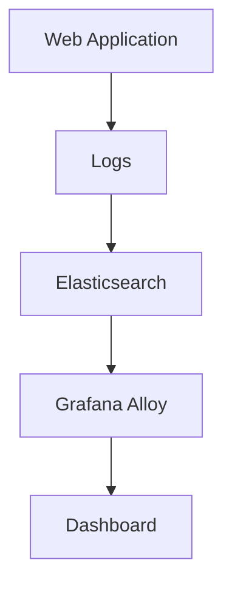

# Elasticsearch数据源设置

在本教程中，我们将学习如何在Grafana Alloy中配置Elasticsearch数据源。Elasticsearch是一个强大的分布式搜索和分析引擎，常用于日志和事件数据的存储与查询。通过将其与Grafana Alloy集成，您可以轻松地将Elasticsearch中的数据可视化。

## 什么是Elasticsearch数据源？

Elasticsearch数据源允许Grafana Alloy从Elasticsearch集群中提取数据，并将其用于创建仪表盘和可视化图表。这对于监控日志、分析事件数据或任何其他存储在Elasticsearch中的信息非常有用。

## 配置Elasticsearch数据源

### 1. 前提条件

在开始之前，请确保您已经具备以下条件：

- 一个运行中的Elasticsearch集群。
- Grafana Alloy已安装并运行。
- 对Elasticsearch的基本了解。

### 2. 添加Elasticsearch数据源

要在Grafana Alloy中添加Elasticsearch数据源，请按照以下步骤操作：

1. 打开Grafana Alloy的Web界面。
2. 导航到“Configuration” > “Data Sources”。
3. 点击“Add data source”按钮。
4. 在数据源列表中选择“Elasticsearch”。

### 3. 配置数据源

在配置页面中，您需要填写以下信息：

- **Name**: 数据源的名称，例如“Elasticsearch-Production”。
- **URL**: Elasticsearch集群的URL，例如`http://localhost:9200`。
- **Access**: 选择“Server”或“Browser”访问模式。通常建议使用“Server”模式。
- **Basic auth**: 如果您的Elasticsearch集群需要身份验证，请启用此选项并填写用户名和密码。
- **Index name**: 指定要查询的索引名称，例如`logstash-*`。

:::tip
如果您不确定索引名称，可以使用通配符`*`来匹配所有索引。
:::

### 4. 测试连接

在填写完所有信息后，点击“Save & Test”按钮。如果配置正确，您将看到“Data source is working”的提示。

### 5. 使用Elasticsearch数据源

现在，您可以在Grafana Alloy中创建仪表盘并使用Elasticsearch数据源。例如，您可以创建一个时间序列图来显示日志事件的数量。

```yaml
# 示例：查询Elasticsearch中的日志事件数量
query: |
  {
    "size": 0,
    "query": {
      "range": {
        "@timestamp": {
          "gte": "now-1h",
          "lte": "now"
        }
      }
    },
    "aggs": {
      "events_over_time": {
        "date_histogram": {
          "field": "@timestamp",
          "fixed_interval": "1m"
        }
      }
    }
  }
```

### 6. 实际案例

假设您正在监控一个Web应用程序的日志，您可以使用Elasticsearch数据源来创建一个仪表盘，显示过去一小时内错误日志的数量。通过这种方式，您可以快速识别和解决问题。



## 总结

通过本教程，您已经学会了如何在Grafana Alloy中配置Elasticsearch数据源，并使用它来可视化数据。Elasticsearch与Grafana Alloy的结合为监控和分析日志数据提供了强大的工具。

## 附加资源

- [Elasticsearch官方文档](https://www.elastic.co/guide/index.html)
- [Grafana Alloy官方文档](https://grafana.com/docs/alloy/latest/)

## 练习

1. 尝试在Grafana Alloy中创建一个新的仪表盘，使用Elasticsearch数据源显示过去24小时内的日志事件数量。
2. 探索Elasticsearch的其他聚合功能，并在Grafana Alloy中实现。

祝您学习愉快！