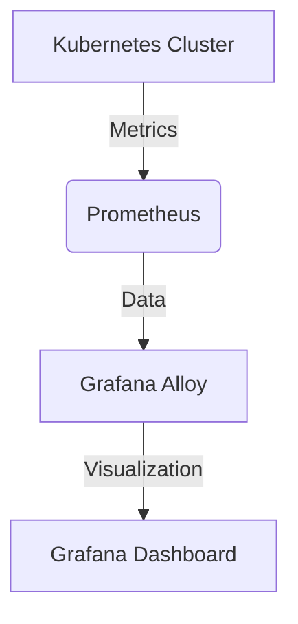

# 数据源插件

在 Grafana Alloy 中，**数据源插件**是用于连接和获取数据的核心组件。它们允许你从各种数据源（如 Prometheus、InfluxDB、MySQL 等）中提取数据，并将其可视化在 Grafana 仪表板中。对于初学者来说，理解数据源插件的工作原理以及如何配置它们是掌握 Grafana Alloy 的关键一步。

## 什么是数据源插件？

数据源插件是 Grafana Alloy 中用于与外部数据源通信的模块。它们负责从数据源中提取数据，并将其转换为 Grafana 可以理解的格式。每个数据源插件都针对特定的数据源进行了优化，以确保高效的数据提取和传输。

:::note
数据源插件是 Grafana Alloy 生态系统的重要组成部分，它们使得 Grafana 能够支持多种数据源，从而满足不同用户的需求。
:::

## 如何配置数据源插件

配置数据源插件通常涉及以下几个步骤：

1. **选择数据源类型**：首先，你需要选择要连接的数据源类型。例如，如果你要连接 Prometheus，你需要选择 Prometheus 数据源插件。

2. **配置连接参数**：接下来，你需要提供连接数据源所需的参数，如 URL、认证信息等。

3. **测试连接**：在保存配置之前，建议先测试连接，以确保配置正确。

4. **保存并应用**：如果测试成功，保存配置并应用到 Grafana Alloy 中。

### 示例：配置 Prometheus 数据源插件

以下是一个配置 Prometheus 数据源插件的示例：

```yaml
apiVersion: 1

datasources:
  - name: Prometheus
    type: prometheus
    url: http://localhost:9090
    access: proxy
    isDefault: true
```

在这个示例中，我们定义了一个名为 `Prometheus` 的数据源，类型为 `prometheus`，并指定了 Prometheus 服务器的 URL。`access: proxy` 表示 Grafana 将通过代理访问 Prometheus，`isDefault: true` 表示这是默认的数据源。

:::tip
你可以通过 Grafana 的 UI 界面来配置数据源插件，也可以通过配置文件（如上面的 YAML 文件）来管理数据源。
:::

## 实际应用场景

数据源插件在实际应用中有多种用途。以下是一些常见的场景：

1. **监控系统性能**：通过连接 Prometheus 数据源插件，你可以实时监控系统的 CPU、内存、网络等性能指标。

2. **日志分析**：通过连接 Elasticsearch 数据源插件，你可以对日志数据进行搜索和分析，快速定位问题。

3. **数据库监控**：通过连接 MySQL 或 PostgreSQL 数据源插件，你可以监控数据库的性能和状态，及时发现潜在问题。

### 示例：监控系统性能

假设你正在使用 Prometheus 监控一个 Kubernetes 集群。你可以通过配置 Prometheus 数据源插件，将集群的性能数据导入 Grafana，并创建仪表板来可视化这些数据。



在这个流程中，Kubernetes 集群的性能数据首先被 Prometheus 收集，然后通过 Prometheus 数据源插件导入 Grafana Alloy，最后在 Grafana 仪表板中进行可视化。

## 总结

数据源插件是 Grafana Alloy 中不可或缺的一部分，它们使得 Grafana 能够连接和可视化多种数据源。通过本文，你应该已经掌握了如何配置和使用数据源插件，并了解了它们在实际应用中的重要性。

## 附加资源与练习

- **官方文档**：阅读 [Grafana 官方文档](https://grafana.com/docs/) 以获取更多关于数据源插件的详细信息。
- **练习**：尝试配置一个 MySQL 数据源插件，并创建一个仪表板来监控数据库的性能。

:::caution
在配置数据源插件时，请确保提供正确的连接参数，以避免连接失败或数据丢失。
:::