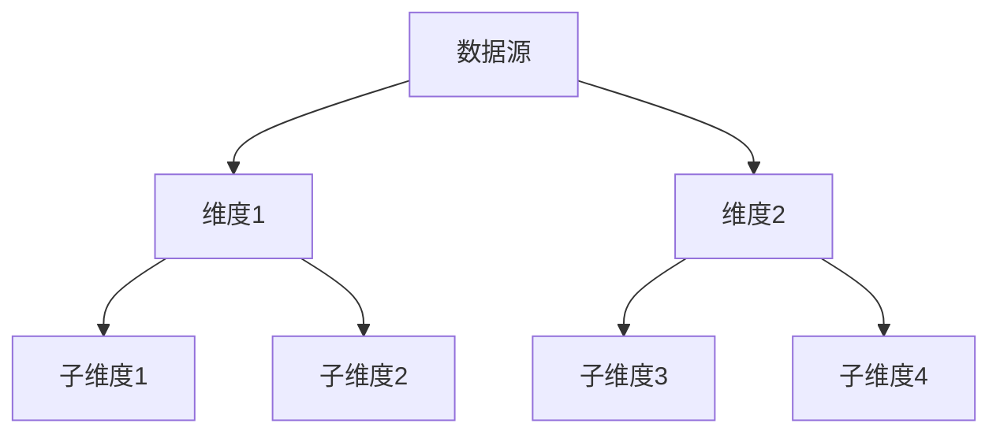

# 高级可视化技术

在现代数据驱动的世界中，可视化技术是理解和分析数据的关键工具。Grafana Alloy 是一个强大的工具，能够帮助你将复杂的数据转化为直观的图表和仪表盘。本文将带你深入了解 Grafana Alloy 的高级可视化技术，帮助你从初学者逐步掌握这些技能。

## 什么是高级可视化技术？

高级可视化技术指的是使用复杂的图表、动态仪表盘和自定义面板来展示数据的方法。这些技术不仅能够帮助你更好地理解数据，还能让你在数据中发现隐藏的模式和趋势。Grafana Alloy 提供了丰富的功能和插件，使得实现这些高级可视化变得简单而高效。

## 动态仪表盘

动态仪表盘是 Grafana Alloy 中的一个重要功能，它允许你根据不同的数据源和时间范围动态更新仪表盘的内容。以下是一个简单的示例，展示如何创建一个动态仪表盘：

```javascript
{
  "panels": [
    {
      "type": "graph",
      "title": "动态图表",
      "datasource": "Prometheus",
      "targets": [
        {
          "expr": "rate(http_requests_total[1m])",
          "legendFormat": "{{method}}"
        }
      ]
    }
  ]
}
```

在这个示例中，我们使用 Prometheus 数据源创建了一个动态图表，展示了 HTTP 请求的速率。通过 `rate(http_requests_total[1m])` 表达式，我们可以实时监控请求速率的变化。

## 自定义面板

Grafana Alloy 允许你创建自定义面板，以满足特定的数据展示需求。以下是一个自定义面板的示例，展示了如何创建一个带有自定义样式的面板：

```javascript
{
  "type": "custom",
  "title": "自定义面板",
  "options": {
    "backgroundColor": "#f0f0f0",
    "borderColor": "#333",
    "borderWidth": 2
  },
  "content": "这是一个自定义面板，用于展示特定数据。"
}
```

在这个示例中，我们定义了一个自定义面板，设置了背景颜色、边框颜色和边框宽度。通过 `content` 字段，我们可以在面板中展示任何自定义内容。

## 复杂数据展示

Grafana Alloy 还支持复杂数据的展示，例如多维度数据和层次结构数据。以下是一个展示多维度数据的示例：



在这个示例中，我们使用 Mermaid 图表展示了多维度数据的层次结构。通过这种方式，你可以清晰地看到数据之间的关系和层次。

## 实际案例

假设你正在监控一个电子商务网站的流量和销售数据。你可以使用 Grafana Alloy 创建一个动态仪表盘，实时展示以下数据：

1. **流量数据**：展示网站的访问量、用户来源和访问路径。
2. **销售数据**：展示销售额、订单数量和转化率。
3. **用户行为数据**：展示用户的点击率、停留时间和跳出率。

通过将这些数据整合到一个仪表盘中，你可以实时监控网站的表现，并根据数据做出相应的调整。

## 总结

Grafana Alloy 提供了强大的高级可视化技术，帮助你更好地理解和分析数据。通过动态仪表盘、自定义面板和复杂数据展示，你可以创建出直观且功能强大的数据可视化工具。希望本文能够帮助你掌握这些技术，并在实际项目中应用它们。

## 附加资源

- [Grafana 官方文档](https://grafana.com/docs/)
- [Prometheus 官方文档](https://prometheus.io/docs/)
- [Mermaid 官方文档](https://mermaid-js.github.io/mermaid/#/)

## 练习

1. 创建一个动态仪表盘，展示你的服务器 CPU 使用率和内存使用情况。
2. 设计一个自定义面板，展示你的应用程序的错误日志。
3. 使用 Mermaid 图表展示你的数据仓库的层次结构。

通过完成这些练习，你将进一步巩固所学的知识，并能够在实际项目中灵活运用 Grafana Alloy 的高级可视化技术。