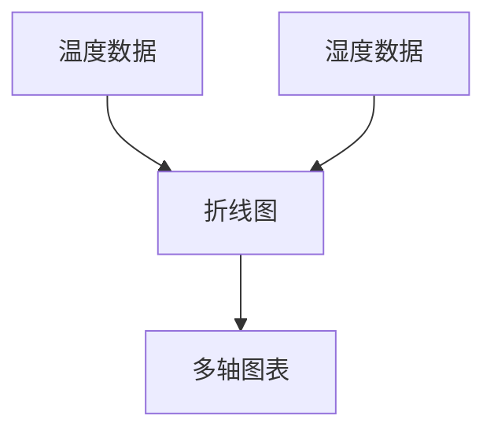

# 多轴图表配置

在数据可视化中，多轴图表是一种强大的工具，它允许我们在同一图表中展示多个具有不同量级或单位的指标。通过配置多轴图表，我们可以更直观地比较和分析这些指标之间的关系。本文将详细介绍如何在 Grafana Alloy 中配置多轴图表，并提供实际案例帮助您理解其应用场景。

## 什么是多轴图表？

多轴图表是一种在同一图表中使用多个 Y 轴（垂直轴）的图表类型。每个 Y 轴可以代表不同的数据系列，并且可以有不同的刻度范围。这种图表特别适用于以下场景：

- 比较不同量级的数据（例如，温度与湿度）。
- 展示具有不同单位的数据（例如，销售额与用户数量）。
- 分析多个指标之间的相关性。

## 配置多轴图表的步骤

### 1. 创建基本图表

首先，我们需要在 Grafana Alloy 中创建一个基本的图表。假设我们有两个数据系列：`温度` 和 `湿度`。我们可以使用以下代码创建一个简单的折线图：

```yaml
panels:
  - type: timeseries
    title: 温度与湿度
    targets:
      - query: 'temperature'
        alias: 温度
      - query: 'humidity'
        alias: 湿度
```

### 2. 添加第二个 Y 轴

接下来，我们需要为 `湿度` 数据系列添加第二个 Y 轴。在 Grafana Alloy 中，可以通过 `overrides` 配置来实现这一点：

```yaml
panels:
  - type: timeseries
    title: 温度与湿度
    targets:
      - query: 'temperature'
        alias: 温度
      - query: 'humidity'
        alias: 湿度
    overrides:
      - matcher:
          id: 'humidity'
        properties:
          - id: 'custom.axisPlacement'
            value: 'right'
```

在这个配置中，我们使用 `overrides` 将 `湿度` 数据系列的 Y 轴放置在右侧。

### 3. 调整刻度范围

有时，我们需要调整每个 Y 轴的刻度范围，以确保数据在图表中显示得更清晰。我们可以通过以下配置来实现：

```yaml
panels:
  - type: timeseries
    title: 温度与湿度
    targets:
      - query: 'temperature'
        alias: 温度
      - query: 'humidity'
        alias: 湿度
    overrides:
      - matcher:
          id: 'humidity'
        properties:
          - id: 'custom.axisPlacement'
            value: 'right'
          - id: 'custom.axisMin'
            value: 0
          - id: 'custom.axisMax'
            value: 100
```

在这个配置中，我们将 `湿度` 数据系列的 Y 轴范围设置为 0 到 100。

## 实际案例

假设我们正在监控一个温室的环境数据，包括温度和湿度。我们希望在同一图表中展示这两个指标，并分析它们之间的关系。通过配置多轴图表，我们可以清晰地看到温度和湿度的变化趋势，并发现它们之间的相关性。



## 总结

多轴图表是 Grafana Alloy 中一种强大的数据可视化工具，特别适用于展示多个具有不同量级或单位的指标。通过本文的学习，您应该已经掌握了如何在 Grafana Alloy 中配置多轴图表，并了解了其在实际应用中的价值。

## 附加资源与练习

- **练习**：尝试在 Grafana Alloy 中创建一个多轴图表，展示两个具有不同单位的数据系列（例如，销售额与用户数量）。
- **资源**：参考 [Grafana 官方文档](https://grafana.com/docs/) 了解更多关于图表配置的高级技巧。

:::tip
如果您在配置过程中遇到问题，可以尝试使用 Grafana 的 `Explore` 功能来调试查询和图表配置。
:::