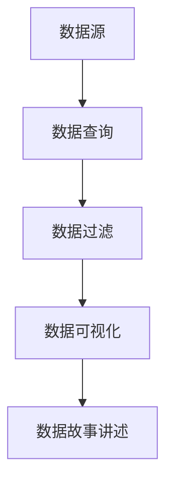
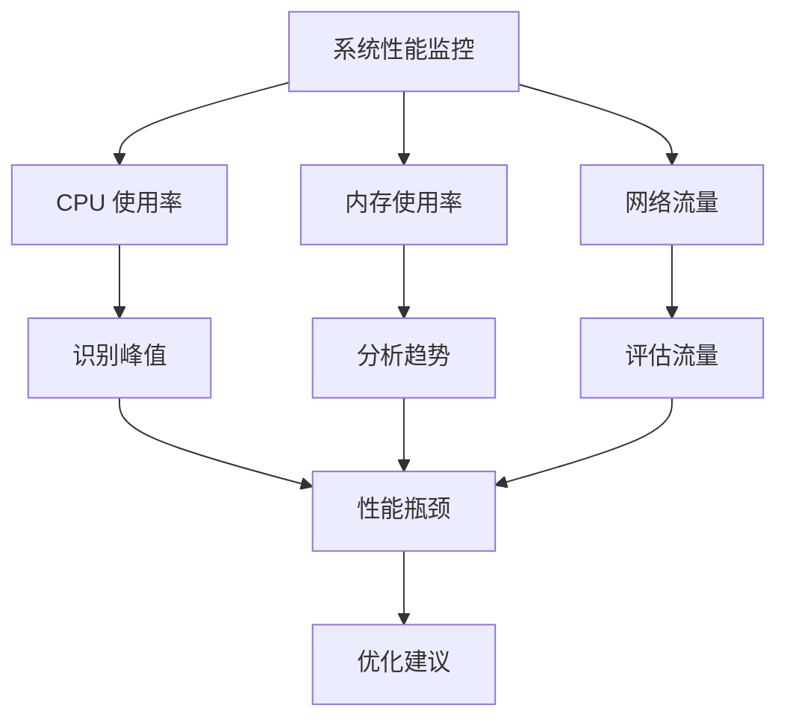

# 数据故事讲述技巧

在数据分析和可视化领域，数据故事讲述（Data Storytelling）是一种将数据转化为有意义、易于理解的叙述方式。通过结合数据、图表和叙述，数据故事讲述能够帮助观众更好地理解数据的含义，并从中获得洞察。本文将介绍如何使用 Grafana Alloy 进行高级可视化，并通过实际案例展示数据故事讲述的核心技巧。

## 什么是数据故事讲述？

数据故事讲述是将数据、分析和可视化结合起来，通过叙述的方式向观众传达信息的过程。它不仅仅是展示数据，而是通过有逻辑的叙述结构，引导观众理解数据背后的故事。一个好的数据故事应该具备以下特点：

1. **清晰的目标**：明确你想要传达的核心信息。
2. **逻辑结构**：按照一定的顺序展示数据，帮助观众逐步理解。
3. **引人入胜的叙述**：通过叙述技巧吸引观众的注意力。
4. **有效的可视化**：使用合适的图表和图形来支持叙述。

## 数据故事讲述的核心步骤

### 1. 确定目标

在开始讲述数据故事之前，首先要明确你的目标。你希望通过数据传达什么信息？你的观众是谁？他们的需求是什么？明确这些问题将帮助你更好地设计数据故事的结构和内容。

### 2. 选择合适的数据

选择与目标相关的数据是讲述数据故事的关键。你需要确保数据是准确、可靠的，并且能够支持你想要传达的信息。在 Grafana Alloy 中，你可以通过查询和过滤数据来选择最相关的部分。

```sql
SELECT time, value FROM metrics WHERE metric = 'cpu_usage' AND time > now() - 1h;
```

### 3. 设计可视化

选择合适的图表和图形来展示数据是数据故事讲述的重要环节。不同的图表类型适用于不同的数据类型和场景。例如，折线图适合展示时间序列数据，柱状图适合比较不同类别的数据。



### 4. 构建叙述结构

一个好的数据故事应该有清晰的叙述结构。通常，你可以按照以下步骤构建叙述：

1. **引入**：介绍背景和问题。
2. **分析**：展示数据并进行分析。
3. **结论**：总结发现并提出建议。

### 5. 添加上下文和注释

在可视化中添加上下文和注释可以帮助观众更好地理解数据。例如，你可以在图表中添加注释，解释数据中的异常点或重要趋势。

```json
{
  "annotations": {
    "list": [
      {
        "text": "CPU 使用率峰值",
        "time": "2023-10-01T12:00:00Z"
      }
    ]
  }
}
```

## 实际案例：监控系统性能

假设你正在监控一个系统的性能，并希望通过数据故事讲述向团队展示系统的健康状况。你可以按照以下步骤进行：

1. **目标**：展示系统在过去一周的性能表现，并识别潜在的性能瓶颈。
2. **数据**：选择 CPU 使用率、内存使用率和网络流量等关键指标。
3. **可视化**：使用折线图展示时间序列数据，并使用柱状图比较不同时间段的性能。
4. **叙述**：
   - **引入**：介绍系统的背景和监控目的。
   - **分析**：展示 CPU 使用率的峰值和内存使用率的趋势。
   - **结论**：总结性能瓶颈，并提出优化建议。



## 总结

数据故事讲述是一种强大的工具，能够帮助你将复杂的数据转化为易于理解的叙述。通过明确目标、选择合适的数据、设计有效的可视化、构建清晰的叙述结构以及添加上下文和注释，你可以创建引人入胜的数据故事。Grafana Alloy 提供了丰富的可视化工具，帮助你更好地讲述数据故事。

## 附加资源

- [Grafana Alloy 官方文档](https://grafana.com/docs/alloy/)
- [数据可视化最佳实践](https://www.example.com/data-visualization-best-practices)
- [数据故事讲述技巧](https://www.example.com/data-storytelling-tips)

## 练习

1. 选择一个你感兴趣的数据集，尝试使用 Grafana Alloy 创建一个数据故事。
2. 设计一个叙述结构，包括引入、分析和结论。
3. 在可视化中添加注释，解释数据中的关键点。

通过不断练习，你将能够掌握数据故事讲述的技巧，并有效地传达数据背后的故事。