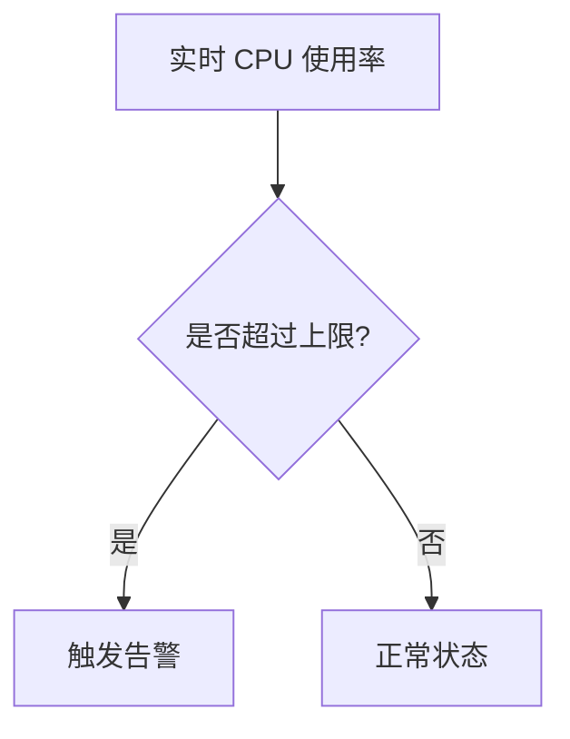

# 数据驱动的阈值

在监控和可视化领域，阈值是判断系统状态是否正常的重要依据。传统阈值通常是静态的，例如设置一个固定的 CPU 使用率上限（如 80%）。然而，这种静态阈值可能无法适应动态变化的环境。**数据驱动的阈值**则是一种更灵活的方法，它基于历史数据或实时数据动态调整阈值，从而更准确地反映系统的真实状态。

本文将介绍如何在 Grafana Alloy 中使用数据驱动的阈值，并通过实际案例展示其应用场景。

---

## 什么是数据驱动的阈值？

数据驱动的阈值是一种基于数据动态调整的阈值计算方法。它通过分析历史数据或实时数据，自动计算出适合当前环境的阈值。这种方法特别适用于以下场景：

- **动态负载**：系统负载随时间变化，静态阈值无法准确反映当前状态。
- **季节性变化**：某些指标（如流量、温度）可能随季节或时间周期性变化。
- **异常检测**：通过对比历史数据，自动识别异常值。

数据驱动的阈值通常基于统计方法（如均值、标准差）或机器学习算法（如时间序列预测）来计算。

---

## 如何在 Grafana Alloy 中实现数据驱动的阈值？

Grafana Alloy 提供了强大的工具来实现数据驱动的阈值。以下是实现步骤：

### 1. 收集历史数据
首先，您需要收集足够的历史数据。这些数据将用于计算动态阈值。

```promql
# 示例：查询过去 7 天的 CPU 使用率
avg_over_time(cpu_usage_percent{job="node_exporter"}[7d])
```

### 2. 计算动态阈值
基于历史数据，您可以计算动态阈值。例如，使用均值和标准差来计算上下限：

```promql
# 计算过去 7 天的 CPU 使用率均值和标准差
avg_cpu = avg_over_time(cpu_usage_percent{job="node_exporter"}[7d])
stddev_cpu = stddev_over_time(cpu_usage_percent{job="node_exporter"}[7d])

# 动态阈值：均值 ± 2倍标准差
upper_threshold = avg_cpu + 2 * stddev_cpu
lower_threshold = avg_cpu - 2 * stddev_cpu
```

### 3. 在 Grafana 中可视化动态阈值
将计算出的动态阈值与实时数据一起可视化：



### 4. 设置告警
当实时数据超过动态阈值时，触发告警：

```yaml
alert: HighCPUUsage
expr: cpu_usage_percent{job="node_exporter"} > upper_threshold
for: 5m
labels:
  severity: critical
annotations:
  summary: "CPU 使用率过高"
  description: "当前 CPU 使用率为 {{ $value }}%，超过动态阈值 {{ upper_threshold }}%。"
```

---

## 实际案例：动态监控网站流量

假设您需要监控一个网站的流量。由于流量可能随时间和季节变化，静态阈值无法准确反映异常情况。以下是实现步骤：

1. **收集历史流量数据**：
   ```promql
   avg_over_time(http_requests_total{job="web_server"}[30d])
   ```

2. **计算动态阈值**：
   ```promql
   avg_traffic = avg_over_time(http_requests_total{job="web_server"}[30d])
   stddev_traffic = stddev_over_time(http_requests_total{job="web_server"}[30d])
   upper_threshold = avg_traffic + 3 * stddev_traffic
   ```

3. **设置告警**：
   ```yaml
   alert: HighTraffic
   expr: http_requests_total{job="web_server"} > upper_threshold
   for: 10m
   labels:
     severity: warning
   annotations:
     summary: "网站流量异常"
     description: "当前流量为 {{ $value }}，超过动态阈值 {{ upper_threshold }}。"
   ```

4. **可视化**：
   在 Grafana 中创建一个面板，显示实时流量和动态阈值。

---

## 总结

数据驱动的阈值是一种强大的工具，可以帮助您更灵活地监控系统状态。通过基于历史数据动态调整阈值，您可以更准确地识别异常并减少误报。Grafana Alloy 提供了丰富的功能来实现这一目标。

:::tip 提示
- 确保收集足够的历史数据以支持动态阈值的计算。
- 结合机器学习算法（如时间序列预测）可以进一步提高动态阈值的准确性。
:::

---

## 附加资源与练习

### 资源
- [Grafana 官方文档](https://grafana.com/docs/)
- [PromQL 查询语言指南](https://prometheus.io/docs/prometheus/latest/querying/basics/)

### 练习
1. 使用 Grafana Alloy 实现一个动态内存使用率监控系统。
2. 尝试结合机器学习算法（如 ARIMA 模型）预测未来阈值。
3. 在 Grafana 中创建一个仪表板，展示实时数据和动态阈值的变化趋势。

通过实践这些练习，您将更深入地理解数据驱动的阈值的应用场景和实现方法。