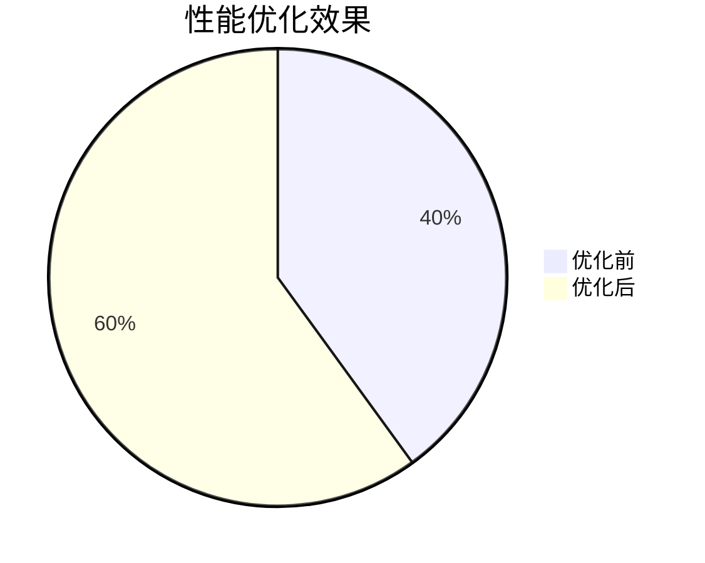

# Grafana Alloy 性能概述

Grafana Alloy 是一个强大的工具，用于监控和可视化系统的性能数据。它通过高效的数据处理和灵活的配置选项，帮助用户快速识别和解决性能瓶颈。本文将带你了解 Grafana Alloy 的性能优化基础，帮助你更好地利用这一工具。

## 什么是 Grafana Alloy？

Grafana Alloy 是 Grafana 生态系统中的一个组件，专注于高性能的数据收集、处理和可视化。它通过优化数据流和资源管理，确保在大规模数据场景下仍能保持高效运行。无论是监控服务器性能、应用程序指标，还是网络流量，Grafana Alloy 都能提供强大的支持。

## 性能优化的核心概念

### 1. 数据流优化
Grafana Alloy 的核心优势之一是其高效的数据流处理能力。它通过以下方式优化数据流：
- **数据压缩**：减少数据传输和存储的开销。
- **并行处理**：利用多核 CPU 并行处理数据，提高吞吐量。
- **缓存机制**：通过缓存常用数据，减少重复计算和查询时间。

### 2. 资源管理
Grafana Alloy 通过智能的资源分配策略，确保系统在高负载下仍能稳定运行。主要策略包括：
- **动态资源分配**：根据当前负载动态调整 CPU 和内存的使用。
- **资源隔离**：确保不同任务之间的资源不会相互干扰。

### 3. 查询优化
Grafana Alloy 提供了强大的查询引擎，支持复杂的查询操作。通过以下方式优化查询性能：
- **索引优化**：为常用查询字段创建索引，加快查询速度。
- **查询缓存**：缓存查询结果，减少重复查询的开销。

## 实际案例：优化服务器监控系统

假设你正在监控一个拥有数百台服务器的集群，每台服务器每秒都会生成大量的性能数据。为了确保 Grafana Alloy 能够高效处理这些数据，你可以采取以下优化措施：

1. **启用数据压缩**：
   ```yaml
   data_compression:
     enabled: true
     algorithm: gzip
   ```
   这将减少数据传输和存储的开销。

2. **配置并行处理**：
   ```yaml
   parallel_processing:
     enabled: true
     max_workers: 8
   ```
   通过利用多核 CPU 并行处理数据，提高吞吐量。

3. **设置查询缓存**：
   ```yaml
   query_cache:
     enabled: true
     ttl: 5m
   ```
   缓存查询结果，减少重复查询的开销。

## 性能优化效果

通过上述优化措施，你可以显著提升 Grafana Alloy 的性能。以下是一个简单的性能对比：



:::tip
在实际应用中，建议根据具体场景调整配置参数，以达到最佳性能。
:::

## 总结

Grafana Alloy 是一个功能强大的工具，通过优化数据流、资源管理和查询性能，能够显著提升系统监控的效率。本文介绍了其核心概念和优化策略，并通过实际案例展示了如何应用这些策略。希望这些内容能帮助你更好地理解和利用 Grafana Alloy。

## 附加资源

- [Grafana Alloy 官方文档](https://grafana.com/docs/alloy/)
- [性能优化最佳实践](https://grafana.com/docs/alloy/best-practices/performance-optimization/)
- [Grafana Alloy 社区论坛](https://community.grafana.com/c/alloy/)

## 练习

1. 在你的 Grafana Alloy 配置中启用数据压缩，并观察性能变化。
2. 尝试调整并行处理的 `max_workers` 参数，找到适合你系统的最佳值。
3. 为常用查询字段创建索引，并测试查询速度的提升。

通过实践这些练习，你将更深入地理解 Grafana Alloy 的性能优化机制。