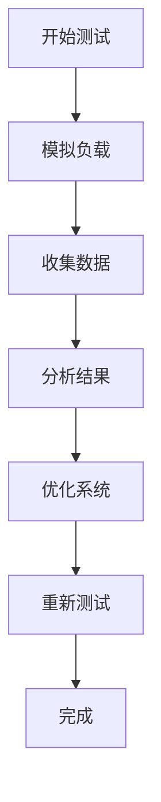

# 性能基准测试

性能基准测试是评估系统、应用程序或组件在特定条件下的性能表现的过程。通过基准测试，您可以识别性能瓶颈、优化资源利用率，并确保系统在高负载下仍能稳定运行。对于 Grafana Alloy 这样的监控工具，性能基准测试尤为重要，因为它需要高效处理大量数据并提供实时反馈。

## 什么是性能基准测试？

性能基准测试的核心目标是通过模拟真实场景或特定负载条件，测量系统的响应时间、吞吐量、资源消耗等关键指标。这些指标可以帮助您了解系统的性能极限，并为优化提供数据支持。

:::note
性能基准测试通常包括以下步骤：
1. **定义目标**：明确测试的目的和需要测量的指标。
2. **设计测试场景**：模拟真实负载或极端条件。
3. **执行测试**：运行测试并收集数据。
4. **分析结果**：评估性能表现并识别问题。
5. **优化和验证**：根据测试结果进行优化，并重新测试以验证改进效果。
:::

## 为什么需要性能基准测试？

在 Grafana Alloy 中，性能基准测试可以帮助您：
- 确保系统在高负载下仍能稳定运行。
- 识别数据处理或传输中的瓶颈。
- 优化资源分配，提高效率。
- 为未来的扩展提供数据支持。

## 性能基准测试的关键指标

在进行性能基准测试时，通常需要关注以下指标：
- **响应时间**：系统处理请求所需的时间。
- **吞吐量**：单位时间内系统处理的请求数量。
- **资源利用率**：CPU、内存、磁盘和网络的使用情况。
- **错误率**：在测试过程中发生的错误数量或比例。

## 性能基准测试的实际案例

假设您正在使用 Grafana Alloy 监控一个分布式系统，并希望评估其在高负载下的性能表现。以下是一个简单的基准测试流程：

### 1. 定义目标
您的目标是测量 Grafana Alloy 在处理每秒 10,000 个数据点时的响应时间和资源利用率。

### 2. 设计测试场景
使用工具（如 `k6` 或 `JMeter`）模拟每秒 10,000 个数据点的负载。

```bash
# 使用 k6 模拟负载
k6 run --vus 100 --duration 60s script.js
```

### 3. 执行测试
运行测试并收集数据。您可以使用 Grafana Alloy 自带的监控工具来记录系统的性能指标。

### 4. 分析结果
查看 Grafana 仪表板，分析响应时间、CPU 使用率和内存消耗等指标。



### 5. 优化和验证
根据测试结果，您可能会发现某些配置需要调整。例如，增加 Alloy 的线程池大小或优化数据存储策略。完成优化后，重新运行测试以验证改进效果。

## 总结

性能基准测试是优化 Grafana Alloy 性能的关键步骤。通过定义目标、设计测试场景、执行测试和分析结果，您可以识别并解决性能瓶颈，确保系统在高负载下仍能高效运行。

:::tip
**附加资源**：
- [Grafana Alloy 官方文档](https://grafana.com/docs/alloy/)
- [k6 性能测试工具](https://k6.io/docs/)
- [JMeter 性能测试指南](https://jmeter.apache.org/usermanual/index.html)
:::

:::caution
**练习**：
1. 使用 `k6` 或 `JMeter` 为您的 Grafana Alloy 实例设计一个基准测试场景。
2. 运行测试并分析结果，尝试识别可能的性能瓶颈。
3. 根据测试结果优化配置，并重新测试以验证改进效果。
:::