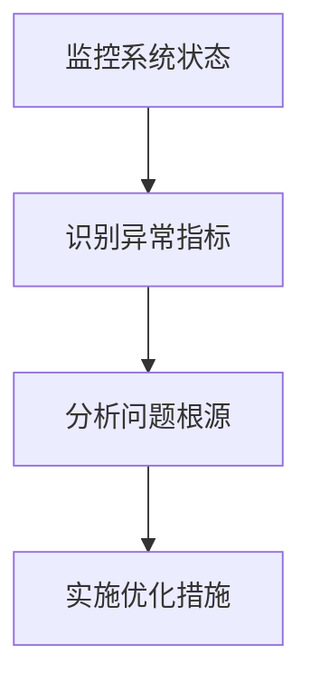
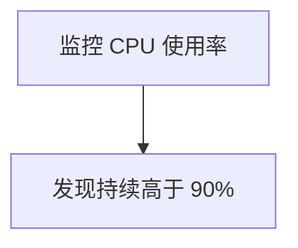

# 性能故障排除

在 Grafana Alloy 中，性能优化是一个关键任务，尤其是在处理大规模数据时。性能故障排除是指通过分析系统运行状态，识别性能瓶颈，并采取相应措施解决问题的过程。本文将引导你逐步了解如何排查和优化 Grafana Alloy 的性能问题。

---

## 什么是性能故障排除？

性能故障排除是一种系统化的方法，用于识别和解决影响系统运行效率的问题。在 Grafana Alloy 中，性能问题可能表现为数据延迟、资源占用过高或响应时间过长等。通过性能故障排除，你可以找到问题的根本原因，并采取适当的优化措施。

---

## 性能故障排除的步骤

### 1. 监控系统状态
首先，你需要监控系统的运行状态。Grafana Alloy 提供了丰富的监控工具，帮助你实时查看系统的性能指标。



### 2. 识别异常指标
通过监控工具，你可以查看以下关键指标：
- **CPU 使用率**：高 CPU 使用率可能表明系统负载过高。
- **内存使用率**：内存泄漏或过度分配可能导致性能下降。
- **磁盘 I/O**：频繁的磁盘读写操作可能成为性能瓶颈。
- **网络延迟**：高网络延迟会影响数据传输效率。

### 3. 分析问题根源
一旦发现异常指标，下一步是分析问题的根源。例如：
- 如果 CPU 使用率过高，可能是由于某个查询过于复杂。
- 如果内存使用率持续增长，可能是内存泄漏导致的。

### 4. 实施优化措施
根据分析结果，采取相应的优化措施。例如：
- 优化查询语句，减少计算复杂度。
- 调整资源配置，增加内存或 CPU 分配。
- 使用缓存机制，减少重复计算。

---

## 实际案例：优化高 CPU 使用率

假设你在 Grafana Alloy 中发现 CPU 使用率持续高于 90%，以下是如何排查和解决问题的步骤：

### 步骤 1：监控 CPU 使用率
使用 Grafana 的监控面板查看 CPU 使用率的变化趋势。



### 步骤 2：分析高 CPU 使用率的原因
通过日志和查询分析工具，发现某个查询语句执行时间过长。

```sql
SELECT * FROM large_table WHERE condition = 'complex';
```

### 步骤 3：优化查询语句
将查询语句优化为更高效的形式：

```sql
SELECT column1, column2 FROM large_table WHERE condition = 'simple' LIMIT 1000;
```

### 步骤 4：验证优化效果
重新运行优化后的查询，观察 CPU 使用率是否下降。

---

## 总结

性能故障排除是 Grafana Alloy 优化的重要环节。通过监控系统状态、识别异常指标、分析问题根源和实施优化措施，你可以显著提升系统的运行效率。以下是一些额外的资源和建议：

- **Grafana 官方文档**：了解更多关于性能优化的最佳实践。
- **练习**：尝试在你的环境中模拟性能问题，并练习故障排除。

:::tip
记住，性能优化是一个持续的过程。定期监控和调整系统配置，可以确保系统始终处于最佳状态。
:::