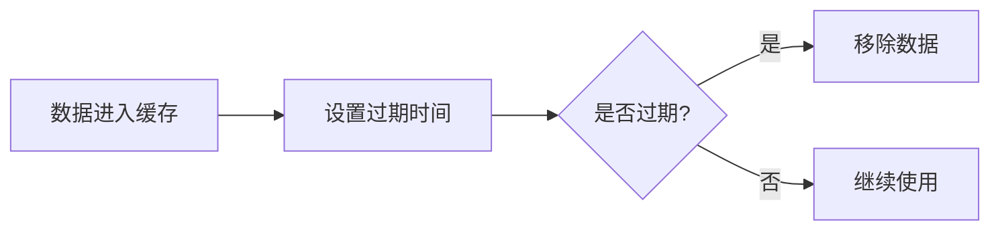

# 缓存策略与设置

在 Grafana Alloy 中，缓存是提升性能的关键技术之一。通过合理配置缓存策略，可以有效减少重复计算和数据库查询，从而加快响应速度并降低系统负载。本文将详细介绍缓存的基本概念、常见的缓存策略以及如何在 Grafana Alloy 中实现缓存优化。

## 什么是缓存？

缓存是一种临时存储机制，用于保存频繁访问的数据或计算结果。当系统需要这些数据时，可以直接从缓存中获取，而不必重新计算或从原始数据源中查询。缓存的主要目的是减少延迟、提高吞吐量并降低系统资源消耗。

在 Grafana Alloy 中，缓存可以应用于多种场景，例如：
- 减少重复的数据库查询
- 加速复杂计算的结果获取
- 存储频繁访问的静态资源

## 常见的缓存策略

### 1. 最近最少使用（LRU）
LRU 是一种常见的缓存淘汰策略。当缓存空间不足时，系统会优先移除最近最少使用的数据。这种策略适用于访问模式较为均匀的场景。


### 2. 先进先出（FIFO）
FIFO 策略按照数据进入缓存的顺序进行淘汰。最早进入缓存的数据会被优先移除。这种策略适用于数据访问模式较为随机的场景。


### 3. 时间过期（TTL）
TTL 策略为缓存中的数据设置一个过期时间。一旦数据过期，系统会自动将其从缓存中移除。这种策略适用于数据更新频率较高的场景。



## 在 Grafana Alloy 中实现缓存

### 1. 配置缓存
在 Grafana Alloy 中，可以通过配置文件或代码来设置缓存。以下是一个简单的缓存配置示例：

```yaml
cache:
  enabled: true
  strategy: "LRU"
  max_size: 1000
  ttl: "5m"
```

- `enabled`: 启用缓存
- `strategy`: 缓存策略（如 LRU、FIFO）
- `max_size`: 缓存的最大容量
- `ttl`: 数据的过期时间

### 2. 使用缓存
在代码中，可以通过以下方式使用缓存：

```python
from grafana_alloy import cache

# 获取缓存实例
cache_instance = cache.get_cache()

# 设置缓存
cache_instance.set("key", "value", ttl=300)

# 获取缓存
value = cache_instance.get("key")
if value:
    print("从缓存中获取数据:", value)
else:
    print("缓存未命中，重新计算数据")
```

### 3. 监控缓存性能
Grafana Alloy 提供了丰富的监控工具，可以帮助你实时查看缓存的命中率、使用率等关键指标。通过这些指标，你可以优化缓存配置，进一步提升系统性能。

## 实际案例

假设你正在开发一个电商网站，商品信息需要频繁查询。为了提高性能，你可以使用缓存来存储商品信息。以下是一个简单的实现：

```python
from grafana_alloy import cache

# 获取缓存实例
cache_instance = cache.get_cache()

def get_product_info(product_id):
    # 尝试从缓存中获取商品信息
    product_info = cache_instance.get(f"product_{product_id}")
    if product_info:
        return product_info
    else:
        # 缓存未命中，从数据库中查询
        product_info = query_database(product_id)
        # 将查询结果存入缓存
        cache_instance.set(f"product_{product_id}", product_info, ttl=600)
        return product_info
```

在这个案例中，商品信息被缓存了 10 分钟（600 秒）。如果在这段时间内有用户请求相同的商品信息，系统可以直接从缓存中获取，而不必再次查询数据库。

## 总结

缓存是提升系统性能的重要手段。通过合理配置缓存策略，可以有效减少重复计算和数据库查询，从而加快响应速度并降低系统负载。在 Grafana Alloy 中，你可以通过简单的配置和代码实现缓存功能，并通过监控工具实时优化缓存性能。

## 附加资源与练习

- **练习 1**: 尝试在你的项目中实现一个简单的缓存系统，并使用 LRU 策略进行数据淘汰。
- **练习 2**: 使用 Grafana Alloy 的监控工具，观察缓存的命中率和使用率，并根据结果调整缓存配置。
- **附加资源**: 阅读 [Grafana Alloy 官方文档](https://grafana.com/docs/alloy/) 了解更多关于缓存的高级配置和优化技巧。

:::tip
缓存虽然能显著提升性能，但也需要谨慎使用。过大的缓存可能导致内存占用过高，而过小的缓存则可能无法发挥其优势。因此，合理配置缓存大小和策略是关键。
:::