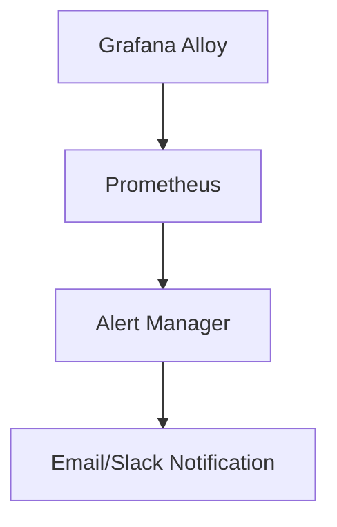

# Grafana Alloy 安全基础

Grafana Alloy 是一个强大的工具，用于监控和可视化数据。然而，随着数据的重要性日益增加，确保数据的安全性和合规性变得至关重要。本文将介绍 Grafana Alloy 的基本安全概念，帮助初学者理解如何保护他们的数据。

## 什么是Grafana Alloy安全？

Grafana Alloy 安全是指在使用 Grafana Alloy 时，确保数据的机密性、完整性和可用性。这包括保护数据免受未经授权的访问、防止数据被篡改，以及确保系统在需要时能够正常运行。

## 基本安全概念

### 1. 身份验证（Authentication）

身份验证是确认用户身份的过程。Grafana Alloy 支持多种身份验证方法，包括：

- **基本身份验证**：使用用户名和密码进行验证。
- **OAuth**：通过第三方服务（如 Google、GitHub）进行验证。

```yaml
auth:
  basic:
    username: "admin"
    password: "securepassword"
```

### 2. 授权（Authorization）

授权是确定用户是否有权限访问特定资源的过程。Grafana Alloy 使用角色和权限来控制访问。

```yaml
roles:
  - name: "admin"
    permissions:
      - "read"
      - "write"
  - name: "viewer"
    permissions:
      - "read"
```

### 3. 数据加密（Data Encryption）

数据加密是保护数据在传输和存储过程中不被窃取或篡改的关键措施。Grafana Alloy 支持 TLS/SSL 加密来保护数据传输。

```yaml
tls:
  cert_file: "/path/to/cert.pem"
  key_file: "/path/to/key.pem"
```

### 4. 日志记录和监控（Logging and Monitoring）

日志记录和监控是检测和响应安全事件的重要手段。Grafana Alloy 提供了详细的日志记录功能，并可以与 Prometheus 等监控工具集成。

```yaml
logging:
  level: "info"
  format: "json"
```

## 实际案例

### 案例1：保护敏感数据

假设你有一个包含敏感数据的 Grafana Alloy 实例。你可以通过以下步骤来保护这些数据：

1. **启用身份验证**：确保只有经过身份验证的用户才能访问系统。
2. **配置授权**：为不同用户分配不同的角色和权限，限制他们对敏感数据的访问。
3. **启用数据加密**：使用 TLS/SSL 加密数据传输，确保数据在传输过程中不被窃取。

### 案例2：监控安全事件

假设你需要监控 Grafana Alloy 的安全事件。你可以通过以下步骤来实现：

1. **配置日志记录**：启用详细的日志记录，记录所有重要的安全事件。
2. **集成监控工具**：将 Grafana Alloy 与 Prometheus 集成，实时监控系统状态和安全事件。



## 总结

Grafana Alloy 提供了多种安全功能，帮助用户保护他们的数据。通过身份验证、授权、数据加密以及日志记录和监控，你可以确保数据的安全性和合规性。希望本文能帮助你理解 Grafana Alloy 的基本安全概念，并在实际应用中加以运用。

## 附加资源

- [Grafana Alloy 官方文档](https://grafana.com/docs/alloy/latest/)
- [Prometheus 官方文档](https://prometheus.io/docs/)
- [OAuth 2.0 官方文档](https://oauth.net/2/)

## 练习

1. 配置 Grafana Alloy 的基本身份验证，并测试其有效性。
2. 为 Grafana Alloy 配置 TLS/SSL 加密，并验证数据传输的安全性。
3. 将 Grafana Alloy 与 Prometheus 集成，并设置一个简单的监控警报。

:::tip
在配置安全设置时，务必遵循最小权限原则，即只授予用户完成其工作所需的最小权限。
:::