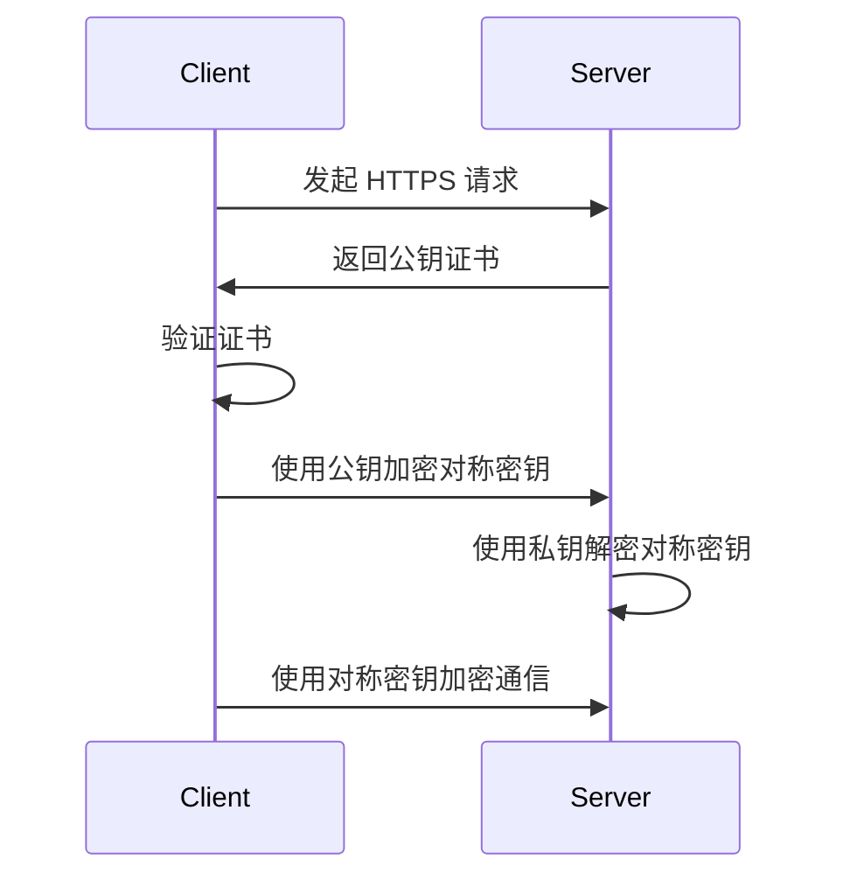

# 数据传输加密

在现代互联网应用中，数据传输的安全性至关重要。无论是用户登录信息、支付数据，还是敏感的业务数据，都需要在传输过程中得到保护。**数据传输加密**是一种确保数据在传输过程中不被窃取或篡改的技术。本文将详细介绍数据传输加密的基本概念、实现方式及其在 Grafana Alloy 中的应用。

## 什么是数据传输加密？

数据传输加密是指通过加密算法将数据转换为密文，以确保数据在传输过程中即使被截获，也无法被读取或篡改。常见的加密方式包括对称加密和非对称加密。

- **对称加密**：使用相同的密钥进行加密和解密。常见的对称加密算法有 AES、DES 等。
- **非对称加密**：使用一对密钥（公钥和私钥）进行加密和解密。常见的非对称加密算法有 RSA、ECC 等。

## 数据传输加密的实现

### 1. 使用 HTTPS 进行加密传输

HTTPS 是 HTTP 的安全版本，它通过 SSL/TLS 协议对数据进行加密传输。以下是使用 HTTPS 的基本流程：

1. 客户端向服务器发起 HTTPS 请求。
2. 服务器返回其公钥证书。
3. 客户端验证证书的有效性。
4. 客户端生成一个随机的对称密钥，并使用服务器的公钥加密后发送给服务器。
5. 服务器使用私钥解密，获取对称密钥。
6. 双方使用对称密钥进行加密通信。



### 2. 使用加密库进行数据加密

在实际开发中，我们可以使用加密库来实现数据传输加密。以下是一个使用 Python 的 `cryptography` 库进行 AES 加密的示例：

```python
from cryptography.hazmat.primitives.ciphers import Cipher, algorithms, modes
from cryptography.hazmat.backends import default_backend
import os

# 生成一个随机的 256 位密钥
key = os.urandom(32)

# 生成一个随机的 128 位初始化向量 (IV)
iv = os.urandom(16)

# 创建 AES 加密器
cipher = Cipher(algorithms.AES(key), modes.CFB(iv), backend=default_backend())

# 加密数据
encryptor = cipher.encryptor()
plaintext = b"Hello, Grafana Alloy!"
ciphertext = encryptor.update(plaintext) + encryptor.finalize()

# 解密数据
decryptor = cipher.decryptor()
decrypted_text = decryptor.update(ciphertext) + decryptor.finalize()

print("原始数据:", plaintext)
print("加密后的数据:", ciphertext)
print("解密后的数据:", decrypted_text)
```

**输出示例：**

```
原始数据: b'Hello, Grafana Alloy!'
加密后的数据: b'\x1a\x2b\x3c\x4d\x5e\x6f\x70\x81\x92\xa3\xb4\xc5\xd6\xe7\xf8'
解密后的数据: b'Hello, Grafana Alloy!'
```

## 实际应用场景

### 1. Grafana Alloy 中的数据传输加密

在 Grafana Alloy 中，数据传输加密通常用于保护监控数据的传输。例如，当 Alloy 从远程数据源收集指标数据时，可以使用 HTTPS 或 TLS 来加密数据传输，确保数据在传输过程中不被窃取或篡改。

### 2. 用户登录信息的加密传输

在用户登录过程中，密码等敏感信息通常通过 HTTPS 进行加密传输，以防止中间人攻击（Man-in-the-Middle Attack）。

## 总结

数据传输加密是确保数据在传输过程中安全性的关键技术。通过使用 HTTPS 或加密库，我们可以有效地保护数据不被窃取或篡改。在 Grafana Alloy 中，数据传输加密广泛应用于监控数据的传输和用户登录信息的保护。

## 附加资源

- [HTTPS 协议详解](https://developer.mozilla.org/zh-CN/docs/Web/HTTP/Overview)
- [Python cryptography 库文档](https://cryptography.io/en/latest/)
- [Grafana Alloy 官方文档](https://grafana.com/docs/alloy/latest/)

## 练习

1. 使用 Python 的 `cryptography` 库实现一个简单的非对称加密程序。
2. 在 Grafana Alloy 中配置 HTTPS，确保数据传输的安全性。