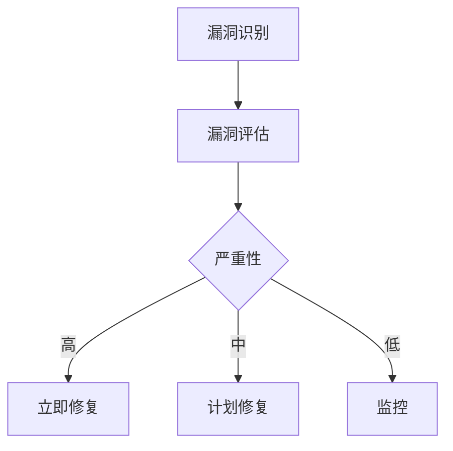

# 漏洞管理与修复

在当今的软件开发环境中，漏洞管理与修复是确保系统安全性和合规性的关键步骤。漏洞是指系统中可能被攻击者利用的弱点或缺陷。有效的漏洞管理不仅能够减少安全风险，还能提高系统的可靠性和稳定性。

## 什么是漏洞管理？

漏洞管理是一个系统化的过程，包括识别、评估、修复和监控系统中的漏洞。这个过程通常包括以下几个步骤：

1. **漏洞识别**：通过扫描工具或手动检查，发现系统中的潜在漏洞。
2. **漏洞评估**：评估漏洞的严重性和潜在影响，确定修复的优先级。
3. **漏洞修复**：开发并部署修复补丁或更新，以消除漏洞。
4. **漏洞监控**：持续监控系统，确保漏洞已被修复，并防止新的漏洞出现。

## 漏洞修复的步骤

### 1. 漏洞识别

在 Grafana Alloy 中，漏洞识别可以通过多种方式进行。例如，使用内置的安全扫描工具或第三方工具来检测系统中的漏洞。

```bash
# 使用内置工具扫描漏洞
grafana-alloy scan-vulnerabilities
```

### 2. 漏洞评估

一旦发现漏洞，下一步是评估其严重性。通常，漏洞的严重性分为高、中、低三个等级。评估时需要考虑漏洞的潜在影响、利用难度以及受影响的范围。



### 3. 漏洞修复

根据漏洞的严重性，制定修复计划。对于高严重性的漏洞，应立即修复；对于中低严重性的漏洞，可以在下一个版本或维护周期中修复。

```bash
# 修复高严重性漏洞
grafana-alloy apply-patch --severity high
```

### 4. 漏洞监控

修复漏洞后，需要持续监控系统，确保漏洞已被彻底修复，并且没有引入新的漏洞。

```bash
# 持续监控系统
grafana-alloy monitor-vulnerabilities
```

## 实际案例

假设我们在 Grafana Alloy 中发现了一个高严重性的 SQL 注入漏洞。以下是修复该漏洞的步骤：

1. **识别漏洞**：通过安全扫描工具发现了一个 SQL 注入漏洞。
2. **评估漏洞**：该漏洞允许攻击者执行任意 SQL 查询，严重性为高。
3. **修复漏洞**：开发团队立即修复了代码中的 SQL 查询，使用参数化查询来防止注入攻击。
4. **监控漏洞**：修复后，持续监控系统，确保漏洞已被修复，并且没有新的 SQL 注入漏洞出现。

```sql
-- 修复前的代码
SELECT * FROM users WHERE username = 'admin' AND password = 'password';

-- 修复后的代码
SELECT * FROM users WHERE username = ? AND password = ?;
```

## 总结

漏洞管理与修复是确保系统安全性和合规性的重要步骤。通过系统化的漏洞管理流程，可以有效地减少安全风险，提高系统的可靠性和稳定性。在 Grafana Alloy 中，使用内置工具和最佳实践，可以帮助你更好地管理和修复漏洞。

## 附加资源

- [Grafana Alloy 官方文档](https://grafana.com/docs/alloy/)
- [OWASP 漏洞管理指南](https://owasp.org/www-project-vulnerability-management/)
- [CVE 漏洞数据库](https://cve.mitre.org/)

## 练习

1. 使用 Grafana Alloy 的内置工具扫描你的系统，识别潜在的漏洞。
2. 评估发现的漏洞，确定其严重性和修复优先级。
3. 尝试修复一个中严重性的漏洞，并监控修复后的系统。

通过以上步骤，你将能够更好地理解和应用漏洞管理与修复的概念，确保你的系统更加安全可靠。