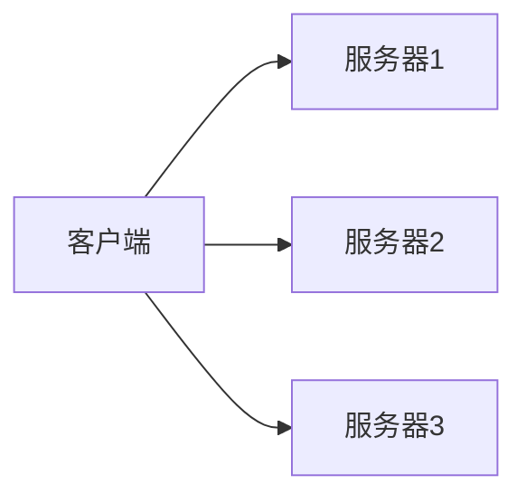
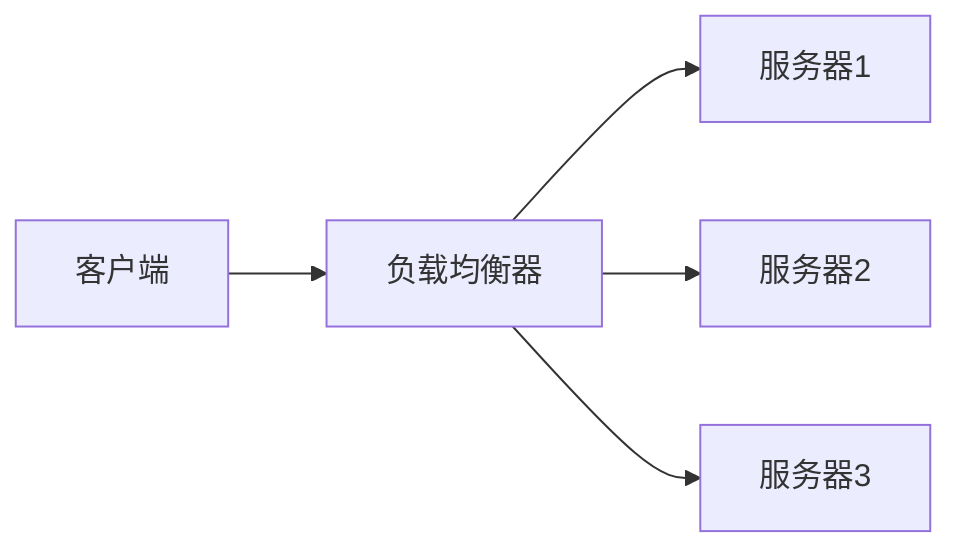
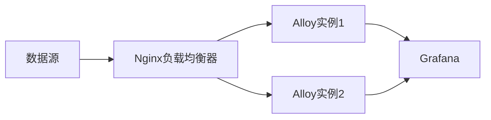

# 高可用架构设计

高可用性（High Availability, HA）是系统设计中的一个关键目标，旨在确保系统在出现故障时仍能持续运行。对于初学者来说，理解高可用架构设计是掌握现代分布式系统的基础。本文将逐步介绍高可用架构的核心概念，并通过实际案例展示其在Grafana Alloy中的应用。

## 什么是高可用架构？

高可用架构是一种系统设计方法，旨在通过冗余、故障转移和负载均衡等技术手段，最大限度地减少系统停机时间。高可用性通常用“可用性百分比”来衡量，例如99.9%的可用性意味着系统每年只能有约8.76小时的停机时间。

:::note
高可用性并不意味着系统永远不会宕机，而是通过设计减少宕机时间并快速恢复。
:::

## 高可用架构的核心组件

### 1. 冗余（Redundancy）
冗余是高可用架构的基础。通过部署多个相同的组件（如服务器、数据库或服务），系统可以在某个组件故障时继续运行。



### 2. 故障转移（Failover）
故障转移是指当主节点发生故障时，系统能够自动切换到备用节点。这通常通过心跳检测（Heartbeat）和健康检查（Health Check）来实现。


### 3. 负载均衡（Load Balancing）
负载均衡通过将流量分配到多个服务器，避免单点过载，同时提高系统的整体性能和可用性。



## 高可用架构的实现步骤

### 1. 设计冗余
在Grafana Alloy中，可以通过部署多个实例来实现冗余。例如，部署多个Alloy实例以处理监控数据的收集和转发。

```bash
# 启动多个Alloy实例
alloy --config.file=config1.yml &
alloy --config.file=config2.yml &
```

### 2. 配置故障转移
使用工具如`Prometheus`或`Consul`来监控Alloy实例的健康状态，并在主实例故障时自动切换到备用实例。

```yaml
# Prometheus配置示例
scrape_configs:
  - job_name: 'alloy'
    static_configs:
      - targets: ['alloy1:12345', 'alloy2:12345']
```

### 3. 设置负载均衡
使用`Nginx`或`HAProxy`等负载均衡器，将流量均匀分配到多个Alloy实例。

```nginx
# Nginx配置示例
upstream alloy {
    server alloy1:12345;
    server alloy2:12345;
}

server {
    location / {
        proxy_pass http://alloy;
    }
}
```

## 实际案例：Grafana Alloy的高可用部署

假设我们有一个监控系统，需要收集来自多个数据源的数据并将其转发到Grafana进行可视化。以下是高可用架构的设计步骤：

1. **部署多个Alloy实例**：在多个服务器上部署Alloy实例，确保每个实例都能独立处理数据。
2. **配置故障转移**：使用Prometheus监控Alloy实例的健康状态，并在主实例故障时自动切换到备用实例。
3. **设置负载均衡**：使用Nginx将流量均匀分配到多个Alloy实例，避免单点过载。



## 总结

高可用架构设计是确保系统稳定运行的关键。通过冗余、故障转移和负载均衡等技术手段，可以有效减少系统停机时间并提高整体性能。在Grafana Alloy中，高可用架构的设计和实现可以帮助我们构建一个稳定、可靠的监控系统。

## 附加资源与练习

- **练习**：尝试在自己的环境中部署多个Alloy实例，并配置Nginx实现负载均衡。
- **资源**：
  - [Grafana Alloy官方文档](https://grafana.com/docs/alloy/latest/)
  - [Prometheus高可用配置指南](https://prometheus.io/docs/prometheus/latest/high_availability/)
  - [Nginx负载均衡教程](https://nginx.org/en/docs/http/load_balancing.html)

:::tip
高可用架构的设计需要根据具体业务需求进行调整，建议在实际项目中逐步实践和优化。
:::