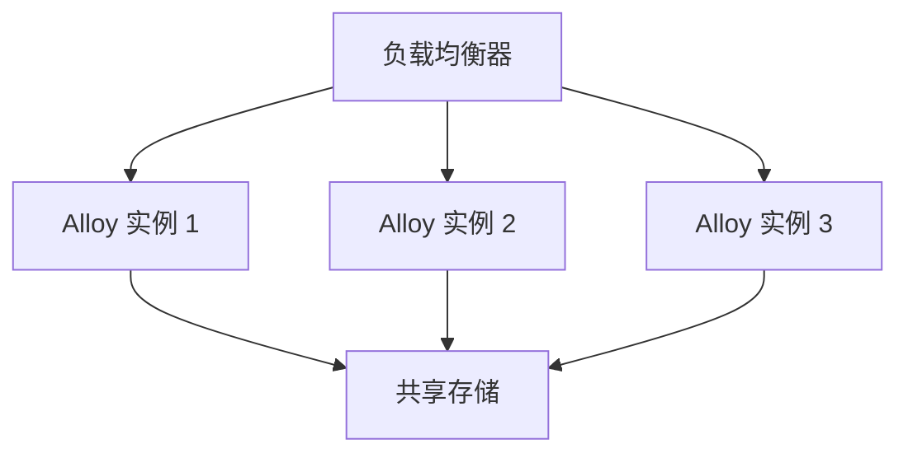

# 集群部署策略

在现代分布式系统中，高可用性（High Availability, HA）是一个关键目标。Grafana Alloy 作为一种高性能的监控和日志收集工具，支持通过集群化部署来实现高可用性。本文将详细介绍 Grafana Alloy 的集群部署策略，帮助初学者理解如何通过集群化部署来提升系统的稳定性和扩展性。

## 什么是集群部署？

集群部署是指将多个节点（服务器或实例）组合在一起，形成一个逻辑上的单一系统。这些节点可以协同工作，共同承担负载，并在某个节点发生故障时自动接管其任务，从而确保系统的高可用性。

在 Grafana Alloy 中，集群部署策略允许你将多个 Alloy 实例组合成一个集群，以实现以下目标：
- **高可用性**：即使某个实例发生故障，其他实例仍能继续工作。
- **负载均衡**：多个实例可以分担负载，避免单个实例过载。
- **扩展性**：通过增加实例数量，可以轻松扩展系统的处理能力。

## 集群部署的基本架构

Grafana Alloy 的集群部署通常包括以下组件：
1. **Alloy 实例**：每个实例都是一个独立的 Alloy 进程，负责收集和处理数据。
2. **负载均衡器**：用于将请求分发到不同的 Alloy 实例。
3. **共享存储**：用于存储配置和状态信息，确保所有实例的一致性。



## 集群部署策略

### 1. 主从模式（Leader-Follower）

在主从模式中，集群中的一个实例被选为主节点（Leader），负责处理所有写操作，而从节点（Follower）则负责处理读操作。如果主节点发生故障，从节点中的一个会被提升为新的主节点。

**优点**：
- 简单易实现。
- 适合读多写少的场景。

**缺点**：
- 主节点可能成为性能瓶颈。
- 主节点故障时，切换过程可能导致短暂的服务中断。

### 2. 多主模式（Multi-Leader）

在多主模式中，所有实例都可以处理读写操作。每个实例都会将数据同步到其他实例，以确保数据的一致性。

**优点**：
- 更高的可用性和扩展性。
- 适合读写均衡的场景。

**缺点**：
- 数据同步可能带来复杂性。
- 需要解决冲突问题。

### 3. 无主模式（Leaderless）

在无主模式中，所有实例都是平等的，没有主从之分。客户端可以直接与任意实例通信，实例之间通过一致性协议（如 Raft 或 Paxos）来确保数据的一致性。

**优点**：
- 更高的可用性和容错性。
- 适合分布式环境。

**缺点**：
- 实现复杂。
- 需要处理网络分区等问题。

## 实际案例

假设你正在为一个大型电商网站部署 Grafana Alloy 来监控其服务器和应用程序。为了确保系统的高可用性，你决定采用多主模式的集群部署策略。

### 部署步骤

1. **配置共享存储**：使用一个分布式数据库（如 etcd）来存储 Alloy 的配置和状态信息。
2. **启动多个 Alloy 实例**：在每个服务器上启动一个 Alloy 实例，并配置它们连接到共享存储。
3. **配置负载均衡器**：使用 Nginx 或 HAProxy 作为负载均衡器，将请求分发到不同的 Alloy 实例。
4. **测试故障切换**：模拟一个 Alloy 实例的故障，确保其他实例能够接管其任务。

### 示例配置

以下是一个简单的 Alloy 配置文件示例，展示了如何配置多个实例以连接到共享存储：

```yaml
# alloy.yaml
storage:
  type: "etcd"
  endpoints:
    - "http://etcd1:2379"
    - "http://etcd2:2379"
    - "http://etcd3:2379"

instances:
  - name: "instance1"
    address: "0.0.0.0:8080"
  - name: "instance2"
    address: "0.0.0.0:8081"
  - name: "instance3"
    address: "0.0.0.0:8082"
```

## 总结

集群部署策略是实现 Grafana Alloy 高可用性的关键。通过选择合适的部署模式（如主从模式、多主模式或无主模式），你可以确保系统在面对故障时仍能保持稳定运行。本文介绍了集群部署的基本概念、架构和实际案例，希望能帮助你更好地理解和应用这些策略。

## 附加资源

- [Grafana Alloy 官方文档](https://grafana.com/docs/alloy/latest/)
- [etcd 官方文档](https://etcd.io/docs/)
- [Nginx 负载均衡配置指南](https://nginx.org/en/docs/http/load_balancing.html)

## 练习

1. 尝试在一个本地环境中部署一个包含三个 Alloy 实例的集群，并使用负载均衡器进行测试。
2. 模拟一个实例的故障，观察集群的行为，并记录故障切换的时间。
3. 研究不同的共享存储方案（如 etcd、Consul），并比较它们在集群部署中的优缺点。
