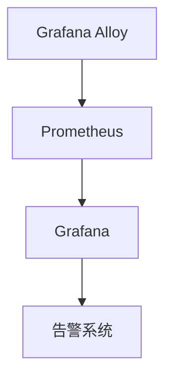

# 升级与维护策略

在 Grafana Alloy 的高可用部署中，升级与维护策略是确保系统长期稳定运行的关键。无论是修复漏洞、优化性能，还是引入新功能，都需要一个明确的策略来指导操作。本文将详细介绍如何制定和执行升级与维护策略，帮助初学者掌握这一重要技能。

## 什么是升级与维护策略？

升级与维护策略是指在系统运行过程中，如何有计划地进行软件更新、硬件维护以及故障排除的一系列操作。对于 Grafana Alloy 这样的高可用系统，升级与维护策略需要特别关注以下几点：

1. **最小化停机时间**：确保系统在升级或维护期间仍能提供服务。
2. **数据一致性**：在升级过程中，确保数据不会丢失或损坏。
3. **回滚机制**：如果升级失败，能够快速恢复到之前的稳定状态。

## 升级策略

### 1. 版本控制

在升级之前，首先要明确当前系统的版本以及目标版本。Grafana Alloy 的版本控制通常遵循语义化版本（SemVer）规范，即 `主版本号.次版本号.修订号`。例如，`v1.2.3` 表示主版本号为 1，次版本号为 2，修订号为 3。

:::tip
在升级之前，务必查看官方发布的[升级日志](https://grafana.com/docs/alloy/latest/release-notes/)和[迁移指南](https://grafana.com/docs/alloy/latest/migration/)，了解新版本的变化和潜在的不兼容问题。
:::

### 2. 分阶段升级

对于高可用系统，建议采用分阶段升级策略。具体步骤如下：

1. **测试环境验证**：首先在测试环境中进行升级，验证新版本的稳定性和兼容性。
2. **灰度发布**：在生产环境中选择一部分节点进行升级，观察其运行情况。
3. **全量升级**：如果灰度发布没有问题，再逐步升级所有节点。

```bash
# 示例：在 Kubernetes 中分阶段升级 Grafana Alloy
kubectl rollout restart deployment/alloy-deployment --namespace=monitoring
```

### 3. 回滚机制

在升级过程中，如果发现问题，需要能够快速回滚到之前的版本。Grafana Alloy 通常支持通过配置文件或命令行工具进行回滚。

```bash
# 示例：回滚到上一个版本
kubectl rollout undo deployment/alloy-deployment --namespace=monitoring
```

## 维护策略

### 1. 定期备份

定期备份是维护策略中的重要环节。对于 Grafana Alloy，需要备份配置文件、数据库以及日志文件。

```bash
# 示例：备份配置文件
cp /etc/alloy/config.yaml /backup/alloy-config-$(date +%F).yaml
```

### 2. 监控与告警

在维护过程中，实时监控系统的运行状态至关重要。Grafana Alloy 本身提供了丰富的监控指标，可以通过 Prometheus 和 Grafana 进行可视化展示。



### 3. 自动化维护

为了减少人为错误，建议使用自动化工具进行维护操作。例如，使用 Ansible 或 Terraform 自动化部署和升级。

```yaml
# 示例：使用 Ansible 自动化升级
- name: Upgrade Grafana Alloy
  hosts: all
  tasks:
    - name: Download latest version
      get_url:
        url: https://github.com/grafana/alloy/releases/latest/download/alloy-linux-amd64
        dest: /usr/local/bin/alloy
    - name: Restart service
      service:
        name: alloy
        state: restarted
```

## 实际案例

假设你负责一个 Grafana Alloy 高可用集群的维护工作。某天，你收到通知，新版本 `v1.3.0` 修复了一个重要的安全漏洞。你需要在不影响业务的情况下完成升级。

1. **测试环境验证**：在测试环境中升级到 `v1.3.0`，验证功能正常。
2. **灰度发布**：在生产环境中选择 10% 的节点进行升级，观察 24 小时。
3. **全量升级**：确认无问题后，逐步升级所有节点。
4. **回滚准备**：在升级过程中，始终保持回滚机制可用，以防万一。

## 总结

升级与维护策略是 Grafana Alloy 高可用部署中不可或缺的一部分。通过合理的版本控制、分阶段升级、定期备份以及自动化维护，可以确保系统的稳定性和可靠性。希望本文能帮助你更好地理解和应用这些策略。

## 附加资源

- [Grafana Alloy 官方文档](https://grafana.com/docs/alloy/latest/)
- [Kubernetes 部署指南](https://kubernetes.io/docs/concepts/workloads/controllers/deployment/)
- [Ansible 自动化工具](https://docs.ansible.com/ansible/latest/index.html)

## 练习

1. 在你的测试环境中，尝试升级 Grafana Alloy 到最新版本，并记录升级过程中的关键步骤。
2. 设计一个自动化脚本，用于定期备份 Grafana Alloy 的配置文件和数据库。
3. 在 Grafana 中创建一个仪表盘，监控 Grafana Alloy 的运行状态，并设置告警规则。