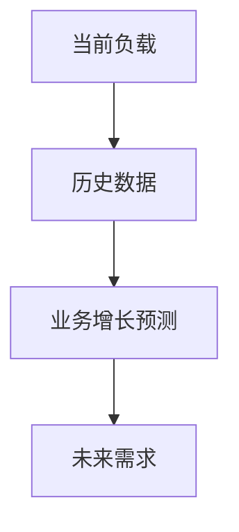
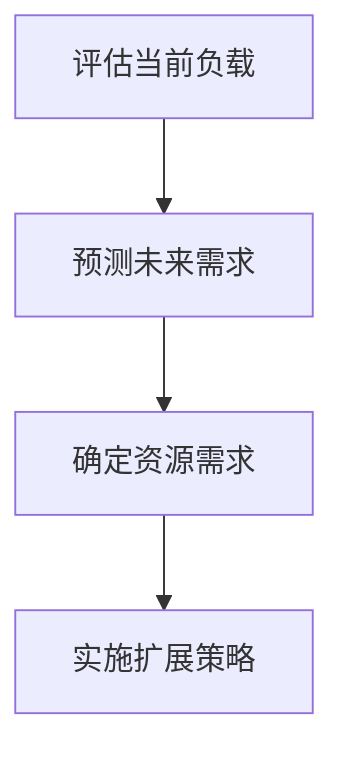

## 介绍

在 Grafana Alloy 的高可用部署中，容量规划与扩展是确保系统能够高效处理不断增长的工作负载的关键步骤。容量规划涉及评估系统的当前和未来需求，以确定所需的资源（如 CPU、内存、存储和网络带宽）。扩展则是在需求增加时，通过增加资源或优化现有资源来提升系统性能的过程。

本文将逐步讲解如何进行容量规划与扩展，并通过实际案例展示其应用场景。

## 容量规划

### 1. 评估当前负载

首先，您需要评估系统的当前负载。这包括：

- **CPU 使用率**：监控 CPU 的使用情况，确保没有过载。
- **内存使用率**：检查内存的使用情况，避免内存不足。
- **存储需求**：评估存储的使用情况，确保有足够的磁盘空间。
- **网络带宽**：监控网络流量，确保网络带宽能够满足需求。

```bash
# 示例：使用 Prometheus 查询 CPU 使用率
rate(process_cpu_seconds_total[1m])
```

### 2. 预测未来需求

基于历史数据和业务增长预测，估算未来的资源需求。例如，如果您的业务每月增长 10%，您需要相应地增加资源。



### 3. 确定资源需求

根据评估和预测，确定所需的资源。例如，如果您的 CPU 使用率预计在未来 6 个月内增加 50%，您需要增加相应的 CPU 资源。

## 扩展策略

### 1. 垂直扩展

垂直扩展是通过增加单个节点的资源（如 CPU、内存）来提升系统性能。这种方法适用于负载增长较小的情况。

```bash
# 示例：增加 Kubernetes Pod 的 CPU 限制
resources:
  limits:
    cpu: "2"
```

### 2. 水平扩展

水平扩展是通过增加节点数量来分散负载。这种方法适用于负载增长较大的情况。

```bash
# 示例：增加 Kubernetes 集群的节点数量
kubectl scale deployment my-deployment --replicas=5
```

### 3. 自动扩展

自动扩展是根据实时负载动态调整资源。例如，Kubernetes 的 Horizontal Pod Autoscaler (HPA) 可以根据 CPU 使用率自动调整 Pod 数量。

```bash
# 示例：配置 HPA
apiVersion: autoscaling/v2beta2
kind: HorizontalPodAutoscaler
metadata:
  name: my-hpa
spec:
  scaleTargetRef:
    apiVersion: apps/v1
    kind: Deployment
    name: my-deployment
  minReplicas: 1
  maxReplicas: 10
  metrics:
  - type: Resource
    resource:
      name: cpu
      target:
        type: Utilization
        averageUtilization: 50
```

## 实际案例

### 案例：电商平台的容量规划与扩展

假设您运营一个电商平台，预计在节假日期间流量将增加 300%。您需要进行以下步骤：

1. **评估当前负载**：监控当前的 CPU、内存、存储和网络带宽使用情况。
2. **预测未来需求**：基于历史数据，预测节假日期间的资源需求。
3. **确定资源需求**：根据预测，增加相应的资源。
4. **实施扩展策略**：使用水平扩展和自动扩展，确保系统能够应对流量高峰。



## 总结

容量规划与扩展是确保 Grafana Alloy 高可用部署能够高效处理不断增长的工作负载的关键步骤。通过评估当前负载、预测未来需求、确定资源需求，并实施适当的扩展策略，您可以确保系统的稳定性和性能。

## 附加资源

- [Grafana Alloy 官方文档](https://grafana.com/docs/alloy/latest/)
- [Kubernetes 自动扩展指南](https://kubernetes.io/docs/tasks/run-application/horizontal-pod-autoscale/)
- [Prometheus 监控指南](https://prometheus.io/docs/introduction/overview/)

## 练习

1. 使用 Prometheus 监控您的系统，评估当前负载。
2. 基于历史数据，预测未来 6 个月的资源需求。
3. 配置 Kubernetes 的 Horizontal Pod Autoscaler，实现自动扩展。
