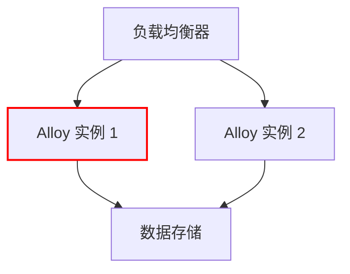

# 高可用测试与验证

在分布式系统中，高可用性（High Availability, HA）是一个关键的设计目标。高可用性意味着系统能够在部分组件发生故障时，仍然保持正常运行。Grafana Alloy 是一个强大的工具，支持高可用部署，但仅仅部署高可用架构是不够的，我们还需要对其进行测试与验证，以确保系统在真实故障场景下能够按预期工作。

本文将逐步介绍如何对 Grafana Alloy 的高可用部署进行测试与验证，包括故障注入、监控和恢复验证等内容。

## 什么是高可用测试与验证？

高可用测试与验证是指通过模拟故障场景，验证系统在高可用架构下的表现。测试的目标是确保系统在部分组件失效时，能够自动切换到备用组件，并且不会导致服务中断或数据丢失。

:::note
高可用测试不仅仅是验证系统是否能够继续运行，还需要验证系统的性能、数据一致性和恢复能力。
:::

## 高可用测试的步骤

### 1. 准备测试环境

首先，我们需要准备一个高可用的 Grafana Alloy 部署环境。假设我们已经部署了两个 Alloy 实例，分别运行在不同的服务器上，并且配置了负载均衡器来分发流量。

```bash
# 示例：启动两个 Alloy 实例
alloy --config.file=/path/to/alloy1/config.yml &
alloy --config.file=/path/to/alloy2/config.yml &
```

### 2. 模拟故障场景

接下来，我们需要模拟一些常见的故障场景，例如：

- **网络分区**：模拟两个 Alloy 实例之间的网络中断。
- **节点故障**：模拟其中一个 Alloy 实例崩溃。
- **磁盘故障**：模拟存储数据的磁盘损坏。

#### 示例：模拟节点故障

我们可以通过手动停止其中一个 Alloy 实例来模拟节点故障：

```bash
# 停止 Alloy 实例 1
killall -9 alloy
```

### 3. 监控系统行为

在模拟故障后，我们需要监控系统的行为，确保流量能够正确地切换到备用实例，并且没有数据丢失。

:::tip
使用 Grafana 监控面板来实时观察系统的状态变化，例如请求成功率、延迟和错误率。
:::



在上面的图表中，Alloy 实例 1 被标记为故障状态（红色），负载均衡器应该将流量切换到 Alloy 实例 2。

### 4. 验证数据一致性

在故障恢复后，我们需要验证数据的一致性，确保在故障期间没有数据丢失或损坏。

```bash
# 检查数据存储中的日志
cat /var/log/alloy/data.log
```

### 5. 恢复测试

最后，我们需要验证系统在故障恢复后的表现。例如，重新启动故障的 Alloy 实例，并确保它能够重新加入集群并恢复正常工作。

```bash
# 重新启动 Alloy 实例 1
alloy --config.file=/path/to/alloy1/config.yml &
```

## 实际案例

假设我们有一个在线商店，使用 Grafana Alloy 来监控订单处理系统。在高可用测试中，我们模拟了一个 Alloy 实例的故障，并观察到以下结果：

1. 负载均衡器成功将流量切换到备用实例。
2. 订单处理系统继续正常运行，没有出现服务中断。
3. 在故障恢复后，所有订单数据保持一致，没有丢失。

## 总结

高可用测试与验证是确保分布式系统可靠性的关键步骤。通过模拟故障场景并验证系统的表现，我们可以确保 Grafana Alloy 在真实生产环境中能够应对各种故障情况。

:::caution
在进行高可用测试时，务必在非生产环境中进行，以避免对实际业务造成影响。
:::

## 附加资源

- [Grafana Alloy 官方文档](https://grafana.com/docs/alloy/latest/)
- [高可用性设计模式](https://en.wikipedia.org/wiki/High_availability)
- [分布式系统故障注入测试工具](https://github.com/Netflix/chaosmonkey)

## 练习

1. 在你的本地环境中部署两个 Grafana Alloy 实例，并配置负载均衡器。
2. 模拟一个节点故障，观察系统的行为并记录结果。
3. 验证数据一致性，并尝试恢复故障节点。
