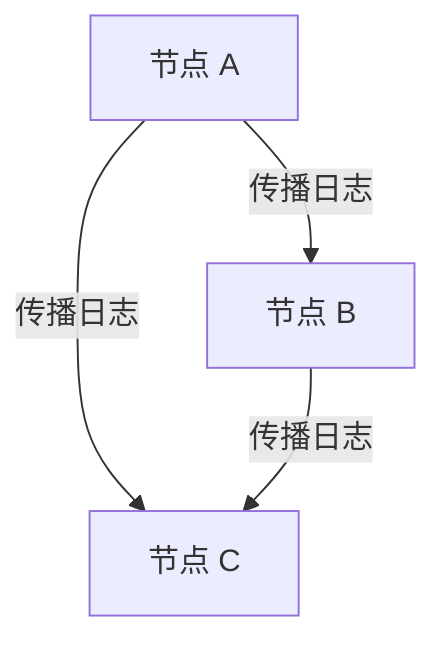

# 状态同步与一致性

在分布式系统中，**状态同步**和**一致性**是两个至关重要的概念。它们确保了多个节点之间的数据保持一致，从而避免数据丢失或不一致的情况。本文将详细介绍这些概念，并通过实际案例帮助你理解它们在 Grafana Alloy 高可用部署中的应用。

## 什么是状态同步与一致性？

### 状态同步
**状态同步**是指在分布式系统中，多个节点之间的数据状态保持一致的过程。当一个节点的状态发生变化时，其他节点需要及时更新以反映这一变化。状态同步的目标是确保所有节点在任何时刻都拥有相同的数据视图。

### 一致性
**一致性**是指分布式系统中的所有节点在同一时间对数据的看法是一致的。一致性模型定义了系统在数据更新和读取时的行为。常见的一致性模型包括强一致性、弱一致性和最终一致性。

## 状态同步的工作原理

在 Grafana Alloy 高可用部署中，状态同步通常通过以下步骤实现：

1. **数据更新**：当一个节点接收到新的数据或状态变化时，它会将这一变化记录到本地存储中。
2. **数据传播**：该节点会将这一变化传播给其他节点，通常通过消息队列或分布式日志系统。
3. **数据应用**：其他节点接收到变化后，会将其应用到本地存储中，确保所有节点的状态保持一致。

### 代码示例
以下是一个简单的状态同步示例，展示了如何在两个节点之间同步状态：

```python
# 节点 A
def update_state(state, new_value):
    state['value'] = new_value
    return state

# 节点 B
def apply_update(state, update):
    state.update(update)
    return state

# 示例
state_a = {'value': 0}
state_b = {'value': 0}

# 节点 A 更新状态
state_a = update_state(state_a, 1)

# 节点 A 将更新传播给节点 B
state_b = apply_update(state_b, state_a)

print("节点 A 的状态:", state_a)
print("节点 B 的状态:", state_b)
```

**输出：**
```
节点 A 的状态: {'value': 1}
节点 B 的状态: {'value': 1}
```

## 一致性模型

### 强一致性
在强一致性模型中，任何读取操作都会返回最新的写入结果。这意味着所有节点在任何时刻都拥有相同的数据视图。

### 最终一致性
在最终一致性模型中，系统保证在没有新的更新操作的情况下，最终所有节点都会达到一致的状态。这种模型在分布式系统中非常常见，因为它允许系统在短时间内存在不一致的情况，从而提高性能和可用性。

### 代码示例
以下是一个最终一致性的示例，展示了如何在分布式系统中实现最终一致性：

```python
# 节点 A
def update_state(state, new_value):
    state['value'] = new_value
    return state

# 节点 B
def apply_update(state, update):
    state.update(update)
    return state

# 示例
state_a = {'value': 0}
state_b = {'value': 0}

# 节点 A 更新状态
state_a = update_state(state_a, 1)

# 节点 A 将更新传播给节点 B
state_b = apply_update(state_b, state_a)

# 模拟延迟
import time
time.sleep(1)

print("节点 A 的状态:", state_a)
print("节点 B 的状态:", state_b)
```

**输出：**
```
节点 A 的状态: {'value': 1}
节点 B 的状态: {'value': 1}
```

## 实际应用场景

### Grafana Alloy 高可用部署
在 Grafana Alloy 高可用部署中，状态同步和一致性是确保系统可靠性的关键。例如，当多个 Prometheus 实例同时收集指标数据时，Grafana Alloy 需要确保这些数据在所有实例之间保持一致，以避免数据丢失或不一致的情况。

### 案例：分布式日志系统
假设我们有一个分布式日志系统，多个节点同时接收日志数据。为了确保所有节点的日志数据一致，系统需要实现状态同步和一致性机制。当一个节点接收到新的日志数据时，它会将这一数据传播给其他节点，并确保所有节点最终都拥有相同的日志数据。



## 总结

状态同步和一致性是分布式系统中确保数据可靠性和一致性的关键机制。通过理解这些概念及其实现方式，你可以更好地设计和维护高可用的分布式系统，如 Grafana Alloy。

## 附加资源与练习

- **练习**：尝试在一个简单的分布式系统中实现状态同步和一致性机制，并测试其在不同网络条件下的表现。
- **资源**：阅读更多关于分布式系统的书籍和文章，如《分布式系统：概念与设计》。

:::tip
在实际应用中，选择合适的一致性模型和同步策略非常重要。强一致性适用于对数据一致性要求极高的场景，而最终一致性则适用于对性能和可用性要求更高的场景。
:::