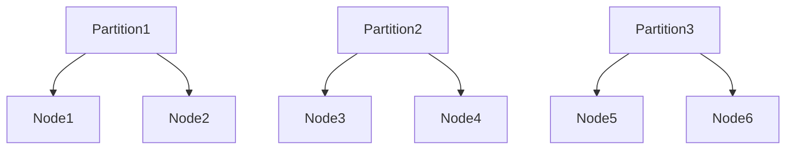

## 介绍

在网络架构中，**网络隔离**和**分区**是两个关键概念，它们在高可用性（High Availability, HA）系统中尤为重要。网络隔离是指通过物理或逻辑手段将网络划分为多个独立的区域，以减少故障传播的风险。分区则是将系统划分为多个独立的部分，每个部分可以独立运行，从而提高系统的容错能力。

在 Grafana Alloy 的高可用部署中，网络隔离与分区可以帮助我们确保即使某个部分发生故障，整个系统仍能继续运行。本文将逐步讲解这些概念，并通过实际案例展示它们如何应用于真实场景。

## 网络隔离

网络隔离的主要目的是限制故障的传播范围。通过将网络划分为多个独立的区域，可以确保一个区域的故障不会影响到其他区域。常见的网络隔离方法包括：

1. **物理隔离**：使用不同的物理设备（如交换机、路由器）来分隔网络。
2. **逻辑隔离**：通过 VLAN、子网划分等技术在同一个物理网络中创建多个逻辑网络。

### 示例：VLAN 隔离

假设我们有一个 Grafana Alloy 集群，包含三个节点：`node1`、`node2` 和 `node3`。我们可以使用 VLAN 将这些节点隔离到不同的网络中。

```bash
# 配置 VLAN
vlan 10
 name Grafana-Alloy-Node1
vlan 20
 name Grafana-Alloy-Node2
vlan 30
 name Grafana-Alloy-Node3
```

通过这种方式，即使 `node1` 所在的 VLAN 发生故障，`node2` 和 `node3` 仍然可以正常运行。

## 分区

分区是指将系统划分为多个独立的部分，每个部分可以独立运行。在高可用系统中，分区可以帮助我们实现故障隔离和负载均衡。

### 示例：Grafana Alloy 分区部署

假设我们有一个 Grafana Alloy 集群，包含三个分区：`partition1`、`partition2` 和 `partition3`。每个分区包含一组独立的节点。



在这个例子中，每个分区都可以独立运行。如果 `partition1` 发生故障，`partition2` 和 `partition3` 仍然可以继续提供服务。

## 实际案例

### 案例：电商平台的高可用部署

假设我们正在为一个电商平台部署 Grafana Alloy 集群。为了提高系统的可靠性，我们决定使用网络隔离和分区。

1. **网络隔离**：我们将用户服务、订单服务和支付服务分别隔离到不同的 VLAN 中。
2. **分区**：我们将每个服务划分为多个分区，每个分区包含一组独立的节点。

通过这种方式，即使某个服务或分区发生故障，其他服务仍能继续运行，从而确保整个电商平台的可用性。

## 总结

网络隔离与分区是 Grafana Alloy 高可用部署中的关键概念。通过合理的网络隔离和分区设计，我们可以有效减少故障传播的风险，提高系统的可靠性和安全性。

## 附加资源

- [Grafana Alloy 官方文档](https://grafana.com/docs/alloy/latest/)
- [网络隔离与分区的最佳实践](https://example.com/network-isolation-partitioning-best-practices)

## 练习

1. 尝试在你的本地环境中配置 VLAN，并将不同的服务隔离到不同的 VLAN 中。
2. 设计一个包含多个分区的 Grafana Alloy 集群，并测试其中一个分区发生故障时系统的行为。
