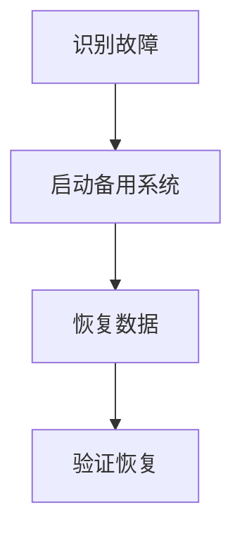

## 介绍

在 Grafana Alloy 的高可用部署中，灾难恢复规划是确保系统在面临硬件故障、网络中断、自然灾害或其他不可预见事件时能够快速恢复的关键步骤。灾难恢复规划不仅仅是备份数据，它还包括制定详细的恢复策略、测试恢复流程以及确保团队能够高效执行这些流程。

本文将逐步介绍如何为 Grafana Alloy 高可用部署制定灾难恢复规划，并通过实际案例展示其重要性。

## 灾难恢复规划的核心要素

### 1. 风险评估

首先，您需要识别可能影响 Grafana Alloy 部署的潜在风险。这些风险可能包括：

- **硬件故障**：服务器、存储设备或网络设备的故障。
- **软件故障**：Grafana Alloy 或相关依赖组件的崩溃。
- **自然灾害**：洪水、地震等可能导致数据中心不可用的事件。
- **人为错误**：配置错误、误删除数据等。

:::tip
进行风险评估时，建议与团队一起头脑风暴，列出所有可能的威胁，并评估它们对系统的影响。
:::

### 2. 备份策略

备份是灾难恢复的基础。您需要确保 Grafana Alloy 的配置、数据和相关组件（如 Prometheus、Loki 等）都定期备份。以下是一个简单的备份策略示例：

```bash
# 备份 Grafana Alloy 配置文件
cp /etc/grafana-alloy/config.yaml /backup/grafana-alloy-config.yaml

# 备份 Prometheus 数据
rsync -avz /var/lib/prometheus/data /backup/prometheus-data
```

:::caution
确保备份存储在异地或云存储中，以防止本地灾难导致备份丢失。
:::

### 3. 恢复流程

制定详细的恢复流程是灾难恢复规划的核心。以下是一个简化的恢复流程示例：

1. **识别故障**：通过监控系统（如 Grafana）检测到 Grafana Alloy 服务不可用。
2. **启动备用系统**：如果主系统不可用，切换到备用 Grafana Alloy 实例。
3. **恢复数据**：从备份中恢复配置和数据。
4. **验证恢复**：确保系统功能正常，数据完整。



### 4. 测试与演练

定期测试灾难恢复流程是确保其有效性的关键。您可以通过模拟故障场景来测试恢复流程，例如：

- 关闭主 Grafana Alloy 实例，观察备用实例是否自动接管。
- 删除部分数据，验证备份恢复是否成功。

:::warning
测试过程中可能会影响生产环境，建议在非高峰时段进行，并提前通知相关团队。
:::

## 实际案例

### 案例：数据中心断电

假设您的 Grafana Alloy 部署在一个数据中心，突然发生断电。以下是灾难恢复规划的应对步骤：

1. **识别故障**：监控系统显示 Grafana Alloy 服务不可用，数据中心断电。
2. **启动备用系统**：切换到位于另一个数据中心的备用 Grafana Alloy 实例。
3. **恢复数据**：从云存储中恢复最新的备份数据。
4. **验证恢复**：检查 Grafana 仪表板是否正常显示，数据是否完整。

通过上述步骤，系统在短时间内恢复正常运行，避免了长时间的服务中断。

## 总结

灾难恢复规划是 Grafana Alloy 高可用部署中不可或缺的一部分。通过风险评估、备份策略、恢复流程和定期测试，您可以确保系统在面临灾难时能够快速恢复，最大限度地减少停机时间和数据丢失。

## 附加资源

- [Grafana Alloy 官方文档](https://grafana.com/docs/alloy/latest/)
- [Prometheus 备份与恢复指南](https://prometheus.io/docs/prometheus/latest/storage/)
- [Loki 数据备份策略](https://grafana.com/docs/loki/latest/operations/storage/backup/)

## 练习

1. 为您的 Grafana Alloy 部署制定一个详细的备份策略。
2. 模拟一次灾难场景（如删除配置文件），并尝试从备份中恢复。
3. 与团队一起进行一次灾难恢复演练，记录并改进恢复流程。

通过以上步骤，您将能够更好地应对潜在的灾难，确保 Grafana Alloy 部署的高可用性。