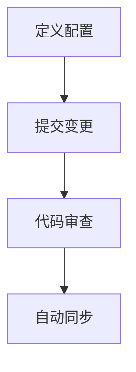

# GitOps与配置管理

在现代云原生应用开发中，**GitOps** 是一种基于Git的运维实践，旨在通过版本控制系统（如Git）来管理和自动化基础设施与应用程序的部署。它结合了**配置管理**的理念，使得整个系统的状态可以通过代码来定义和追踪。本文将带你深入了解GitOps的核心概念，并通过实际案例展示其应用场景。

## 什么是GitOps？

GitOps是一种将Git作为单一事实来源（Single Source of Truth）的运维模式。它通过将基础设施和应用程序的配置存储在Git仓库中，并使用自动化工具（如ArgoCD、Flux等）来同步这些配置到目标环境。GitOps的核心原则包括：

1. **声明式配置**：所有配置都以声明式的方式定义，系统根据这些配置自动调整状态。
2. **版本控制**：所有变更都通过Git进行版本控制，便于追踪和回滚。
3. **自动化**：通过自动化工具实现配置的持续部署和同步。

## GitOps与配置管理的关系

配置管理是GitOps的重要组成部分。通过将配置存储在Git仓库中，团队可以确保配置的一致性和可追溯性。GitOps工具会监控Git仓库中的变更，并自动将这些变更应用到目标环境，从而实现配置的自动化管理。

### 配置管理的核心概念

1. **声明式配置**：使用YAML或JSON等格式定义系统的期望状态。
2. **版本控制**：通过Git管理配置的变更历史。
3. **自动化同步**：使用工具自动将Git中的配置同步到目标环境。

## GitOps的工作流程

以下是GitOps的典型工作流程：

1. **定义配置**：在Git仓库中定义基础设施和应用程序的配置。
2. **提交变更**：开发人员通过Pull Request提交配置变更。
3. **代码审查**：团队审查并合并变更到主分支。
4. **自动同步**：GitOps工具检测到变更并自动同步到目标环境。



## 实际案例：使用ArgoCD实现GitOps

以下是一个使用ArgoCD实现GitOps的简单示例。假设我们有一个Kubernetes集群，并希望通过GitOps管理应用的部署。

### 步骤1：定义Kubernetes清单

在Git仓库中创建一个名为`app.yaml`的文件，定义应用的Kubernetes清单：

```yaml
apiVersion: apps/v1
kind: Deployment
metadata:
  name: my-app
spec:
  replicas: 3
  template:
    spec:
      containers:
      - name: my-app
        image: my-app:1.0.0
```

### 步骤2：配置ArgoCD

在ArgoCD中创建一个应用，指向Git仓库中的`app.yaml`文件：

```yaml
apiVersion: argoproj.io/v1alpha1
kind: Application
metadata:
  name: my-app
spec:
  destination:
    namespace: default
    server: https://kubernetes.default.svc
  source:
    repoURL: https://github.com/my-org/my-repo.git
    path: .
    targetRevision: main
  project: default
  syncPolicy:
    automated:
      prune: true
      selfHeal: true
```

### 步骤3：提交变更并自动同步

当你将`app.yaml`文件提交到Git仓库的主分支时，ArgoCD会自动检测到变更，并将应用部署到Kubernetes集群中。

:::tip
你可以通过ArgoCD的UI界面查看应用的同步状态和日志，确保部署过程顺利进行。
:::

## 总结

GitOps通过将配置管理与Git结合，提供了一种高效、可靠的运维模式。它不仅简化了部署流程，还增强了系统的可追溯性和一致性。对于初学者来说，掌握GitOps的核心概念和实践方法，将为你在云原生领域的进一步发展奠定坚实基础。

## 附加资源

- [ArgoCD官方文档](https://argo-cd.readthedocs.io/)
- [Flux官方文档](https://fluxcd.io/docs/)
- [GitOps实践指南](https://www.gitops.tech/)

## 练习

1. 创建一个Git仓库，并定义一个简单的Kubernetes应用清单。
2. 使用ArgoCD或Flux配置GitOps，将应用部署到Kubernetes集群中。
3. 尝试修改应用清单，观察GitOps工具如何自动同步变更。

通过以上练习，你将更深入地理解GitOps的工作原理和实际应用。