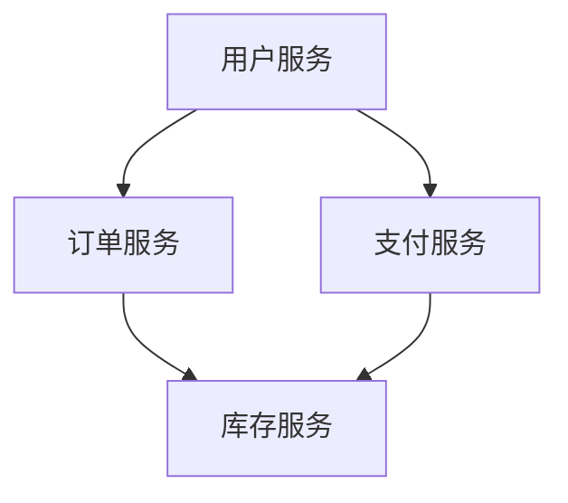

# 云原生最佳实践

## 介绍

云原生（Cloud Native）是一种构建和运行应用程序的方法，它充分利用了云计算的优势。云原生应用通常设计为微服务架构，运行在容器中，并通过自动化工具进行管理和部署。云原生的核心目标是提高开发效率、增强系统的可扩展性和可靠性。

在本指南中，我们将探讨云原生技术的最佳实践，帮助初学者理解如何构建高效、可扩展和可靠的云原生应用。

## 1. 使用容器化技术

容器化是云原生应用的基础。容器将应用程序及其依赖项打包在一起，确保在不同环境中运行的一致性。Docker 是最常用的容器化工具之一。

### 示例：创建一个简单的 Docker 容器

```dockerfile
# Dockerfile
FROM python:3.8-slim
WORKDIR /app
COPY . /app
RUN pip install -r requirements.txt
CMD ["python", "app.py"]
```

在这个示例中，我们创建了一个基于 Python 3.8 的 Docker 镜像，并将应用程序代码复制到容器中。然后，我们安装了所需的依赖项，并指定了启动命令。

## 2. 采用微服务架构

微服务架构将应用程序拆分为多个小型、独立的服务，每个服务负责特定的功能。这种架构提高了系统的灵活性和可维护性。

### 示例：微服务架构



在这个示例中，用户服务、订单服务、支付服务和库存服务都是独立的微服务，它们通过 API 进行通信。

## 3. 使用 Kubernetes 进行容器编排

Kubernetes 是一个开源的容器编排平台，用于自动化部署、扩展和管理容器化应用。它提供了强大的功能，如自动扩展、负载均衡和故障恢复。

### 示例：部署一个简单的 Kubernetes 应用

```yaml
# deployment.yaml
apiVersion: apps/v1
kind: Deployment
metadata:
  name: my-app
spec:
  replicas: 3
  selector:
    matchLabels:
      app: my-app
  template:
    metadata:
      labels:
        app: my-app
    spec:
      containers:
      - name: my-app
        image: my-app:1.0
        ports:
        - containerPort: 80
```

在这个示例中，我们定义了一个 Kubernetes Deployment，它创建了 3 个副本的 `my-app` 容器，并将它们暴露在端口 80 上。

## 4. 实施持续集成和持续交付（CI/CD）

持续集成和持续交付（CI/CD）是云原生开发的关键实践。它们通过自动化构建、测试和部署流程，提高了开发效率和软件质量。

### 示例：使用 GitHub Actions 实现 CI/CD

```yaml
# .github/workflows/ci-cd.yaml
name: CI/CD Pipeline

on:
  push:
    branches:
      - main

jobs:
  build:
    runs-on: ubuntu-latest
    steps:
    - uses: actions/checkout@v2
    - name: Build Docker image
      run: docker build -t my-app .
    - name: Push Docker image
      run: docker push my-app
  deploy:
    runs-on: ubuntu-latest
    needs: build
    steps:
    - name: Deploy to Kubernetes
      run: kubectl apply -f deployment.yaml
```

在这个示例中，我们定义了一个 GitHub Actions 工作流，它在每次推送到 `main` 分支时自动构建 Docker 镜像并将其部署到 Kubernetes。

## 5. 监控和日志管理

监控和日志管理是确保云原生应用可靠性的关键。通过实时监控和日志分析，可以快速发现和解决问题。

### 示例：使用 Prometheus 和 Grafana 进行监控

```yaml
# prometheus-config.yaml
global:
  scrape_interval: 15s

scrape_configs:
  - job_name: 'my-app'
    static_configs:
      - targets: ['my-app:8080']
```

在这个示例中，我们配置了 Prometheus 来抓取 `my-app` 服务的指标数据，并使用 Grafana 进行可视化。

## 实际案例

### 案例：Netflix 的云原生架构

Netflix 是云原生技术的早期采用者之一。他们使用微服务架构和容器化技术来构建和运行其流媒体平台。通过 Kubernetes 和 CI/CD 管道，Netflix 能够快速部署新功能并扩展其服务以满足全球用户的需求。

## 总结

云原生技术为构建高效、可扩展和可靠的应用程序提供了强大的工具和方法。通过采用容器化、微服务架构、Kubernetes、CI/CD 和监控日志管理，您可以构建现代化的云原生应用。

## 附加资源

- [Kubernetes 官方文档](https://kubernetes.io/docs/home/)
- [Docker 官方文档](https://docs.docker.com/)
- [Prometheus 官方文档](https://prometheus.io/docs/)
- [Grafana 官方文档](https://grafana.com/docs/)

## 练习

1. 创建一个简单的 Docker 容器并运行它。
2. 使用 Kubernetes 部署一个多副本的应用程序。
3. 设置一个 GitHub Actions 工作流来自动化构建和部署流程。
4. 配置 Prometheus 和 Grafana 来监控您的应用程序。

通过完成这些练习，您将更好地理解云原生技术的最佳实践，并能够在实际项目中应用它们。