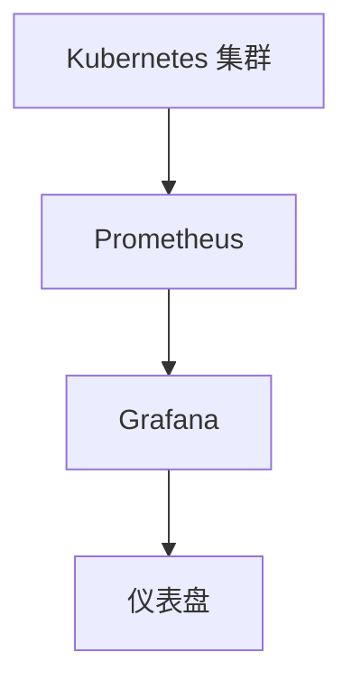
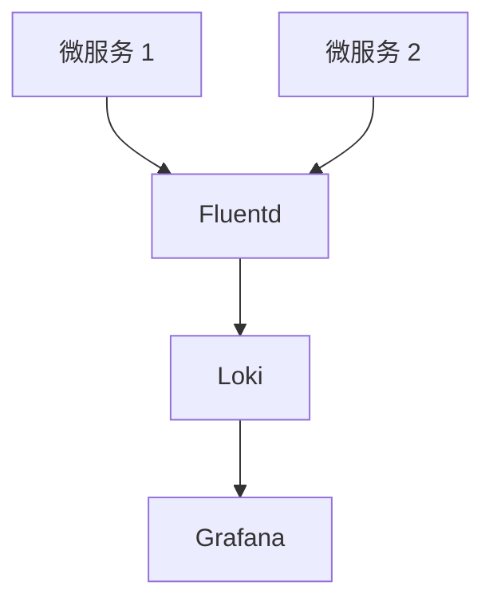

# 云原生监控策略

## 介绍

云原生监控策略是指在云原生环境中，通过一系列工具和方法来监控和管理应用程序、基础设施以及服务的性能和健康状况。云原生架构通常基于微服务、容器化和动态编排（如 Kubernetes），这些特性使得传统的监控方法不再适用。因此，云原生监控策略需要适应这些变化，提供实时、可扩展和自动化的监控解决方案。

## 核心组件

### 1. 指标收集

在云原生环境中，指标收集是监控的基础。常见的指标包括 CPU 使用率、内存使用率、网络流量、请求延迟等。这些指标通常由以下工具收集：

- **Prometheus**: 一个开源的监控和警报工具，专门为云原生环境设计。
- **Grafana Alloy**: 一个轻量级的监控代理，可以与 Prometheus 集成，提供更高效的指标收集和传输。

```yaml
# Prometheus 配置示例
scrape_configs:
  - job_name: 'node_exporter'
    static_configs:
      - targets: ['localhost:9100']
```

### 2. 日志管理

日志管理是监控策略中不可或缺的一部分。通过收集和分析日志，可以深入了解系统的运行状态和潜在问题。常见的日志管理工具包括：

- **Fluentd**: 一个开源的日志收集器，支持多种输入和输出插件。
- **Loki**: 一个轻量级的日志聚合系统，专为云原生环境设计。

```yaml
# Fluentd 配置示例
<source>
  @type tail
  path /var/log/nginx/access.log
  pos_file /var/log/fluentd/nginx.access.log.pos
  tag nginx.access
  format nginx
</source>
```

### 3. 分布式追踪

在微服务架构中，分布式追踪可以帮助开发者理解请求在不同服务之间的流转情况。常见的分布式追踪工具包括：

- **Jaeger**: 一个开源的分布式追踪系统，支持多种编程语言和框架。
- **OpenTelemetry**: 一个跨语言的分布式追踪框架，提供了统一的 API 和 SDK。

```go
// OpenTelemetry 示例代码
import (
    "go.opentelemetry.io/otel"
    "go.opentelemetry.io/otel/trace"
)

func main() {
    tracer := otel.Tracer("example")
    ctx, span := tracer.Start(context.Background(), "example-span")
    defer span.End()
    // 业务逻辑
}
```

## 实际案例

### 案例 1: 使用 Prometheus 和 Grafana 监控 Kubernetes 集群

假设你有一个 Kubernetes 集群，并且希望监控集群中各个节点的资源使用情况。你可以使用 Prometheus 来收集指标，并使用 Grafana 来可视化这些指标。

1. **部署 Prometheus**: 在 Kubernetes 集群中部署 Prometheus，并配置它来收集节点和 Pod 的指标。
2. **部署 Grafana**: 部署 Grafana，并配置它连接到 Prometheus 数据源。
3. **创建仪表盘**: 在 Grafana 中创建仪表盘，展示 CPU、内存、网络等关键指标。



### 案例 2: 使用 Fluentd 和 Loki 进行日志管理

假设你有一个微服务架构的应用程序，并且希望集中管理所有服务的日志。你可以使用 Fluentd 来收集日志，并使用 Loki 来存储和查询这些日志。

1. **部署 Fluentd**: 在每个微服务中部署 Fluentd，配置它来收集日志并发送到 Loki。
2. **部署 Loki**: 部署 Loki 作为日志存储和查询系统。
3. **查询日志**: 使用 Grafana 连接到 Loki，并查询和分析日志。



## 总结

云原生监控策略是确保云原生应用程序和基础设施健康运行的关键。通过使用 Prometheus、Grafana Alloy、Fluentd、Loki 等工具，你可以有效地收集、存储和分析指标和日志，从而及时发现和解决问题。分布式追踪工具如 Jaeger 和 OpenTelemetry 则帮助你理解复杂的微服务架构中的请求流转情况。

## 附加资源

- [Prometheus 官方文档](https://prometheus.io/docs/)
- [Grafana Alloy 官方文档](https://grafana.com/docs/alloy/latest/)
- [Fluentd 官方文档](https://docs.fluentd.org/)
- [Loki 官方文档](https://grafana.com/docs/loki/latest/)
- [Jaeger 官方文档](https://www.jaegertracing.io/docs/)
- [OpenTelemetry 官方文档](https://opentelemetry.io/docs/)

## 练习

1. 在你的 Kubernetes 集群中部署 Prometheus 和 Grafana，并创建一个仪表盘来监控节点的 CPU 和内存使用情况。
2. 使用 Fluentd 和 Loki 收集和查询你的应用程序日志，并在 Grafana 中创建一个日志查询仪表盘。
3. 在你的微服务应用程序中集成 OpenTelemetry，并使用 Jaeger 进行分布式追踪。

通过完成这些练习，你将更深入地理解云原生监控策略的实际应用。