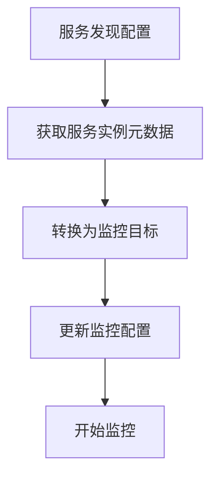

# 服务发现集成

在现代云原生环境中，服务发现是一个关键组件，它允许系统动态地发现和连接到服务实例。Grafana Alloy 提供了强大的服务发现集成功能，帮助您自动化监控配置，确保您的监控系统能够实时响应服务的变化。

## 什么是服务发现？

服务发现是一种机制，用于自动检测和注册网络中的服务实例。在微服务架构中，服务实例可能会频繁地启动、停止或迁移，手动管理这些变化既繁琐又容易出错。服务发现通过自动化的方式解决了这个问题，使得服务实例的变更能够被系统实时感知和处理。

## Grafana Alloy 中的服务发现

Grafana Alloy 支持多种服务发现机制，包括 Kubernetes、Consul、AWS EC2 等。通过这些集成，Alloy 可以自动发现服务实例，并根据发现的结果动态调整监控目标。

### 配置服务发现

在 Grafana Alloy 中，服务发现的配置通常通过 `scrape_configs` 部分来完成。以下是一个简单的示例，展示了如何配置 Kubernetes 服务发现：

```yaml
scrape_configs:
  - job_name: 'kubernetes-pods'
    kubernetes_sd_configs:
      - role: pod
    relabel_configs:
      - source_labels: [__meta_kubernetes_pod_label_app]
        action: keep
        regex: my-app
```

在这个配置中，`kubernetes_sd_configs` 指定了使用 Kubernetes 服务发现，`role: pod` 表示发现的目标是 Kubernetes 中的 Pod。`relabel_configs` 部分用于过滤和重命名标签，确保只有符合特定条件的 Pod 被监控。

### 服务发现的工作原理

服务发现的核心是动态地获取服务实例的元数据，并将其转换为监控目标。以下是一个简化的流程图，展示了服务发现的工作流程：



1. **服务发现配置**：在 Alloy 中配置服务发现的来源和规则。
2. **获取服务实例元数据**：Alloy 从服务发现源（如 Kubernetes API）获取服务实例的元数据。
3. **转换为监控目标**：将元数据转换为 Alloy 可以理解的监控目标。
4. **更新监控配置**：Alloy 根据新的监控目标更新其内部配置。
5. **开始监控**：Alloy 开始对新的监控目标进行数据采集。

### 实际案例

假设您有一个运行在 Kubernetes 上的微服务应用，每个服务实例都会暴露一个 `/metrics` 端点用于 Prometheus 监控。通过配置 Kubernetes 服务发现，Alloy 可以自动发现这些服务实例，并开始采集它们的监控数据。

以下是一个更复杂的配置示例，展示了如何结合多个服务发现源：

```yaml
scrape_configs:
  - job_name: 'kubernetes-services'
    kubernetes_sd_configs:
      - role: service
    relabel_configs:
      - source_labels: [__meta_kubernetes_service_label_app]
        action: keep
        regex: my-service
  - job_name: 'consul-services'
    consul_sd_configs:
      - server: 'consul:8500'
    relabel_configs:
      - source_labels: [__meta_consul_service]
        action: keep
        regex: my-consul-service
```

在这个配置中，Alloy 同时使用了 Kubernetes 和 Consul 作为服务发现源，分别监控 Kubernetes 服务和 Consul 服务。

## 总结

服务发现是云原生环境中不可或缺的一部分，它使得监控系统能够动态地适应服务实例的变化。Grafana Alloy 通过强大的服务发现集成功能，帮助您自动化监控配置，确保您的监控系统始终能够覆盖所有关键服务。

## 附加资源与练习

- **练习**：尝试在您的 Kubernetes 集群中配置 Grafana Alloy 的服务发现，并观察它如何自动发现和监控新的服务实例。
- **资源**：阅读 [Grafana Alloy 官方文档](https://grafana.com/docs/alloy/latest/) 以获取更多关于服务发现配置的详细信息。

:::tip
如果您在配置过程中遇到问题，可以参考 Alloy 的日志输出，通常会有详细的错误信息帮助您定位问题。
:::