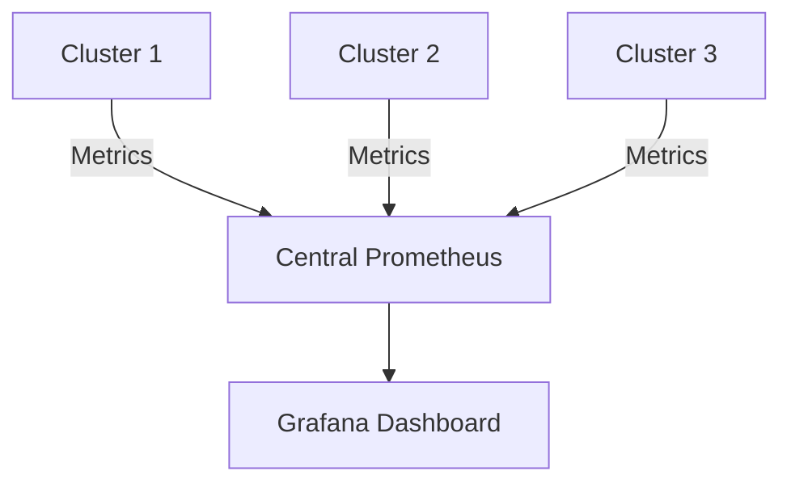

# 多集群监控设计

在现代云原生环境中，许多组织会运行多个 Kubernetes 集群来支持不同的业务需求。这些集群可能分布在不同的区域、云提供商或环境中（如开发、测试和生产）。为了确保这些集群的健康和性能，我们需要一种有效的方式来监控它们。本文将介绍如何使用 **Grafana Alloy** 实现多集群监控设计。

## 什么是多集群监控？

多集群监控是指在一个统一的平台上监控多个 Kubernetes 集群的状态、性能和资源使用情况。通过多集群监控，您可以：

- 集中查看所有集群的健康状况。
- 快速识别和解决问题。
- 比较不同集群的性能指标。
- 实现跨集群的告警和通知。

## 为什么需要多集群监控？

随着 Kubernetes 的普及，许多组织开始运行多个集群来支持不同的业务需求。例如：

- **多区域部署**：为了高可用性和低延迟，应用程序可能部署在多个区域。
- **多云环境**：组织可能使用多个云提供商来避免供应商锁定。
- **环境隔离**：开发、测试和生产环境可能分别运行在不同的集群中。

在这些情况下，如果没有一个统一的监控系统，管理和维护这些集群将变得非常复杂。

## 多集群监控的设计原则

在设计多集群监控系统时，需要考虑以下几个关键原则：

1. **集中化**：所有集群的监控数据应集中存储和处理。
2. **可扩展性**：系统应能够轻松扩展以支持更多的集群。
3. **安全性**：确保监控数据的传输和存储是安全的。
4. **灵活性**：支持不同的监控工具和数据源。

## 使用 Grafana Alloy 实现多集群监控

Grafana Alloy 是一个开源的监控工具，专为云原生环境设计。它支持多种数据源，并提供了强大的数据聚合和可视化功能。以下是使用 Grafana Alloy 实现多集群监控的步骤：

### 1. 安装 Grafana Alloy

首先，在每个 Kubernetes 集群中安装 Grafana Alloy。您可以使用 Helm Chart 来简化安装过程：

```bash
helm repo add grafana https://grafana.github.io/helm-charts
helm install grafana-alloy grafana/alloy -n monitoring
```

### 2. 配置数据收集

在每个集群中，配置 Grafana Alloy 收集 Kubernetes 的指标数据。您可以使用 Prometheus 作为数据源，并配置 Alloy 从 Prometheus 中拉取数据：

```yaml
scrape_configs:
  - job_name: 'kubernetes-apiservers'
    kubernetes_sd_configs:
      - role: endpoints
    scheme: https
    tls_config:
      ca_file: /var/run/secrets/kubernetes.io/serviceaccount/ca.crt
    bearer_token_file: /var/run/secrets/kubernetes.io/serviceaccount/token
    relabel_configs:
      - source_labels: [__meta_kubernetes_namespace, __meta_kubernetes_service_name, __meta_kubernetes_endpoint_port_name]
        action: keep
        regex: default;kubernetes;https
```

### 3. 集中化数据存储

将所有集群的监控数据集中存储在一个中央 Prometheus 或 Thanos 实例中。您可以使用 Grafana Alloy 的远程写入功能将数据发送到中央存储：

```yaml
remote_write:
  - url: "http://central-prometheus:9090/api/v1/write"
```

### 4. 数据可视化

使用 Grafana 创建仪表板来可视化所有集群的监控数据。您可以为每个集群创建单独的仪表板，或者在一个仪表板中显示所有集群的关键指标。



### 5. 设置告警

在 Grafana 中设置告警规则，以便在集群出现问题时及时通知。您可以为 CPU 使用率、内存使用率、Pod 崩溃等关键指标设置告警。

```yaml
alerting:
  alertmanagers:
    - static_configs:
        - targets:
          - alertmanager:9093
```

## 实际案例

假设您有三个 Kubernetes 集群，分别运行在 AWS、GCP 和 Azure 上。您希望在一个统一的平台上监控这些集群的健康状况。通过使用 Grafana Alloy，您可以：

1. 在每个集群中安装 Grafana Alloy 并配置数据收集。
2. 将所有集群的监控数据集中存储在一个中央 Prometheus 实例中。
3. 使用 Grafana 创建一个仪表板，显示所有集群的 CPU 使用率、内存使用率和 Pod 状态。
4. 设置告警规则，当某个集群的 CPU 使用率超过 80% 时发送通知。

## 总结

多集群监控是现代云原生环境中不可或缺的一部分。通过使用 Grafana Alloy，您可以轻松实现跨多个 Kubernetes 集群的监控，确保所有集群的健康和性能。本文介绍了多集群监控的设计原则和实现步骤，并提供了一个实际案例来帮助您理解如何在实际场景中应用这些概念。

## 附加资源

- [Grafana Alloy 官方文档](https://grafana.com/docs/alloy/latest/)
- [Prometheus 官方文档](https://prometheus.io/docs/)
- [Kubernetes 监控最佳实践](https://kubernetes.io/docs/concepts/cluster-administration/monitoring/)

## 练习

1. 在一个 Kubernetes 集群中安装 Grafana Alloy 并配置数据收集。
2. 创建一个 Grafana 仪表板，显示集群的 CPU 使用率和内存使用率。
3. 设置一个告警规则，当 CPU 使用率超过 70% 时发送通知。