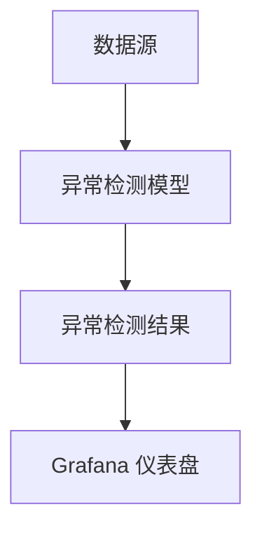

# 机器学习可视化

机器学习可视化是将机器学习模型的结果、数据分布、特征重要性等信息以图形化的方式呈现出来，帮助开发者和数据分析师更好地理解模型的行为和性能。对于初学者来说，可视化是理解复杂机器学习概念的重要工具。本文将介绍如何使用 Grafana Alloy 进行机器学习与异常检测的可视化。

## 什么是机器学习可视化？

机器学习可视化是指通过图表、图形和仪表盘等形式，将机器学习模型的结果、数据分布、特征重要性等信息直观地展示出来。它可以帮助我们：

- 理解数据的分布和特征。
- 评估模型的性能。
- 检测异常值和异常行为。
- 解释模型的决策过程。

## 为什么需要机器学习可视化？

机器学习模型通常处理大量数据，并且其内部机制可能非常复杂。通过可视化，我们可以：

- **简化复杂信息**：将复杂的数据和模型结果转化为易于理解的图形。
- **发现模式**：通过图表发现数据中的潜在模式和趋势。
- **调试模型**：通过可视化发现模型中的问题，如过拟合、欠拟合等。
- **沟通结果**：将模型的结果以直观的方式展示给非技术人员。

## Grafana Alloy 中的机器学习可视化

Grafana Alloy 是一个强大的工具，可以用于监控和可视化机器学习模型的结果。它支持多种数据源，并且可以轻松地与机器学习模型集成。以下是如何使用 Grafana Alloy 进行机器学习可视化的步骤。

### 1. 数据准备

首先，我们需要准备数据。假设我们有一个简单的数据集，包含两个特征 `feature1` 和 `feature2`，以及一个目标变量 `target`。

```python
import pandas as pd

data = {
    'feature1': [1, 2, 3, 4, 5],
    'feature2': [10, 20, 30, 40, 50],
    'target': [0, 1, 0, 1, 0]
}

df = pd.DataFrame(data)
```

### 2. 训练模型

接下来，我们使用一个简单的机器学习模型来训练数据。这里我们使用 `scikit-learn` 中的逻辑回归模型。

```python
from sklearn.linear_model import LogisticRegression

X = df[['feature1', 'feature2']]
y = df['target']

model = LogisticRegression()
model.fit(X, y)
```

### 3. 可视化模型结果

现在，我们可以使用 Grafana Alloy 来可视化模型的结果。首先，我们需要将模型的预测结果导出到 Grafana 支持的数据源中，例如 Prometheus 或 InfluxDB。

```python
import prometheus_client as prom

# 假设我们将预测结果存储在 Prometheus 中
predictions = model.predict(X)
for i, prediction in enumerate(predictions):
    prom.Gauge('model_prediction', 'Model prediction').set(prediction)
```

### 4. 创建 Grafana 仪表盘

在 Grafana 中，我们可以创建一个新的仪表盘，并添加一个图表来显示模型的预测结果。以下是一个简单的 Grafana 查询示例：

```promql
model_prediction
```

### 5. 可视化异常检测

Grafana Alloy 还支持异常检测的可视化。我们可以使用 `Grafana Anomaly Detection` 插件来检测数据中的异常值，并将其可视化。



### 实际案例

假设我们有一个电商网站，我们使用机器学习模型来预测用户的购买行为。通过 Grafana Alloy，我们可以实时监控模型的预测结果，并检测异常行为。例如，如果某个用户的购买行为与模型预测的结果相差较大，我们可以立即发现并进行处理。

## 总结

机器学习可视化是理解和优化机器学习模型的重要工具。通过 Grafana Alloy，我们可以轻松地将机器学习模型的结果可视化，并实时监控模型的性能。希望本文能帮助你掌握机器学习可视化的基本概念，并在实际项目中应用这些技巧。

## 附加资源

- [Grafana 官方文档](https://grafana.com/docs/)
- [scikit-learn 官方文档](https://scikit-learn.org/stable/)
- [Prometheus 官方文档](https://prometheus.io/docs/)

## 练习

1. 尝试使用 Grafana Alloy 可视化一个简单的线性回归模型的结果。
2. 使用 `Grafana Anomaly Detection` 插件检测一个时间序列数据中的异常值，并将其可视化。
3. 创建一个 Grafana 仪表盘，展示多个机器学习模型的预测结果，并比较它们的性能。
