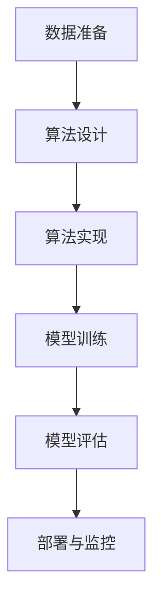

# 自定义算法应用

在 Grafana Alloy 中，自定义算法应用是指通过编写或集成特定的算法来增强机器学习与异常检测的能力。这些算法可以根据业务需求进行定制，从而更精准地识别异常或预测趋势。本文将逐步介绍如何在 Grafana Alloy 中应用自定义算法，并通过实际案例展示其应用场景。

## 什么是自定义算法？

自定义算法是指根据特定需求设计的算法，通常用于解决标准算法无法处理的问题。在 Grafana Alloy 中，自定义算法可以用于数据预处理、特征提取、模型训练和异常检测等任务。通过自定义算法，用户可以更灵活地应对复杂的业务场景。

## 自定义算法的基本步骤

1. **数据准备**：收集并整理需要分析的数据。
2. **算法设计**：根据需求设计或选择适合的算法。
3. **算法实现**：将算法编写成代码，并集成到 Grafana Alloy 中。
4. **模型训练**：使用历史数据训练模型。
5. **模型评估**：评估模型的性能，并根据需要进行调整。
6. **部署与监控**：将模型部署到生产环境，并持续监控其表现。

## 代码示例：自定义异常检测算法

以下是一个简单的自定义异常检测算法的示例，该算法基于统计学方法检测数据中的异常值。

```python
import numpy as np

def detect_anomalies(data, threshold=3):
    mean = np.mean(data)
    std = np.std(data)
    anomalies = []
    for i, value in enumerate(data):
        z_score = (value - mean) / std
        if abs(z_score) > threshold:
            anomalies.append((i, value))
    return anomalies

# 示例数据
data = [10, 12, 11, 13, 15, 12, 100, 14, 13, 12]
anomalies = detect_anomalies(data)
print("检测到的异常值：", anomalies)
```

**输入**：`data = [10, 12, 11, 13, 15, 12, 100, 14, 13, 12]`

**输出**：`检测到的异常值： [(6, 100)]`

:::tip
在实际应用中，您可以根据业务需求调整 `threshold` 参数，以控制异常检测的敏感度。
:::

## 实际案例：电商平台异常订单检测

假设您正在运营一个电商平台，需要检测异常订单以防止欺诈行为。以下是如何应用自定义算法进行异常订单检测的步骤：

1. **数据准备**：收集历史订单数据，包括订单金额、下单时间、用户行为等。
2. **算法设计**：设计一个基于统计学的异常检测算法，识别订单金额异常高的订单。
3. **算法实现**：将算法编写成代码，并集成到 Grafana Alloy 中。
4. **模型训练**：使用历史订单数据训练模型。
5. **模型评估**：评估模型的准确性，确保其能够有效识别异常订单。
6. **部署与监控**：将模型部署到生产环境，并持续监控其表现。



:::note
在实际应用中，您可能需要结合多种算法（如机器学习模型）来提高检测的准确性。
:::

## 总结

通过本文，您已经了解了如何在 Grafana Alloy 中应用自定义算法进行机器学习与异常检测。自定义算法可以帮助您更灵活地应对复杂的业务场景，提高数据分析的精准度。希望本文的内容能够帮助您在 Grafana Alloy 中更好地应用自定义算法。

## 附加资源与练习

- **资源**：
  - [Grafana Alloy 官方文档](https://grafana.com/docs/alloy/)
  - [Python 数据分析与机器学习教程](https://www.example.com)
- **练习**：
  - 尝试在 Grafana Alloy 中实现一个自定义的异常检测算法，并使用实际数据进行测试。
  - 探索其他类型的自定义算法，如时间序列预测算法，并将其应用到您的业务场景中。

:::caution
在实现自定义算法时，请确保充分测试算法的性能，以避免在生产环境中出现意外问题。
:::