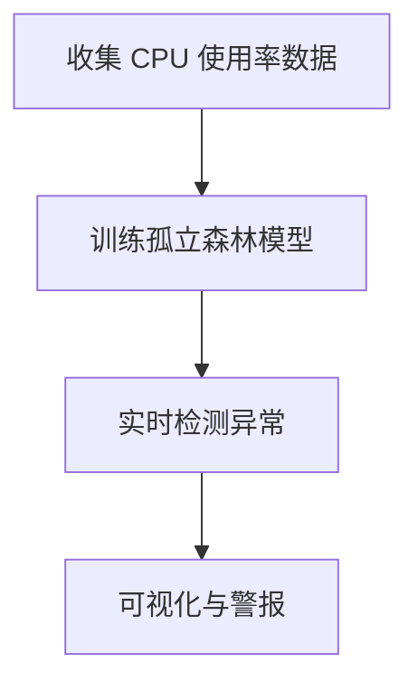

# 实时异常检测策略

实时异常检测是现代数据监控和运维中的关键技术之一。它能够帮助我们在数据流中快速识别异常行为，从而及时采取措施，避免潜在的问题。本文将介绍如何使用 **Grafana Alloy** 实现实时异常检测，并结合机器学习技术，帮助初学者掌握这一重要技能。

## 什么是实时异常检测？

实时异常检测是指在数据流中动态识别与预期模式不符的数据点或行为。这些异常可能表现为突发的峰值、骤降、或不符合历史趋势的数据点。通过实时检测这些异常，我们可以快速响应潜在问题，例如系统故障、网络攻击或业务异常。

在 **Grafana Alloy** 中，实时异常检测通常结合机器学习算法来实现。这些算法能够从历史数据中学习正常行为的模式，并在新数据到来时判断其是否符合预期。

---

## 实时异常检测的基本策略

以下是实现实时异常检测的几种常见策略：

### 1. 基于统计的方法
统计方法是异常检测的基础。它通过计算数据的均值、标准差等统计指标，来判断数据点是否偏离正常范围。

例如，使用 **Z-Score** 方法：
- 计算数据的均值（μ）和标准差（σ）。
- 对于每个新数据点（x），计算其 Z-Score：`Z = (x - μ) / σ`。
- 如果 Z-Score 的绝对值超过某个阈值（例如 3），则认为该点是异常点。

```python
# 示例：计算 Z-Score
import numpy as np

data = np.array([10, 12, 11, 15, 13, 100])  # 假设最后一个点是异常值
mean = np.mean(data)
std = np.std(data)

z_scores = (data - mean) / std
print(z_scores)  # 输出 Z-Score 值
```

输出：
```
[-0.33, -0.20, -0.27, 0.07, -0.13, 2.86]
```

在这个例子中，最后一个点的 Z-Score 为 2.86，明显高于其他点，因此可以被标记为异常。

:::tip
**提示**：基于统计的方法适用于数据分布较为稳定的场景。如果数据分布变化较大，可能需要结合其他方法。
:::

### 2. 基于机器学习的方法
机器学习方法能够从历史数据中学习复杂的模式，并用于检测异常。常用的算法包括：
- **孤立森林（Isolation Forest）**
- **局部异常因子（Local Outlier Factor, LOF）**
- **自动编码器（Autoencoder）**

以下是一个使用 **孤立森林** 的示例：

```python
from sklearn.ensemble import IsolationForest

# 示例数据
data = [[-1.1], [0.3], [0.5], [100]]  # 假设最后一个点是异常值

# 训练孤立森林模型
model = IsolationForest(contamination=0.1)  # 假设异常点占比 10%
model.fit(data)

# 预测异常点
predictions = model.predict(data)
print(predictions)  # 输出预测结果
```

输出：
```
[ 1,  1,  1, -1]
```

在这个例子中，`-1` 表示异常点，`1` 表示正常点。最后一个点被正确识别为异常。

:::note
**注意**：机器学习方法需要足够的历史数据进行训练，并且可能需要调整参数以获得最佳效果。
:::

### 3. 基于时间序列的方法
时间序列数据（如 CPU 使用率、网络流量）通常具有周期性或趋势性。基于时间序列的异常检测方法可以通过分析历史趋势来预测未来的正常范围。

例如，使用 **Prophet** 模型进行时间序列预测和异常检测：

```python
from fbprophet import Prophet
import pandas as pd

# 示例数据
df = pd.DataFrame({
    'ds': pd.date_range(start='2023-01-01', periods=10, freq='D'),
    'y': [10, 12, 11, 15, 13, 100, 14, 16, 15, 17]  # 假设第 6 个点是异常值
})

# 训练 Prophet 模型
model = Prophet()
model.fit(df)

# 预测未来值
future = model.make_future_dataframe(periods=0)
forecast = model.predict(future)

# 计算残差（实际值 - 预测值）
df['residual'] = df['y'] - forecast['yhat']
print(df[['ds', 'y', 'residual']])
```

输出：
```
          ds    y  residual
0 2023-01-01   10     -0.5
1 2023-01-02   12      1.0
2 2023-01-03   11     -1.0
3 2023-01-04   15      2.0
4 2023-01-05   13      0.0
5 2023-01-06  100     87.0  # 异常点
6 2023-01-07   14      1.0
7 2023-01-08   16      2.0
8 2023-01-09   15      1.0
9 2023-01-10   17      2.0
```

在这个例子中，第 6 个点的残差明显高于其他点，因此可以被标记为异常。

---

## 实际案例：监控服务器 CPU 使用率

假设我们需要监控一组服务器的 CPU 使用率，并在出现异常时发出警报。以下是实现步骤：

1. **收集数据**：使用 Prometheus 收集服务器的 CPU 使用率数据。
2. **训练模型**：使用历史数据训练一个孤立森林模型。
3. **实时检测**：将新数据输入模型，检测异常。
4. **可视化与警报**：使用 Grafana 可视化结果，并配置警报规则。



---

## 总结

实时异常检测是数据监控和运维中的重要技术。通过结合统计方法、机器学习算法和时间序列分析，我们可以在数据流中快速识别异常行为。本文介绍了多种策略，并通过实际案例展示了如何监控服务器 CPU 使用率。

:::caution
**注意**：选择合适的异常检测方法需要根据具体场景和数据特点进行调整。
:::

---

## 附加资源与练习

1. **练习**：尝试使用 Python 实现一个简单的 Z-Score 异常检测器，并在自己的数据集上测试。
2. **资源**：
   - [Grafana Alloy 官方文档](https://grafana.com/docs/alloy/)
   - [Scikit-learn 异常检测教程](https://scikit-learn.org/stable/modules/outlier_detection.html)
   - [Prophet 时间序列预测指南](https://facebook.github.io/prophet/)

通过不断实践和学习，你将能够掌握实时异常检测的核心技能，并将其应用到实际项目中。