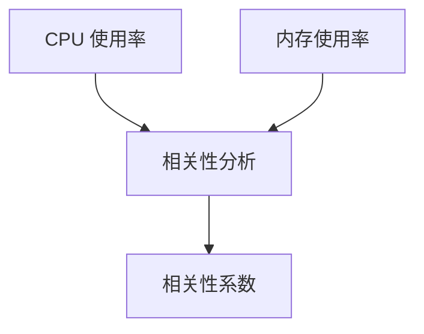

# 指标相关性分析

在监控和运维系统中，指标相关性分析是一种强大的工具，用于识别不同指标之间的关系。通过分析这些关系，我们可以更好地理解系统的行为，并快速定位潜在的问题。本文将介绍如何使用 Grafana Alloy 进行指标相关性分析，并通过实际案例展示其应用。

## 什么是指标相关性分析？

指标相关性分析是一种统计方法，用于衡量两个或多个指标之间的线性关系。相关性系数（通常用 `r` 表示）的取值范围在 `-1` 到 `1` 之间：

- `1` 表示完全正相关，即一个指标的增加会导致另一个指标的增加。
- `-1` 表示完全负相关，即一个指标的增加会导致另一个指标的减少。
- `0` 表示无相关性，即两个指标之间没有线性关系。

在监控系统中，相关性分析可以帮助我们识别哪些指标可能受到相同因素的影响，从而更好地理解系统的行为。

## 如何使用 Grafana Alloy 进行指标相关性分析

Grafana Alloy 提供了强大的工具来进行指标相关性分析。以下是一个简单的步骤指南：

### 1. 收集数据

首先，我们需要收集相关的指标数据。假设我们有两个指标：`CPU 使用率` 和 `内存使用率`。我们可以使用 Prometheus 来收集这些数据。

```promql
cpu_usage{instance="example.com"}
memory_usage{instance="example.com"}
```

### 2. 计算相关性

接下来，我们可以使用 Grafana Alloy 的 `correlation` 函数来计算这两个指标之间的相关性。

```promql
correlation(cpu_usage{instance="example.com"}, memory_usage{instance="example.com"})
```

### 3. 可视化结果

将相关性结果可视化可以帮助我们更直观地理解指标之间的关系。我们可以使用 Grafana 的图表功能来展示相关性系数。



## 实际案例

假设我们正在监控一个 Web 服务器，并且我们注意到在某些时间段内，服务器的响应时间显著增加。我们怀疑这可能与 CPU 使用率和内存使用率有关。通过进行指标相关性分析，我们发现：

- CPU 使用率与响应时间的相关性系数为 `0.85`，表明两者之间存在强正相关。
- 内存使用率与响应时间的相关性系数为 `0.45`，表明两者之间存在中等程度的正相关。

基于这些结果，我们可以得出结论：CPU 使用率是影响服务器响应时间的主要因素，而内存使用率也有一定的影响。

## 总结

指标相关性分析是理解和优化系统性能的重要工具。通过 Grafana Alloy，我们可以轻松地计算和可视化指标之间的相关性，从而快速识别潜在的问题。希望本文能帮助你更好地理解这一概念，并在实际工作中应用它。

## 附加资源

- [Grafana Alloy 官方文档](https://grafana.com/docs/alloy/latest/)
- [Prometheus 查询语言 (PromQL) 指南](https://prometheus.io/docs/prometheus/latest/querying/basics/)
- [相关性分析在监控中的应用](https://www.datadoghq.com/blog/correlation-analysis-monitoring/)

## 练习

1. 使用 Grafana Alloy 计算你系统中两个指标的相关性系数。
2. 尝试将相关性结果可视化，并分析它们之间的关系。
3. 思考如何利用相关性分析来优化你的系统性能。
