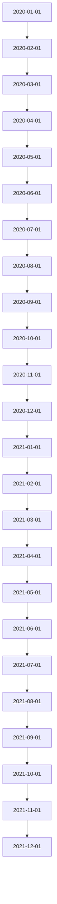

# 季节性与趋势分析

在时间序列分析中，**季节性**和**趋势**是两个非常重要的概念。它们帮助我们理解数据的长期行为和周期性变化。本文将介绍如何使用 Grafana Alloy 进行季节性与趋势分析，并通过实际案例展示其应用。

## 什么是季节性与趋势？

### 季节性
**季节性**是指数据在固定时间间隔内重复出现的模式。例如，零售业的销售额通常在节假日期间显著增加，或者电力消耗在夏季和冬季达到高峰。季节性分析可以帮助我们识别这些周期性变化。

### 趋势
**趋势**是指数据在长时间内的总体方向。它可以是上升、下降或保持不变。例如，随着时间推移，全球气温可能呈现上升趋势。趋势分析可以帮助我们理解数据的长期行为。

## 季节性与趋势分析的基本步骤

1. **数据收集**：首先，我们需要收集时间序列数据。这些数据可以是每日、每周、每月或每年的观测值。
2. **数据可视化**：通过绘制时间序列图，我们可以直观地观察数据的季节性和趋势。
3. **分解时间序列**：将时间序列分解为趋势、季节性和残差三个部分。
4. **模型拟合**：使用统计模型或机器学习模型来拟合数据，并预测未来的趋势和季节性变化。
5. **异常检测**：通过分析残差部分，我们可以检测数据中的异常点。

## 使用 Grafana Alloy 进行季节性与趋势分析

Grafana Alloy 是一个强大的工具，可以帮助我们进行时间序列数据的分析和可视化。以下是一个简单的示例，展示如何使用 Grafana Alloy 进行季节性与趋势分析。

### 示例：分析月度销售额数据

假设我们有一组月度销售额数据，我们希望分析其季节性和趋势。

#### 数据准备

首先，我们需要准备数据。假设我们有以下数据：

```python
import pandas as pd

data = {
    'date': pd.date_range(start='2020-01-01', periods=24, freq='M'),
    'sales': [100, 120, 130, 150, 160, 170, 180, 190, 200, 210, 220, 230, 
              240, 250, 260, 270, 280, 290, 300, 310, 320, 330, 340, 350]
}

df = pd.DataFrame(data)
df.set_index('date', inplace=True)
```

#### 数据可视化

使用 Grafana Alloy 绘制时间序列图：



#### 分解时间序列

使用 Grafana Alloy 的分解功能，我们可以将时间序列分解为趋势、季节性和残差：

```python
from statsmodels.tsa.seasonal import seasonal_decompose

result = seasonal_decompose(df['sales'], model='additive', period=12)
result.plot()
```

#### 模型拟合

我们可以使用线性回归模型来拟合趋势部分：

```python
from sklearn.linear_model import LinearRegression

X = np.arange(len(df)).reshape(-1, 1)
y = df['sales'].values

model = LinearRegression()
model.fit(X, y)

trend = model.predict(X)
```

#### 异常检测

通过分析残差部分，我们可以检测数据中的异常点：

```python
residuals = df['sales'] - trend
anomalies = residuals[abs(residuals) > 2 * residuals.std()]
```

## 实际案例：电力消耗的季节性与趋势分析

假设我们有一组电力消耗数据，我们希望分析其季节性和趋势。通过 Grafana Alloy，我们可以轻松地完成这一任务。

1. **数据收集**：收集每日电力消耗数据。
2. **数据可视化**：绘制时间序列图，观察电力消耗的季节性和趋势。
3. **分解时间序列**：将时间序列分解为趋势、季节性和残差。
4. **模型拟合**：使用线性回归模型拟合趋势部分。
5. **异常检测**：通过分析残差部分，检测电力消耗中的异常点。

:::tip
在实际应用中，季节性与趋势分析可以帮助我们更好地理解数据，并做出更准确的预测。例如，在电力行业中，准确的季节性与趋势分析可以帮助我们优化电力分配，减少浪费。
:::

## 总结

季节性与趋势分析是时间序列分析中的重要组成部分。通过 Grafana Alloy，我们可以轻松地进行季节性与趋势分析，并应用于实际场景中。希望本文能帮助你掌握这一重要概念，并在你的项目中应用它。

## 附加资源与练习

- **资源**：
  - [Grafana Alloy 官方文档](https://grafana.com/docs/alloy/)
  - [时间序列分析入门指南](https://www.analyticsvidhya.com/blog/2021/05/time-series-analysis-a-complete-guide/)
- **练习**：
  - 尝试使用 Grafana Alloy 分析你所在行业的季节性数据。
  - 使用线性回归模型拟合趋势部分，并检测数据中的异常点。

:::caution
在进行季节性与趋势分析时，务必注意数据的质量和完整性。缺失数据或异常值可能会影响分析结果的准确性。
:::