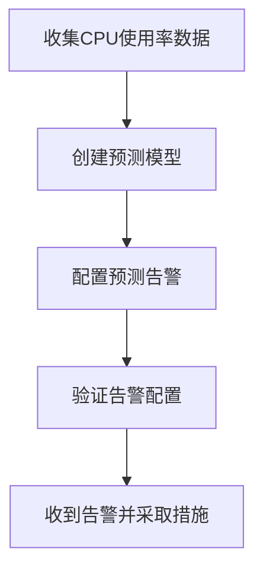

# 预测告警配置

在 Grafana Alloy 中，预测告警是一种基于机器学习模型的告警机制，它能够预测未来的趋势并提前发出告警，从而帮助用户预防潜在的问题。本文将详细介绍如何在 Grafana Alloy 中配置预测告警，并通过实际案例展示其应用场景。

## 什么是预测告警？

预测告警是一种利用机器学习模型对时间序列数据进行分析，预测未来可能发生的异常或趋势变化的告警机制。与传统的阈值告警不同，预测告警能够根据历史数据自动调整告警规则，从而更准确地捕捉潜在问题。

## 配置预测告警的步骤

### 1. 准备数据

首先，你需要确保你的时间序列数据已经导入到 Grafana Alloy 中。这些数据可以是系统指标、应用性能指标或其他任何时间序列数据。

```yaml
# 示例数据源配置
datasources:
  - name: prometheus
    type: prometheus
    url: http://localhost:9090
```

### 2. 创建机器学习模型

在 Grafana Alloy 中，你可以使用内置的机器学习工具来创建预测模型。以下是一个简单的示例，展示如何创建一个基于时间序列数据的预测模型。

```yaml
# 示例机器学习模型配置
models:
  - name: cpu_usage_model
    type: time_series
    datasource: prometheus
    query: rate(container_cpu_usage_seconds_total[5m])
    algorithm: prophet
    training_period: 7d
```

### 3. 配置预测告警

接下来，你需要配置预测告警规则。以下是一个示例配置，展示如何基于上述模型创建预测告警。

```yaml
# 示例预测告警配置
alerts:
  - name: high_cpu_usage_prediction
    model: cpu_usage_model
    condition: prediction > 0.8
    for: 5m
    labels:
      severity: critical
    annotations:
      summary: "High CPU usage predicted"
      description: "The model predicts that CPU usage will exceed 80% in the next 5 minutes."
```

### 4. 验证告警配置

在配置完成后，你可以通过 Grafana Alloy 的 UI 界面验证告警配置是否正确。你可以查看模型的预测结果，并确保告警规则能够正确触发。

## 实际案例

假设你正在监控一个生产环境中的 Kubernetes 集群，并且希望提前预测 CPU 使用率的异常情况。通过配置预测告警，你可以在 CPU 使用率即将达到临界值时收到告警，从而提前采取措施，避免系统崩溃。



## 总结

预测告警是 Grafana Alloy 中一个强大的功能，它能够帮助你提前发现潜在的问题，从而避免系统故障。通过本文的介绍，你应该已经掌握了如何在 Grafana Alloy 中配置预测告警，并了解了其在实际应用中的价值。

## 附加资源与练习

- **练习**: 尝试在你的 Grafana Alloy 环境中配置一个预测告警，并使用真实数据进行测试。
- **资源**: 阅读 [Grafana Alloy 官方文档](https://grafana.com/docs/alloy/) 以获取更多关于预测告警的详细信息。

:::tip
如果你在配置过程中遇到问题，可以参考 Grafana Alloy 的社区论坛或官方文档，获取更多帮助。
:::