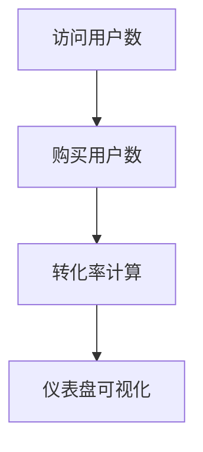

# 业务指标定义

在构建和运维现代应用程序时，业务指标（Business Metrics）是衡量系统健康状态和业务成功的关键工具。业务指标不仅帮助团队了解系统的性能，还能为决策提供数据支持。本文将详细介绍业务指标的定义、分类及其在 Grafana Alloy 中的应用。

## 什么是业务指标？

业务指标是用于衡量业务目标实现程度的量化数据。它们通常与关键业务目标（如收入、用户增长、客户满意度等）直接相关。通过监控这些指标，团队可以快速识别问题并采取行动。

:::note
业务指标与系统指标不同。系统指标（如 CPU 使用率、内存使用率）主要关注技术层面的性能，而业务指标则更关注业务成果。
:::

## 业务指标的分类

业务指标可以根据其用途和范围分为以下几类：

1. **收入相关指标**：如每月经常性收入（MRR）、客户生命周期价值（CLV）。
2. **用户增长指标**：如日活跃用户数（DAU）、月活跃用户数（MAU）。
3. **客户满意度指标**：如净推荐值（NPS）、客户满意度评分（CSAT）。
4. **运营效率指标**：如平均处理时间（AHT）、订单履行率。

## 业务指标的定义步骤

定义业务指标通常包括以下步骤：

1. **确定业务目标**：明确业务的核心目标，例如提高用户留存率或增加收入。
2. **选择关键指标**：选择与目标直接相关的指标，例如用户留存率或每月收入。
3. **定义指标公式**：为每个指标定义明确的计算公式。例如，用户留存率可以定义为：
   ```
   用户留存率 = (期末活跃用户数 - 新增用户数) / 期初活跃用户数 * 100%
   ```
4. **设置目标值**：为每个指标设定目标值或阈值，例如用户留存率的目标为 80%。
5. **监控和调整**：持续监控指标并根据业务需求调整目标。

## 实际案例：电商平台的业务指标

假设我们运营一个电商平台，以下是一些关键业务指标的定义和示例：

1. **转化率**：衡量访问者转化为购买者的比例。
   ```
   转化率 = (购买用户数 / 访问用户数) * 100%
   ```
2. **平均订单价值（AOV）**：衡量每个订单的平均金额。
   ```
   平均订单价值 = 总收入 / 订单总数
   ```
3. **购物车放弃率**：衡量用户将商品加入购物车但未完成购买的比例。
   ```
   购物车放弃率 = (放弃购物车次数 / 加入购物车次数) * 100%
   ```

:::tip
在实际应用中，业务指标的定义应根据具体业务场景进行调整，以确保其准确反映业务状态。
:::

## 使用 Grafana Alloy 监控业务指标

Grafana Alloy 是一个强大的监控工具，可以帮助团队实时监控业务指标。以下是一个简单的示例，展示如何在 Grafana Alloy 中定义和监控业务指标。

### 示例：监控电商平台的转化率

1. **定义指标**：在 Grafana Alloy 中创建一个新的指标，命名为 `conversion_rate`。
2. **设置数据源**：连接到电商平台的数据源，获取访问用户数和购买用户数。
3. **配置查询**：使用 PromQL 查询语言定义转化率的计算公式：
   ```promql
   conversion_rate = (sum(purchases) / sum(visits)) * 100
   ```
4. **创建仪表盘**：在 Grafana 中创建一个仪表盘，将 `conversion_rate` 指标可视化。



:::caution
确保数据源的准确性和实时性，以避免监控结果的偏差。
:::

## 总结

业务指标是衡量业务成功的重要工具。通过明确业务目标、选择关键指标并持续监控，团队可以更好地了解业务状态并做出数据驱动的决策。Grafana Alloy 提供了强大的工具，帮助团队轻松定义和监控业务指标。

## 附加资源与练习

- **练习**：尝试为你的项目定义 3 个关键业务指标，并在 Grafana Alloy 中实现监控。
- **资源**：
  - [Grafana Alloy 官方文档](https://grafana.com/docs/alloy/)
  - [PromQL 查询语言指南](https://prometheus.io/docs/prometheus/latest/querying/basics/)
