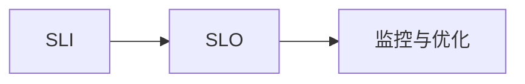

## 介绍

在现代软件开发和运维中，确保服务的可靠性和性能至关重要。为了量化服务的可靠性，我们引入了**服务级别指标（SLI）**和**服务级别目标（SLO）**这两个关键概念。SLI用于衡量服务的某个特定方面的表现，而SLO则是为这些指标设定的目标值。通过SLI和SLO，团队可以明确服务的可靠性目标，并据此进行监控和优化。

## 什么是SLI？

**服务级别指标（SLI，Service Level Indicator）**是用于衡量服务某个特定方面的表现的量化指标。常见的SLI包括：

- **可用性**：服务正常运行的时间比例。
- **延迟**：请求从发出到收到响应的时间。
- **错误率**：请求失败的比例。
- **吞吐量**：单位时间内处理的请求数量。

例如，对于一个Web服务，可用性SLI可以定义为“99.9%的请求在1秒内得到响应”。

## 什么是SLO？

**服务级别目标（SLO，Service Level Objective）**是为SLI设定的目标值。SLO定义了服务在某个时间段内应达到的最低性能标准。例如，一个SLO可以是“99.9%的请求在1秒内得到响应”。

SLO通常以百分比形式表示，并且会设定一个时间窗口（如一个月）。如果SLI在时间窗口内未达到SLO，则意味着服务未达到预期的可靠性标准。

## SLI与SLO的关系

SLI和SLO是紧密相关的。SLI是实际测量的指标，而SLO是对这些指标的目标要求。通过监控SLI，我们可以判断服务是否达到了SLO。



## 实际案例

假设我们有一个在线购物网站，我们希望确保用户能够顺利下单。我们可以定义以下SLI和SLO：

- **SLI**：订单提交的成功率。
- **SLO**：99.9%的订单提交请求在1秒内成功完成。

为了实现这个SLO，我们需要监控订单提交的成功率，并在成功率低于99.9%时采取行动，例如优化数据库查询或增加服务器资源。

## 代码示例

以下是一个简单的Python代码示例，用于计算订单提交的成功率：

```python
# 假设我们有一个订单提交的日志文件
orders_log = [
    {"status": "success", "response_time": 0.8},
    {"status": "success", "response_time": 1.2},
    {"status": "failure", "response_time": 2.0},
    {"status": "success", "response_time": 0.9},
]

# 计算成功率
success_count = sum(1 for order in orders_log if order["status"] == "success")
total_orders = len(orders_log)
success_rate = (success_count / total_orders) * 100

print(f"订单提交成功率为: {success_rate:.2f}%")
```

**输出**：
```
订单提交成功率为: 75.00%
```

:::note
在实际应用中，SLI和SLO的计算通常会结合监控工具（如Grafana Alloy）来自动化进行。
:::

## 总结

SLI和SLO是衡量和确保服务可靠性的重要工具。通过定义明确的SLI和SLO，团队可以更好地理解服务的性能，并在出现问题时迅速采取行动。在实际应用中，SLI和SLO通常与监控工具结合使用，以实现自动化的性能监控和告警。

## 附加资源

- [Google SRE Book: SLIs, SLOs, and SLAs](https://sre.google/sre-book/service-level-objectives/)
- [Grafana Alloy Documentation](https://grafana.com/docs/alloy/latest/)

## 练习

1. 为你的项目定义一个SLI和SLO，并解释为什么选择这些指标。
2. 使用Python编写一个简单的脚本，计算你定义的SLI，并判断是否达到了SLO。
