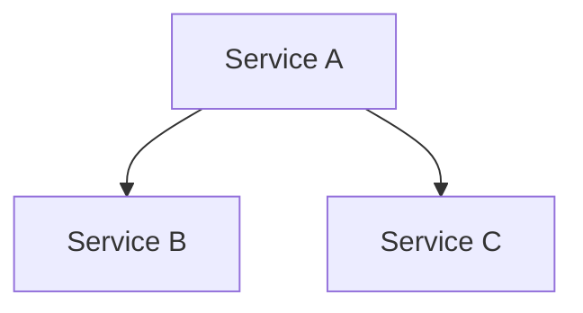
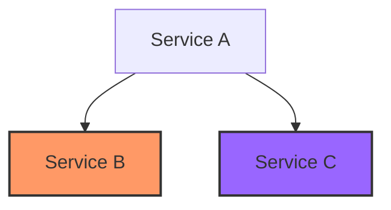

# 服务依赖监控

在现代分布式系统中，服务之间的依赖关系变得越来越复杂。一个服务的正常运行可能依赖于多个其他服务的健康状态。**服务依赖监控**就是通过监控这些依赖关系，确保系统的整体稳定性和可靠性。本文将详细介绍服务依赖监控的概念、实现方法及其在 Grafana Alloy 中的应用。

## 什么是服务依赖监控？

服务依赖监控是指通过监控系统中各个服务之间的依赖关系，及时发现和解决潜在的问题。例如，一个电商网站的下单服务可能依赖于库存服务、支付服务和物流服务。如果其中任何一个依赖服务出现问题，下单服务也会受到影响。通过服务依赖监控，我们可以及时发现这些依赖服务的异常，并采取相应的措施。

## 为什么需要服务依赖监控？

1. **提高系统稳定性**：通过监控服务依赖关系，可以及时发现和解决潜在问题，避免系统崩溃。
2. **快速定位问题**：当系统出现问题时，服务依赖监控可以帮助我们快速定位问题的根源。
3. **优化系统性能**：通过分析服务依赖关系，可以发现系统中的性能瓶颈，并进行优化。

## 如何实现服务依赖监控？

在 Grafana Alloy 中，我们可以通过以下步骤实现服务依赖监控：

### 1. 定义服务依赖关系

首先，我们需要定义系统中各个服务之间的依赖关系。例如，假设我们有一个简单的系统，包含三个服务：`Service A`、`Service B` 和 `Service C`。其中，`Service A` 依赖于 `Service B` 和 `Service C`。



### 2. 监控服务健康状态

接下来，我们需要监控每个服务的健康状态。在 Grafana Alloy 中，我们可以使用 Prometheus 来收集和存储服务的健康指标。例如，我们可以为每个服务定义一个健康检查端点，并通过 Prometheus 来监控这些端点的响应状态。

```yaml
scrape_configs:
  - job_name: 'service_a'
    static_configs:
      - targets: ['service_a:8080']
  - job_name: 'service_b'
    static_configs:
      - targets: ['service_b:8080']
  - job_name: 'service_c'
    static_configs:
      - targets: ['service_c:8080']
```

### 3. 设置告警规则

一旦我们收集到服务的健康指标，就可以设置告警规则。例如，如果 `Service B` 的健康检查失败，我们可以触发一个告警。

```yaml
groups:
  - name: service_dependency_alerts
    rules:
      - alert: ServiceBDown
        expr: up{job="service_b"} == 0
        for: 1m
        labels:
          severity: critical
        annotations:
          summary: "Service B is down"
          description: "Service B has been down for more than 1 minute."
```

### 4. 可视化服务依赖关系

最后，我们可以使用 Grafana 来可视化服务依赖关系。通过 Grafana 的图表功能，我们可以直观地看到各个服务的健康状态及其依赖关系。



:::note
在上面的图表中，`Service B` 的健康状态异常（用红色表示），而 `Service C` 的健康状态正常（用蓝色表示）。
:::

## 实际案例

假设我们有一个在线购物网站，包含以下服务：

1. **用户服务**：负责用户登录和注册。
2. **商品服务**：负责商品信息的展示和管理。
3. **订单服务**：负责订单的创建和管理。

其中，订单服务依赖于用户服务和商品服务。如果用户服务或商品服务出现故障，订单服务将无法正常工作。

通过服务依赖监控，我们可以及时发现用户服务或商品服务的异常，并采取相应的措施。例如，如果用户服务出现故障，我们可以暂时禁用订单服务，避免用户在下单时遇到问题。

## 总结

服务依赖监控是确保分布式系统稳定性和可靠性的重要手段。通过定义服务依赖关系、监控服务健康状态、设置告警规则和可视化服务依赖关系，我们可以及时发现和解决系统中的潜在问题。

## 附加资源

- [Prometheus 官方文档](https://prometheus.io/docs/)
- [Grafana 官方文档](https://grafana.com/docs/)
- [Grafana Alloy 官方文档](https://grafana.com/docs/alloy/latest/)

## 练习

1. 尝试在你的本地环境中部署一个简单的服务，并使用 Prometheus 和 Grafana 监控其健康状态。
2. 定义一个服务依赖关系，并设置相应的告警规则。
3. 使用 Grafana 可视化服务依赖关系，并分析其健康状态。

通过以上练习，你将更好地理解服务依赖监控的概念及其在实际中的应用。