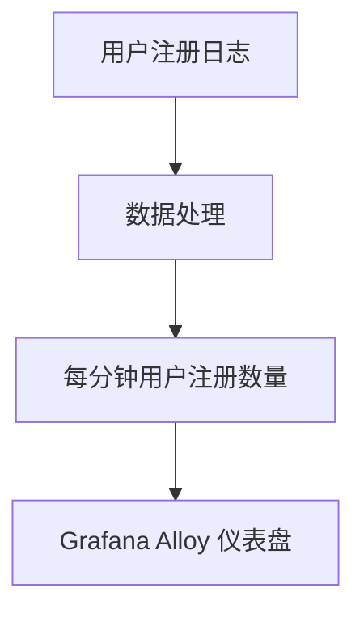

# 业务活动监控

在现代软件开发中，业务活动监控（Business Activity Monitoring, BAM）是一个关键的概念。它帮助团队实时跟踪和分析业务活动，确保业务目标的实现。通过监控关键业务指标（Key Business Metrics, KBM）和服务水平目标（Service Level Objectives, SLO），团队可以快速识别问题并采取行动。

## 什么是业务活动监控？

业务活动监控是指通过收集、分析和可视化业务活动数据，来确保业务目标的实现。它通常涉及以下几个方面：

1. **数据收集**：从各种来源（如应用程序、数据库、日志等）收集业务活动数据。
2. **数据处理**：对收集到的数据进行处理，提取关键业务指标。
3. **数据可视化**：将处理后的数据以图表或仪表盘的形式展示，便于团队理解和分析。
4. **告警与通知**：当业务指标超出预设范围时，触发告警并通知相关人员。

## 为什么需要业务活动监控？

业务活动监控的主要目的是确保业务目标的实现。通过实时监控业务活动，团队可以：

- **快速识别问题**：当业务指标异常时，团队可以立即采取行动，避免问题扩大。
- **优化业务流程**：通过分析业务活动数据，团队可以发现业务流程中的瓶颈并进行优化。
- **提高客户满意度**：通过确保业务目标的实现，团队可以提高客户满意度。

## 如何使用 Grafana Alloy 进行业务活动监控？

Grafana Alloy 是一个强大的监控工具，可以帮助团队实现业务活动监控。以下是使用 Grafana Alloy 进行业务活动监控的步骤：

### 1. 数据收集

首先，我们需要从各种来源收集业务活动数据。例如，我们可以从应用程序的日志中收集用户注册数据。

```python
import logging

logging.basicConfig(level=logging.INFO)
logger = logging.getLogger(__name__)

def register_user(username):
    logger.info(f"User {username} registered")
    # 注册用户的逻辑
```

### 2. 数据处理

接下来，我们需要对收集到的数据进行处理，提取关键业务指标。例如，我们可以计算每分钟的用户注册数量。

```python
from collections import defaultdict
import time

user_registrations = defaultdict(int)

def process_logs(logs):
    for log in logs:
        if "User registered" in log:
            user_registrations[int(time.time() // 60)] += 1

    return user_registrations
```

### 3. 数据可视化

然后，我们可以使用 Grafana Alloy 将处理后的数据可视化。例如，我们可以创建一个仪表盘来展示每分钟的用户注册数量。



### 4. 告警与通知

最后，我们可以配置告警规则，当用户注册数量低于某个阈值时，触发告警并通知相关人员。

```yaml
alert:
  name: LowUserRegistration
  expr: sum(rate(user_registrations_total[5m])) < 10
  for: 5m
  labels:
    severity: critical
  annotations:
    summary: "Low user registration rate"
    description: "The user registration rate is below 10 per minute."
```

## 实际案例

假设我们有一个电子商务网站，我们需要监控每分钟的订单数量。我们可以使用 Grafana Alloy 来实现这一目标。

1. **数据收集**：从订单处理系统中收集订单数据。
2. **数据处理**：计算每分钟的订单数量。
3. **数据可视化**：在 Grafana Alloy 中创建一个仪表盘，展示每分钟的订单数量。
4. **告警与通知**：当订单数量低于某个阈值时，触发告警并通知相关人员。

## 总结

业务活动监控是确保业务目标实现的关键。通过使用 Grafana Alloy，团队可以轻松实现业务活动监控，确保业务指标和 SLO 的可观测性。希望本文能帮助你理解业务活动监控的概念，并开始在你的项目中应用它。

## 附加资源与练习

- **练习**：尝试在你的项目中实现业务活动监控，并创建一个 Grafana Alloy 仪表盘来展示关键业务指标。
- **资源**：
  - [Grafana Alloy 官方文档](https://grafana.com/docs/alloy/latest/)
  - [Prometheus 官方文档](https://prometheus.io/docs/)
  - [Mermaid 官方文档](https://mermaid-js.github.io/mermaid/#/)