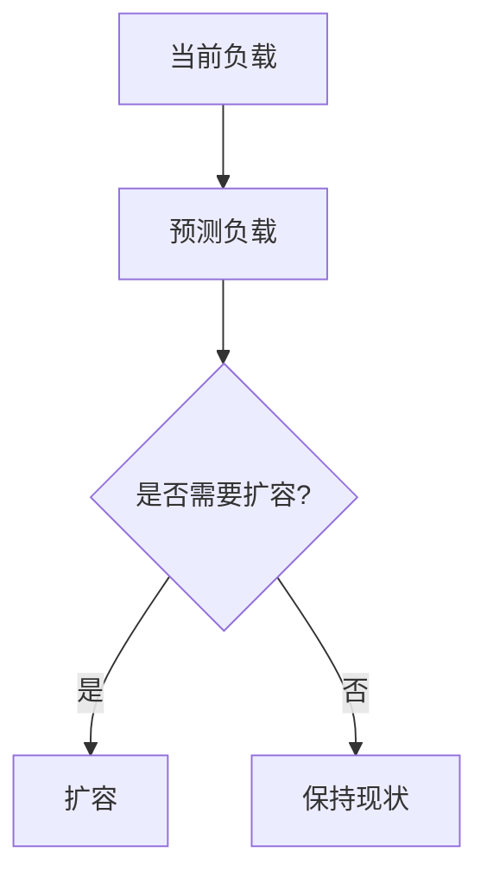

# SRE最佳实践

## 介绍

SRE（Site Reliability Engineering，站点可靠性工程）是一种将软件工程实践应用于运维领域的理念，旨在通过自动化、监控和故障排除等手段，确保系统的高可用性和可靠性。SRE的核心目标是在保证系统稳定性的同时，快速交付新功能。

在本篇内容中，我们将探讨SRE的最佳实践，并展示如何通过Grafana Alloy实现业务指标与SLO（Service Level Objective，服务级别目标）监控，帮助初学者理解如何在实际项目中应用这些概念。

---

## SRE的核心原则

SRE的核心原则可以总结为以下几点：

1. **自动化**：通过自动化减少人为错误，提高效率。
2. **监控与告警**：实时监控系统状态，及时发现问题。
3. **故障排除与恢复**：快速定位问题并恢复服务。
4. **SLO与SLA管理**：定义并跟踪服务级别目标（SLO）和服务级别协议（SLA）。
5. **容量规划**：确保系统能够应对未来的负载增长。

接下来，我们将逐步讲解这些原则，并通过实际案例展示如何应用它们。

---

## 1. 自动化

自动化是SRE的基石。通过自动化，可以减少重复性工作，降低人为错误的风险。常见的自动化任务包括：

- 部署流程自动化
- 监控配置自动化
- 故障恢复自动化

### 示例：自动化部署

以下是一个简单的自动化部署脚本示例：

```bash
#!/bin/bash
# 自动化部署脚本
echo "开始部署..."
git pull origin main
docker-compose up -d --build
echo "部署完成！"
```

:::tip
自动化部署可以显著减少人为错误，并提高部署效率。
:::

---

## 2. 监控与告警

监控是SRE的核心任务之一。通过监控，我们可以实时了解系统的健康状况，并在出现问题时及时发出告警。

### 使用Grafana Alloy进行监控

Grafana Alloy是一个强大的监控工具，可以帮助我们收集、分析和可视化业务指标。以下是一个简单的配置示例：

```yaml
# grafana-alloy-config.yaml
metrics:
  - name: request_latency
    type: histogram
    labels:
      service: "web-service"
    buckets: [0.1, 0.5, 1, 2, 5]
```

:::note
通过配置Grafana Alloy，我们可以轻松监控关键业务指标，如请求延迟、错误率等。
:::

---

## 3. 故障排除与恢复

当系统出现故障时，快速定位问题并恢复服务是SRE的关键任务。以下是一些常见的故障排除步骤：

1. **检查日志**：通过日志定位问题根源。
2. **分析监控数据**：查看监控数据，了解系统状态。
3. **执行回滚**：如果问题是由最近的变更引起的，执行回滚操作。

### 示例：日志分析

以下是一个简单的日志分析命令：

```bash
grep "ERROR" /var/log/web-service.log
```

:::caution
在故障排除过程中，务必保持冷静，并按照预定的流程操作。
:::

---

## 4. SLO与SLA管理

SLO（Service Level Objective）是衡量系统可靠性的关键指标。常见的SLO包括：

- 可用性（如99.9%）
- 请求延迟（如95%的请求延迟小于200ms）

### 示例：定义SLO

以下是一个SLO定义的示例：

```yaml
# slo-definition.yaml
service: "web-service"
slo:
  - name: "availability"
    target: 99.9%
  - name: "latency"
    target: "95% < 200ms"
```

:::warning
SLO的定义应与业务需求紧密结合，并定期进行评估和调整。
:::

---

## 5. 容量规划

容量规划是确保系统能够应对未来负载增长的关键。通过容量规划，我们可以提前识别潜在的瓶颈，并采取相应的措施。

### 示例：容量规划图表

以下是一个使用Mermaid绘制的容量规划图表：



:::tip
定期进行容量规划，可以避免因负载突增导致的系统崩溃。
:::

---

## 实际案例

假设我们有一个电商网站，需要确保其高可用性和低延迟。我们可以通过以下步骤应用SRE最佳实践：

1. **自动化部署**：使用CI/CD工具自动化部署流程。
2. **监控与告警**：配置Grafana Alloy监控请求延迟和错误率。
3. **故障排除**：通过日志和监控数据快速定位问题。
4. **SLO管理**：定义并跟踪可用性和延迟SLO。
5. **容量规划**：根据历史数据预测未来负载，并进行扩容。

---

## 总结

SRE最佳实践是确保系统高可用性和可靠性的关键。通过自动化、监控、故障排除、SLO管理和容量规划，我们可以构建一个稳定、高效的系统。

:::note
如果你想进一步学习SRE，可以参考以下资源：
- 《Site Reliability Engineering》 by Google
- Grafana官方文档
:::

---

## 练习

1. 尝试编写一个自动化部署脚本。
2. 使用Grafana Alloy配置一个简单的监控任务。
3. 定义一个SLO，并思考如何在实际项目中应用它。

通过实践，你将更好地理解SRE的核心概念，并能够在实际项目中应用这些最佳实践。