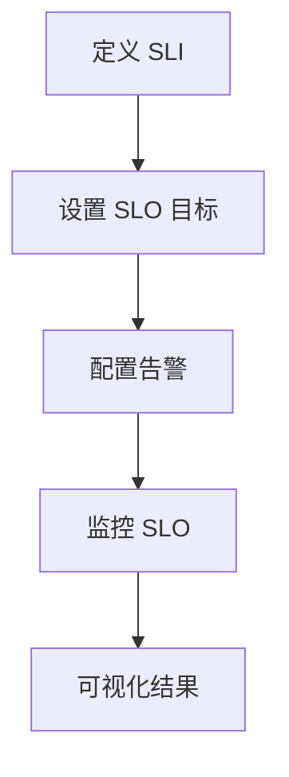

# 服务水平目标设置

服务水平目标（Service Level Objective, SLO）是衡量系统性能的关键指标之一。它定义了系统在特定时间段内应达到的性能水平，通常以百分比形式表示。例如，一个 SLO 可能是“99.9% 的请求应在 200 毫秒内完成”。通过设置 SLO，团队可以明确系统的可靠性目标，并确保用户体验的一致性。

在 Grafana Alloy 中，SLO 的设置和监控是业务指标监控的核心部分。本文将逐步介绍如何设置 SLO，并通过实际案例展示其应用。

---

## 什么是服务水平目标（SLO）？

SLO 是系统性能的量化目标，通常基于服务水平指标（SLI）来定义。SLI 是衡量系统性能的具体指标，例如请求成功率、响应时间等。SLO 则是这些指标的目标值。

例如：
- **SLI**: 请求成功率（成功请求数 / 总请求数）
- **SLO**: 99.9% 的请求应在 1 秒内完成

SLO 的设定需要结合业务需求和用户体验。过高的 SLO 可能导致资源浪费，而过低的 SLO 则可能影响用户满意度。

---

## 如何在 Grafana Alloy 中设置 SLO

在 Grafana Alloy 中，SLO 的设置通常包括以下步骤：

1. **定义 SLI**: 选择需要监控的指标，例如请求成功率或响应时间。
2. **设置 SLO 目标**: 为目标指标设定具体的数值和范围。
3. **配置告警**: 当 SLO 未达到目标时，触发告警以通知团队。

以下是一个简单的代码示例，展示如何在 Grafana Alloy 中配置 SLO：

```yaml
slo:
  name: "api_request_success_rate"
  description: "API 请求成功率 SLO"
  sli:
    type: "ratio"
    success:
      metric: "http_requests_total{status=~\"2..\"}"
    total:
      metric: "http_requests_total"
  target: 0.999  # 99.9% 的成功率
  alerting:
    enabled: true
    severity: "critical"
```

### 代码解释：
- `sli.type`: 定义 SLI 的类型，这里使用 `ratio` 表示成功率。
- `success.metric`: 定义成功请求的指标。
- `total.metric`: 定义总请求的指标。
- `target`: 设置 SLO 目标为 99.9%。
- `alerting`: 配置告警，当 SLO 未达到目标时触发。

---

## 实际案例：电商网站的 SLO 设置

假设我们正在为一个电商网站设置 SLO，目标是确保用户下单流程的可靠性。以下是具体的步骤：

1. **定义 SLI**: 选择“下单请求成功率”作为 SLI。
2. **设置 SLO 目标**: 设定目标为 99.5% 的成功率。
3. **配置告警**: 当成功率低于 99.5% 时，触发告警。

```yaml
slo:
  name: "order_success_rate"
  description: "电商网站下单成功率 SLO"
  sli:
    type: "ratio"
    success:
      metric: "order_requests_total{status=\"success\"}"
    total:
      metric: "order_requests_total"
  target: 0.995  # 99.5% 的成功率
  alerting:
    enabled: true
    severity: "critical"
```

### 案例总结：
通过设置 SLO，团队可以实时监控下单流程的性能，并在出现问题时快速响应，从而提升用户体验。

---

## SLO 监控的可视化

在 Grafana Alloy 中，SLO 的监控结果可以通过仪表盘进行可视化。以下是一个简单的 Mermaid 图表，展示 SLO 的监控流程：



---

## 总结

服务水平目标（SLO）是确保系统可靠性和用户体验的重要工具。通过 Grafana Alloy，您可以轻松定义、监控和告警 SLO，从而快速响应性能问题。以下是本文的关键点：
- SLO 是系统性能的量化目标，基于 SLI 定义。
- 在 Grafana Alloy 中，SLO 的设置包括定义 SLI、设置目标和配置告警。
- 实际案例展示了如何为电商网站设置 SLO。

---

## 附加资源与练习

1. **练习**: 尝试为您的项目定义一个 SLO，并在 Grafana Alloy 中配置监控。
2. **资源**:
   - [Grafana Alloy 官方文档](https://grafana.com/docs/alloy/)
   - [SLO 最佳实践指南](https://sre.google/sre-book/service-level-objectives/)

通过学习和实践，您将能够更好地利用 SLO 提升系统的可靠性和用户体验。