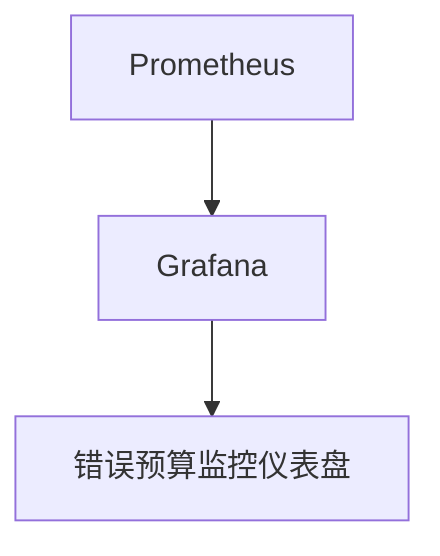

# 错误预算监控

## 介绍

在业务指标与SLO（Service Level Objective，服务级别目标）监控中，错误预算（Error Budget）是一个关键概念。它允许团队在保证服务质量的同时，灵活地进行创新和变更。错误预算监控帮助团队量化和管理服务质量的“容忍度”，从而在保证用户体验的同时，推动业务发展。

错误预算是基于SLO计算得出的，表示在一定时间内允许的服务错误量。例如，如果某个服务的SLO是99.9%的可用性，那么错误预算就是0.1%的不可用时间。通过监控错误预算，团队可以及时发现问题并采取行动，避免违反SLO。

## 错误预算的计算

错误预算通常基于以下公式计算：

```
错误预算 = 1 - SLO
```

例如，如果SLO为99.9%，则错误预算为0.1%。这意味着在给定的时间窗口内，服务最多可以容忍0.1%的错误。

### 示例

假设我们有一个服务的SLO为99.9%，时间窗口为30天。那么错误预算为：

```
错误预算 = 1 - 0.999 = 0.001
```

在30天的时间窗口内，错误预算为：

```
错误预算时间 = 30天 * 24小时 * 60分钟 * 0.001 = 43.2分钟
```

这意味着在30天内，服务最多可以容忍43.2分钟的不可用时间。

## 错误预算监控的实现

在Grafana Alloy中，错误预算监控可以通过配置Prometheus和Grafana来实现。以下是一个简单的示例，展示如何配置错误预算监控。

### 配置Prometheus

首先，我们需要在Prometheus中定义一个查询，用于计算错误预算的消耗情况。假设我们有一个指标`http_requests_total`，其中包含成功和失败的请求数。

```yaml
- name: error_budget
  rules:
    - record: error_budget_consumed
      expr: sum(rate(http_requests_total{status="500"}[5m])) / sum(rate(http_requests_total[5m]))
```

### 配置Grafana

接下来，我们在Grafana中创建一个仪表盘，用于可视化错误预算的消耗情况。我们可以使用以下查询来显示错误预算的消耗情况：

```sql
sum(rate(http_requests_total{status="500"}[5m])) / sum(rate(http_requests_total[5m]))
```

### 示例仪表盘



## 实际案例

假设我们有一个电商网站，其SLO为99.9%的可用性。在某个促销活动期间，网站经历了短暂的高负载，导致部分请求失败。通过错误预算监控，团队发现错误预算在短时间内消耗了20%。团队立即采取措施，增加了服务器资源，避免了SLO的违反。

## 总结

错误预算监控是业务指标与SLO监控中的重要组成部分。它帮助团队量化和管理服务质量的容忍度，从而在保证用户体验的同时，推动业务发展。通过Grafana Alloy，我们可以轻松实现错误预算监控，并及时发现问题。

## 附加资源

- [Grafana Alloy 官方文档](https://grafana.com/docs/alloy/)
- [Prometheus 官方文档](https://prometheus.io/docs/)
- [SLO与错误预算的最佳实践](https://sre.google/workbook/error-budgets/)

## 练习

1. 假设你的服务的SLO为99.5%，时间窗口为7天。计算错误预算时间。
2. 在Grafana中创建一个仪表盘，监控你的服务的错误预算消耗情况。
3. 分析你的服务的错误预算消耗情况，并提出改进建议。
