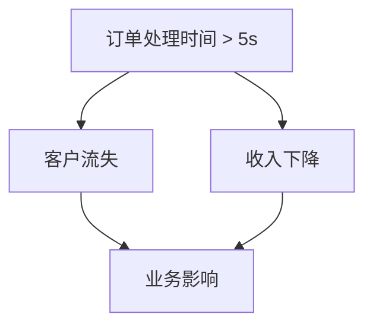

# 业务影响分析

在现代软件开发中，业务影响分析（Business Impact Analysis, BIA）是一个关键过程，用于评估系统故障或性能下降对业务的影响。通过 Grafana Alloy，您可以监控业务指标和服务水平目标（SLO），从而更好地理解这些指标如何影响您的业务。

## 什么是业务影响分析？

业务影响分析是一种评估方法，用于确定系统故障或性能下降对业务运营的影响。它帮助您识别关键业务功能，并量化这些功能的中断可能导致的财务损失、客户满意度下降或其他负面影响。

### 为什么业务影响分析重要？

- **优先级排序**：帮助您确定哪些业务功能最为关键，从而优先分配资源。
- **风险管理**：通过识别潜在风险，您可以提前制定应对策略。
- **决策支持**：为管理层提供数据支持，帮助他们做出更明智的决策。

## 使用 Grafana Alloy 进行业务影响分析

Grafana Alloy 是一个强大的工具，可以帮助您监控业务指标和 SLO，从而进行业务影响分析。以下是如何使用 Grafana Alloy 进行业务影响分析的步骤。

### 步骤 1：定义业务指标

首先，您需要定义与业务相关的关键指标。这些指标可以是收入、用户活跃度、订单处理时间等。

```yaml
metrics:
  - name: revenue
    type: gauge
    description: "Total revenue generated"
  - name: active_users
    type: gauge
    description: "Number of active users"
```

### 步骤 2：设置 SLO

服务水平目标（SLO）是您对服务性能的期望。例如，您可能希望订单处理时间不超过 5 秒。

```yaml
slo:
  - name: order_processing_time
    target: 5s
    description: "Order processing time should be less than 5 seconds"
```

### 步骤 3：监控和报警

使用 Grafana Alloy 监控这些指标和 SLO，并设置报警规则。当指标超出预期范围时，系统会自动触发报警。

```yaml
alerts:
  - name: high_order_processing_time
    condition: order_processing_time > 5s
    severity: critical
    description: "Order processing time exceeds 5 seconds"
```

### 步骤 4：分析业务影响

当报警触发时，您需要分析其对业务的影响。例如，如果订单处理时间超过 5 秒，可能会导致客户流失或收入下降。



### 实际案例

假设您运营一个电子商务网站，订单处理时间是关键业务指标。通过 Grafana Alloy，您发现订单处理时间在某些时段超过了 5 秒。经过分析，您发现这导致了客户流失和收入下降。通过优化订单处理流程，您成功将处理时间控制在 5 秒以内，从而减少了业务影响。

## 总结

业务影响分析是确保业务连续性和优化资源分配的关键工具。通过 Grafana Alloy，您可以轻松监控业务指标和 SLO，从而更好地理解这些指标对业务的影响。

:::tip
**提示**：定期审查和更新您的业务指标和 SLO，以确保它们始终反映当前的业务需求。
:::

## 附加资源

- [Grafana Alloy 官方文档](https://grafana.com/docs/alloy/)
- [业务影响分析指南](https://www.businessimpactanalysis.com/)
- [SLO 最佳实践](https://sre.google/sre-book/service-level-objectives/)

## 练习

1. 定义三个与您的业务相关的关键指标。
2. 为这些指标设置 SLO，并在 Grafana Alloy 中配置监控和报警。
3. 模拟一个系统故障，分析其对业务的影响，并制定应对策略。

通过以上步骤，您将能够更好地理解和使用业务影响分析，从而提升业务的稳定性和效率。