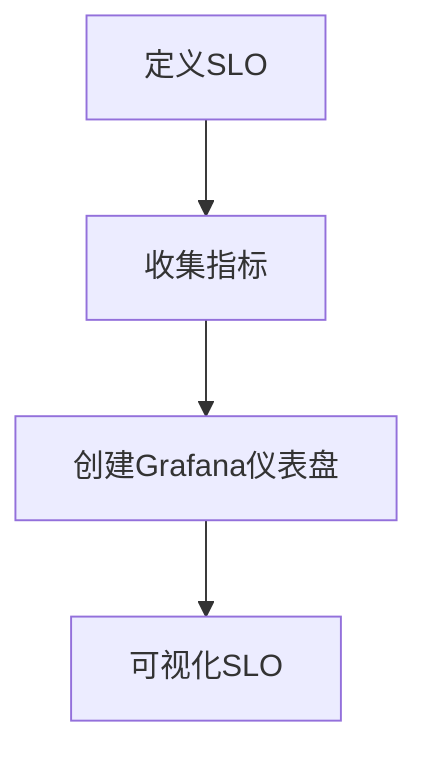

# SLO仪表盘创建

在现代的微服务架构中，确保服务的可靠性和性能至关重要。服务级别目标（SLO，Service Level Objective）是一种量化服务可靠性的方法，它定义了服务在特定时间段内应达到的性能目标。通过创建SLO仪表盘，您可以实时监控服务的健康状况，并在问题发生之前采取行动。

## 什么是SLO？

SLO是服务级别协议（SLA，Service Level Agreement）的一部分，它定义了服务在特定时间段内应达到的性能目标。例如，一个常见的SLO可能是“99.9%的请求应在200毫秒内完成”。SLO通常与错误预算（Error Budget）一起使用，错误预算是指允许的服务不可用时间。

## 为什么需要SLO仪表盘？

SLO仪表盘可以帮助您：

- 实时监控服务的健康状况。
- 快速识别和响应性能问题。
- 确保服务符合预定的性能目标。
- 通过可视化数据，帮助团队理解服务的性能趋势。

## 创建SLO仪表盘的步骤

### 1. 定义SLO

首先，您需要明确服务的SLO。例如，假设我们有一个Web服务，我们希望99.9%的请求在200毫秒内完成。

### 2. 收集指标

接下来，您需要收集与SLO相关的指标。通常，这些指标包括请求的响应时间、错误率等。您可以使用Prometheus、Grafana Alloy等工具来收集和存储这些指标。

### 3. 创建Grafana仪表盘

在Grafana中，您可以创建一个新的仪表盘来可视化SLO相关的指标。以下是一个简单的步骤：

1. **登录Grafana**：打开Grafana并登录到您的账户。
2. **创建新仪表盘**：点击“Create”按钮，然后选择“Dashboard”。
3. **添加面板**：在仪表盘中添加一个新的面板，选择“Graph”或“Time Series”作为面板类型。
4. **配置查询**：在面板的查询编辑器中，配置PromQL查询以获取与SLO相关的指标。例如，以下查询可以获取请求的响应时间：

   ```promql
   rate(http_request_duration_seconds_sum[1m]) / rate(http_request_duration_seconds_count[1m])
   ```

5. **设置阈值**：在面板的设置中，设置与SLO相关的阈值。例如，将阈值设置为200毫秒。

### 4. 可视化SLO

在仪表盘中，您可以使用不同的可视化方式来展示SLO。例如，您可以使用折线图来展示请求的响应时间，并使用颜色编码来标识是否达到了SLO。



### 5. 监控和告警

最后，您可以在Grafana中设置告警，以便在SLO未达到时及时通知团队。例如，您可以设置一个告警规则，当请求的响应时间超过200毫秒时触发告警。

## 实际案例

假设我们有一个电子商务网站，我们希望确保99.9%的订单处理请求在500毫秒内完成。我们可以按照以下步骤创建SLO仪表盘：

1. **定义SLO**：99.9%的订单处理请求在500毫秒内完成。
2. **收集指标**：使用Prometheus收集订单处理请求的响应时间。
3. **创建Grafana仪表盘**：在Grafana中创建一个新的仪表盘，添加一个面板来展示订单处理请求的响应时间。
4. **设置阈值**：在面板中设置500毫秒的阈值。
5. **监控和告警**：设置告警规则，当响应时间超过500毫秒时触发告警。

## 总结

通过创建SLO仪表盘，您可以实时监控服务的健康状况，并确保服务符合预定的性能目标。Grafana Alloy提供了强大的工具来帮助您收集、存储和可视化SLO相关的指标。通过定义SLO、收集指标、创建仪表盘和设置告警，您可以有效地管理服务的可靠性。

## 附加资源

- [Grafana官方文档](https://grafana.com/docs/)
- [Prometheus官方文档](https://prometheus.io/docs/)
- [SLO与错误预算指南](https://sre.google/workbook/error-budget/)

## 练习

1. 为您的服务定义一个SLO，并使用Grafana Alloy创建一个SLO仪表盘。
2. 尝试设置一个告警规则，当SLO未达到时触发告警。
3. 探索Grafana中的其他可视化选项，如热图、柱状图等，以更好地展示SLO数据。
