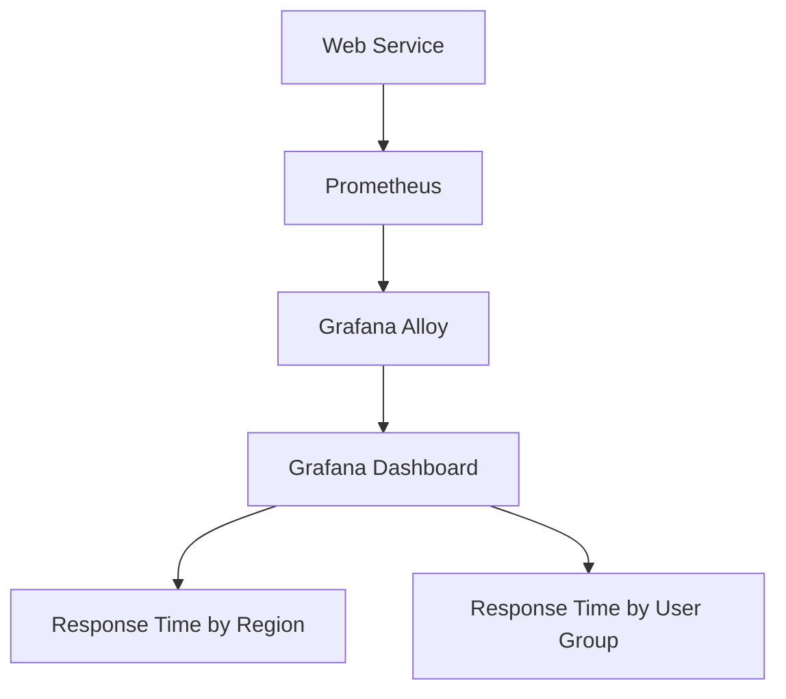

# 多维度服务监控

在现代分布式系统中，服务的复杂性不断增加，单一维度的监控已经无法满足需求。多维度服务监控通过从多个角度（如时间、地域、用户群体等）收集和分析数据，帮助我们更全面地了解系统的运行状态。本文将介绍如何使用 Grafana Alloy 实现多维度服务监控，并通过实际案例展示其应用。

## 什么是多维度服务监控？

多维度服务监控是指从多个维度（如时间、地域、用户群体、服务组件等）对系统进行监控和分析。通过这种方式，我们可以更全面地了解系统的运行状态，快速定位问题，并优化性能。

### 为什么需要多维度服务监控？

1. **全面性**：单一维度的监控可能无法覆盖所有潜在问题。
2. **精准定位**：通过多维度分析，可以更精准地定位问题的根源。
3. **优化性能**：多维度数据可以帮助我们识别性能瓶颈，并进行针对性优化。

## 多维度服务监控的关键维度

以下是一些常见的监控维度：

1. **时间维度**：监控系统在不同时间段的性能表现。
2. **地域维度**：监控系统在不同地理位置的性能表现。
3. **用户群体维度**：监控不同用户群体的使用情况。
4. **服务组件维度**：监控系统中各个组件的性能表现。

## 使用 Grafana Alloy 实现多维度服务监控

Grafana Alloy 是一个强大的监控工具，支持多维度数据收集和分析。以下是一个简单的示例，展示如何使用 Grafana Alloy 实现多维度服务监控。

### 示例：监控 Web 服务的响应时间

假设我们有一个 Web 服务，需要监控其响应时间，并从时间、地域和用户群体三个维度进行分析。

#### 1. 配置数据源

首先，我们需要配置 Grafana Alloy 的数据源，以收集 Web 服务的响应时间数据。

```yaml
datasources:
  - name: web_service
    type: prometheus
    url: http://localhost:9090
```

#### 2. 定义监控指标

接下来，我们定义需要监控的指标。在这个示例中，我们监控 `http_request_duration_seconds`，表示 Web 服务的响应时间。

```yaml
metrics:
  - name: http_request_duration_seconds
    help: "Duration of HTTP requests in seconds"
    type: histogram
    labels:
      - region
      - user_group
```

#### 3. 创建仪表盘

在 Grafana 中创建一个仪表盘，展示不同维度的响应时间数据。

```yaml
dashboards:
  - name: Web Service Response Time
    panels:
      - title: Response Time by Region
        type: graph
        query: 'rate(http_request_duration_seconds_sum{region=~"$region"}[5m]) / rate(http_request_duration_seconds_count{region=~"$region"}[5m])'
      - title: Response Time by User Group
        type: graph
        query: 'rate(http_request_duration_seconds_sum{user_group=~"$user_group"}[5m]) / rate(http_request_duration_seconds_count{user_group=~"$user_group"}[5m])'
```

#### 4. 分析数据

通过 Grafana 仪表盘，我们可以直观地看到不同维度的响应时间数据，并进行深入分析。



## 实际案例

### 案例：电商平台的性能监控

假设我们有一个电商平台，需要监控其在不同地域和用户群体中的性能表现。通过 Grafana Alloy，我们可以从以下维度进行监控：

1. **时间维度**：监控平台在高峰时段的性能表现。
2. **地域维度**：监控不同地域用户的访问速度。
3. **用户群体维度**：监控不同用户群体（如新用户、老用户）的购买行为。

通过多维度监控，我们可以快速定位性能瓶颈，并优化用户体验。

## 总结

多维度服务监控是现代分布式系统中不可或缺的一部分。通过 Grafana Alloy，我们可以轻松实现多维度监控，并从多个角度全面了解系统的运行状态。希望本文能帮助你更好地理解多维度服务监控的概念，并在实际项目中应用。

## 附加资源

- [Grafana Alloy 官方文档](https://grafana.com/docs/alloy/latest/)
- [Prometheus 官方文档](https://prometheus.io/docs/)
- [Grafana 仪表盘配置指南](https://grafana.com/docs/grafana/latest/dashboards/)

## 练习

1. 尝试配置 Grafana Alloy，监控一个简单的 Web 服务的响应时间。
2. 创建一个仪表盘，展示不同维度的响应时间数据。
3. 分析数据，找出性能瓶颈，并提出优化建议。
