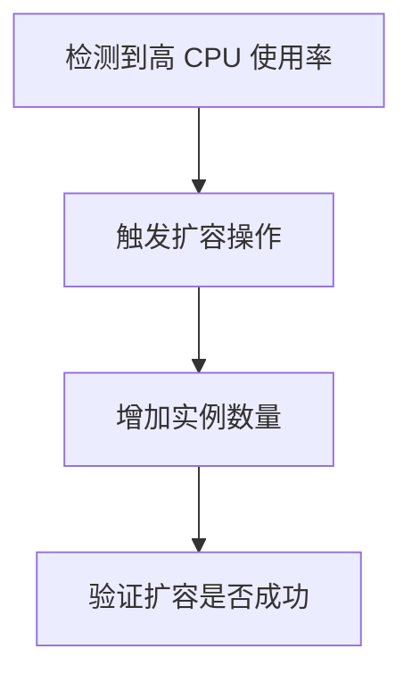
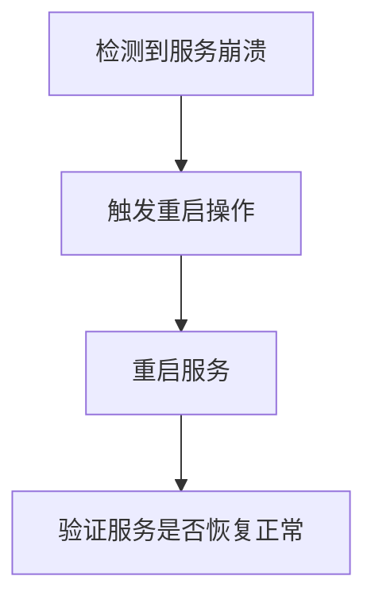

# 自动修复工作流

在现代分布式系统中，监控和自动化修复是确保系统高可用性和稳定性的关键。Grafana Alloy 提供了一种强大的方式来构建自动修复工作流，帮助你在问题发生时快速响应并修复，而无需人工干预。本文将带你逐步了解自动修复工作流的概念、实现方法以及实际应用场景。

## 什么是自动修复工作流？

自动修复工作流是一种自动化流程，用于检测系统中的异常或故障，并自动执行预定义的修复操作。通过 Grafana Alloy，你可以将这些工作流与监控系统集成，实现从问题检测到修复的全自动化。

自动修复工作流的核心思想是：
1. **检测问题**：通过监控系统（如 Prometheus、Grafana）实时检测系统中的异常。
2. **触发修复**：当检测到问题时，自动触发修复操作。
3. **执行修复**：执行预定义的修复脚本或操作，例如重启服务、扩容资源等。
4. **验证修复**：修复完成后，验证系统是否恢复正常。

## 自动修复工作流的实现

### 1. 配置监控系统

首先，你需要配置 Grafana Alloy 与监控系统（如 Prometheus）集成，以便实时获取系统的指标数据。以下是一个简单的 Prometheus 配置示例：

```yaml
global:
  scrape_interval: 15s

scrape_configs:
  - job_name: 'node_exporter'
    static_configs:
      - targets: ['localhost:9100']
```

### 2. 定义告警规则

接下来，你需要定义告警规则，以便在系统出现问题时触发告警。以下是一个 Prometheus 告警规则的示例：

```yaml
groups:
- name: example
  rules:
  - alert: HighCPUUsage
    expr: 100 - (avg by (instance) (irate(node_cpu_seconds_total{mode="idle"}[5m])) * 100 > 80
    for: 5m
    labels:
      severity: critical
    annotations:
      summary: "High CPU usage detected"
      description: "Instance {{ $labels.instance }} has high CPU usage ({{ $value }}%)."
```

### 3. 创建自动修复工作流

在 Grafana Alloy 中，你可以使用 `webhook` 或 `alertmanager` 来触发自动修复操作。以下是一个简单的自动修复工作流示例：

```yaml
receivers:
  - name: 'auto-repair'
    webhook_configs:
      - url: 'http://localhost:8080/repair'
        send_resolved: true

route:
  receiver: 'auto-repair'
  group_by: ['alertname', 'instance']
  group_wait: 30s
  group_interval: 5m
  repeat_interval: 3h
```

在这个示例中，当 Prometheus 检测到高 CPU 使用率时，会触发告警，并通过 `webhook` 发送请求到 `http://localhost:8080/repair`，从而触发自动修复操作。

### 4. 编写修复脚本

修复脚本是自动修复工作流的核心部分。你可以使用任何编程语言编写修复脚本，例如 Python、Bash 等。以下是一个简单的 Bash 脚本示例，用于重启服务：

```bash
#!/bin/bash

# 重启服务
systemctl restart my-service

# 验证服务是否重启成功
if systemctl is-active --quiet my-service; then
  echo "Service restarted successfully."
else
  echo "Failed to restart service."
  exit 1
fi
```

### 5. 验证修复结果

修复完成后，你需要验证系统是否恢复正常。可以通过监控系统查看相关指标，或者通过日志检查修复操作是否成功。

## 实际应用场景

### 场景 1：自动扩容

在高流量场景下，系统可能会因为资源不足而出现性能问题。通过自动修复工作流，你可以自动检测到资源不足的情况，并触发扩容操作。



### 场景 2：自动重启服务

当某个服务崩溃或出现异常时，自动修复工作流可以自动重启该服务，确保系统继续正常运行。



## 总结

自动修复工作流是 Grafana Alloy 中一个强大的功能，可以帮助你自动化监控和修复系统中的问题。通过本文的学习，你应该已经掌握了如何配置监控系统、定义告警规则、创建自动修复工作流以及编写修复脚本。希望你能在实际项目中应用这些知识，提升系统的稳定性和可靠性。

## 附加资源与练习

- **练习 1**：尝试在你的本地环境中配置一个简单的自动修复工作流，检测并修复一个模拟的服务崩溃问题。
- **练习 2**：扩展自动修复工作流，使其能够处理多个不同类型的告警，并执行不同的修复操作。

如果你有任何问题或需要进一步的帮助，请参考 [Grafana Alloy 官方文档](https://grafana.com/docs/alloy/latest/)。