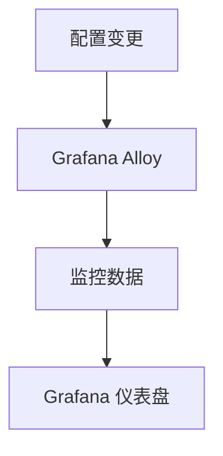

# 配置自动化管理

在现代 IT 运维中，配置管理是一个至关重要的环节。随着系统规模的扩大，手动管理配置不仅效率低下，还容易出错。Grafana Alloy 提供了一种强大的方式来实现配置的自动化管理，帮助开发者简化运维流程，提高系统的可靠性和可维护性。

## 什么是配置自动化管理？

配置自动化管理是指通过工具和脚本自动处理系统配置的过程。它可以帮助开发者快速部署、更新和回滚配置，减少人为错误，并确保系统的一致性。Grafana Alloy 是一个开源工具，专注于监控和可观测性，同时也提供了强大的配置自动化管理功能。

## 为什么需要配置自动化管理？

1. **减少人为错误**：手动配置容易出错，尤其是在复杂的系统中。
2. **提高效率**：自动化可以快速完成重复性任务，节省时间。
3. **确保一致性**：自动化工具可以确保所有系统的配置一致，避免因配置差异导致的问题。
4. **快速回滚**：当配置出现问题，自动化工具可以快速恢复到之前的稳定状态。

## Grafana Alloy 中的配置自动化管理

Grafana Alloy 通过其灵活的配置语言和强大的 API，使得配置自动化管理变得简单而高效。以下是实现配置自动化管理的几个关键步骤：

### 1. 定义配置文件

Grafana Alloy 使用 YAML 或 JSON 格式的配置文件来定义系统的监控和可观测性配置。以下是一个简单的配置文件示例：

```yaml
scrape_configs:
  - job_name: 'node_exporter'
    static_configs:
      - targets: ['localhost:9100']
```

### 2. 使用版本控制系统

将配置文件存储在版本控制系统（如 Git）中，可以方便地跟踪配置的变更历史，并在需要时回滚到之前的版本。

```bash
git init
git add all.yaml
git commit -m "Initial configuration"
```

### 3. 自动化部署

通过 CI/CD 工具（如 Jenkins、GitLab CI 或 GitHub Actions），可以自动化部署 Grafana Alloy 的配置文件。以下是一个简单的 GitHub Actions 工作流示例：

```yaml
name: Deploy Grafana Alloy Config

on:
  push:
    branches:
      - main

jobs:
  deploy:
    runs-on: ubuntu-latest
    steps:
      - name: Checkout code
        uses: actions/checkout@v2

      - name: Deploy configuration
        run: |
          scp all.yaml user@server:/etc/grafana-alloy/config.yaml
          ssh user@server "sudo systemctl restart grafana-alloy"
```

### 4. 监控配置变更

Grafana Alloy 提供了丰富的监控功能，可以实时监控配置变更的影响。通过 Grafana 仪表盘，可以直观地查看系统的状态和性能指标。



## 实际案例

假设你正在管理一个微服务架构的系统，每个服务都需要监控其性能和健康状况。通过 Grafana Alloy 的配置自动化管理，你可以轻松地为每个服务定义监控配置，并通过自动化工具快速部署和更新这些配置。

### 案例步骤：

1. **定义监控配置**：为每个微服务定义一个 `scrape_config`。
2. **存储配置**：将配置文件存储在 Git 仓库中。
3. **自动化部署**：通过 CI/CD 工具自动部署配置。
4. **监控和告警**：通过 Grafana 仪表盘实时监控系统状态，并设置告警规则。

## 总结

配置自动化管理是现代 IT 运维中不可或缺的一部分。通过 Grafana Alloy，你可以轻松实现配置的自动化管理，提高系统的可靠性和可维护性。本文介绍了配置自动化管理的基本概念、实现步骤以及实际案例，希望能帮助你更好地理解和应用这一技术。

## 附加资源

- [Grafana Alloy 官方文档](https://grafana.com/docs/alloy/latest/)
- [GitHub Actions 官方文档](https://docs.github.com/en/actions)
- [YAML 语法指南](https://yaml.org/)

## 练习

1. 创建一个简单的 Grafana Alloy 配置文件，并尝试通过 CI/CD 工具自动化部署。
2. 使用 Grafana 仪表盘监控配置变更的影响，并设置一个简单的告警规则。
