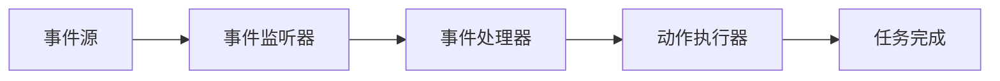

# 事件驱动自动化

事件驱动自动化是一种基于事件触发的自动化机制。它通过监听特定事件的发生，自动执行预定义的任务或流程。这种自动化方式广泛应用于监控、日志管理、CI/CD 管道等领域，能够显著提高系统的响应速度和效率。

## 什么是事件驱动自动化？

事件驱动自动化的核心思想是“事件触发动作”。当某个特定事件发生时（例如，系统日志中出现错误、服务器负载过高或用户提交表单），系统会自动执行相应的任务（例如，发送警报、扩展服务器资源或更新数据库）。

与传统的轮询机制不同，事件驱动自动化是**被动**的，只有在事件发生时才会触发动作。这种方式减少了资源浪费，并能够更快地响应变化。

:::note
**事件驱动 vs 轮询机制**
- **事件驱动**：被动等待事件发生，触发动作。
- **轮询机制**：主动定期检查状态，无论是否有变化。
:::

## 事件驱动自动化的工作原理

事件驱动自动化通常包括以下组件：
1. **事件源**：产生事件的系统或服务（例如，日志系统、传感器、用户界面）。
2. **事件监听器**：监听事件源，捕获事件。
3. **事件处理器**：根据事件类型执行预定义的任务。
4. **动作执行器**：实际执行任务的组件（例如，发送邮件、调用 API）。

以下是一个简单的事件驱动自动化流程：



## 在 Grafana Alloy 中实现事件驱动自动化

Grafana Alloy 是一个强大的自动化与编排工具，支持事件驱动自动化。以下是一个简单的示例，展示如何使用 Grafana Alloy 监听日志事件并触发警报。

### 示例：监听日志错误并发送警报

假设我们有一个日志系统，当出现错误日志时，我们希望自动发送警报。

1. **定义事件源**：配置日志系统作为事件源。
2. **创建事件监听器**：在 Grafana Alloy 中设置监听器，捕获错误日志。
3. **定义事件处理器**：编写处理逻辑，例如提取日志内容并格式化警报消息。
4. **配置动作执行器**：设置发送警报的方式（例如，通过邮件或 Slack）。

以下是一个简单的配置示例：

```yaml
event_source:
  type: log
  path: /var/log/app.log

event_listener:
  filter: "ERROR"

event_handler:
  action: send_alert
  message: "Error detected: {{ .message }}"

action_executor:
  type: email
  to: "admin@example.com"
  subject: "Application Error Alert"
```

### 输入与输出

- **输入**：日志文件 `/var/log/app.log` 中出现错误日志。
- **输出**：管理员邮箱 `admin@example.com` 收到一封标题为 "Application Error Alert" 的邮件，内容包含错误日志的详细信息。

## 实际应用场景

事件驱动自动化在许多场景中都非常有用。以下是一些实际案例：

1. **监控与警报**：当服务器 CPU 使用率超过阈值时，自动扩展资源。
2. **CI/CD 管道**：当代码提交到特定分支时，自动触发构建和部署。
3. **用户行为跟踪**：当用户完成注册时，自动发送欢迎邮件。
4. **物联网（IoT）**：当传感器检测到异常时，自动关闭设备。

:::tip
**最佳实践**
- 确保事件监听器的过滤条件足够精确，避免误触发。
- 为事件处理器添加重试机制，以应对网络或服务不可用的情况。
- 定期审查自动化规则，确保其与业务需求保持一致。
:::

## 总结

事件驱动自动化是一种高效、灵活的自动化方式，能够显著提高系统的响应速度和资源利用率。通过 Grafana Alloy，您可以轻松实现事件驱动自动化，并将其应用于监控、CI/CD、用户行为跟踪等场景。

## 附加资源与练习

- **练习 1**：尝试在 Grafana Alloy 中配置一个事件驱动自动化任务，监听系统日志并触发 Slack 通知。
- **练习 2**：研究如何为事件处理器添加重试机制，确保任务在失败时能够自动重试。
- **资源**：
  - [Grafana Alloy 官方文档](https://grafana.com/docs/alloy/)
  - [事件驱动架构指南](https://aws.amazon.com/event-driven-architecture/)

通过学习和实践，您将能够掌握事件驱动自动化的核心概念，并将其应用于实际项目中。