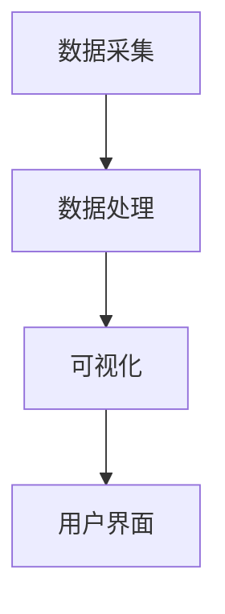

# 自动化测试策略

自动化测试是现代软件开发中不可或缺的一部分，尤其是在复杂的系统如 Grafana Alloy 中。通过自动化测试，开发团队可以快速验证代码的正确性，减少人为错误，并提高系统的可靠性。本文将介绍自动化测试的基本概念、策略设计以及如何在 Grafana Alloy 中实施这些策略。

## 什么是自动化测试？

自动化测试是指使用脚本和工具来自动执行测试用例，以验证软件的功能、性能和安全性。与手动测试相比，自动化测试具有以下优势：

- **效率高**：自动化测试可以在短时间内执行大量测试用例。
- **可重复性**：相同的测试用例可以反复执行，确保每次代码变更后的一致性。
- **减少人为错误**：自动化测试减少了人为操作带来的错误。

## 自动化测试策略的设计

在设计自动化测试策略时，需要考虑以下几个关键因素：

1. **测试覆盖范围**：确定哪些功能模块需要测试，哪些可以暂时忽略。
2. **测试类型**：包括单元测试、集成测试、系统测试和验收测试等。
3. **测试工具**：选择合适的工具来编写和执行测试脚本。
4. **测试环境**：确保测试环境与生产环境尽可能一致。

### 测试覆盖范围

在 Grafana Alloy 中，测试覆盖范围应包括核心功能模块，如数据采集、数据处理和可视化。以下是一个简单的测试覆盖范围示例：



### 测试类型

- **单元测试**：测试单个函数或模块的功能。
- **集成测试**：测试多个模块之间的交互。
- **系统测试**：测试整个系统的功能和性能。
- **验收测试**：验证系统是否满足用户需求。

### 测试工具

在 Grafana Alloy 中，常用的测试工具包括：

- **Prometheus**：用于监控和报警。
- **Grafana**：用于数据可视化和分析。
- **Alloy**：用于自动化编排和测试。

## 实际案例：自动化测试在 Grafana Alloy 中的应用

假设我们有一个 Grafana Alloy 项目，需要自动化测试数据采集模块。以下是一个简单的测试用例：

```python
import unittest
from data_collection import DataCollector

class TestDataCollection(unittest.TestCase):
    def test_data_collection(self):
        collector = DataCollector()
        data = collector.collect_data()
        self.assertIsNotNone(data)
        self.assertEqual(len(data), 10)

if __name__ == '__main__':
    unittest.main()
```

在这个测试用例中，我们使用 Python 的 `unittest` 框架来测试 `DataCollector` 类的 `collect_data` 方法。测试用例验证了数据采集模块是否能够正确采集数据，并且数据的长度是否符合预期。

### 输入和输出

- **输入**：无
- **输出**：采集到的数据

## 总结

自动化测试是确保 Grafana Alloy 系统可靠性和稳定性的关键。通过设计合理的测试策略，选择合适的测试工具，并编写有效的测试用例，开发团队可以大大提高系统的质量和开发效率。

## 附加资源

- [Grafana Alloy 官方文档](https://grafana.com/docs/alloy/latest/)
- [Python unittest 官方文档](https://docs.python.org/3/library/unittest.html)
- [Prometheus 官方文档](https://prometheus.io/docs/)

## 练习

1. 编写一个单元测试，测试 Grafana Alloy 中的数据处理模块。
2. 设计一个集成测试，验证数据采集和数据处理模块的交互。
3. 使用 Prometheus 和 Grafana 监控自动化测试的执行情况，并生成报告。

:::tip
在实际项目中，建议定期运行自动化测试，并在每次代码变更后执行回归测试，以确保系统的稳定性。
:::