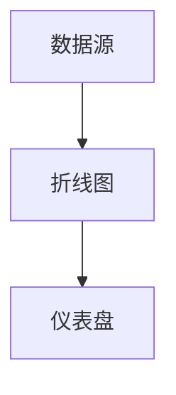
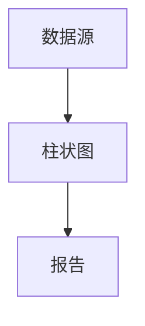

# Grafana Alloy 可视化类型概览

Grafana Alloy 是一个强大的数据可视化工具，能够帮助用户将复杂的数据转化为直观的图表和仪表盘。无论你是监控系统性能、分析业务数据，还是展示实验结果，Grafana Alloy 都提供了多种可视化类型来满足你的需求。本文将为你介绍 Grafana Alloy 中常见的可视化类型，并通过实际案例帮助你理解它们的应用场景。

---

## 什么是可视化类型？

可视化类型是指用于展示数据的图表或图形的种类。不同的数据类型和分析目标需要不同的可视化方式。例如，时间序列数据适合用折线图展示，而分类数据则更适合用柱状图或饼图。Grafana Alloy 提供了丰富的可视化类型，帮助用户以最直观的方式呈现数据。

---

## 常见的可视化类型

以下是 Grafana Alloy 中常见的可视化类型及其适用场景：

### 1. 折线图（Line Chart）
折线图是展示时间序列数据的首选工具。它通过连接数据点的线段来显示数据随时间的变化趋势。

**适用场景：**
- 监控服务器 CPU 使用率
- 展示股票价格波动
- 分析网站流量变化

**示例代码：**
```json
{
  "type": "line",
  "data": {
    "labels": ["2023-10-01", "2023-10-02", "2023-10-03"],
    "datasets": [
      {
        "label": "CPU Usage",
        "data": [30, 45, 60]
      }
    ]
  }
}
```

**输出效果：**
- 横轴：时间
- 纵轴：CPU 使用率（%）

---

### 2. 柱状图（Bar Chart）
柱状图通过不同高度的柱子来展示分类数据的对比情况。

**适用场景：**
- 比较不同产品的销售额
- 展示月度用户增长
- 分析不同地区的访问量

**示例代码：**
```json
{
  "type": "bar",
  "data": {
    "labels": ["Product A", "Product B", "Product C"],
    "datasets": [
      {
        "label": "Sales",
        "data": [120, 200, 150]
      }
    ]
  }
}
```

**输出效果：**
- 横轴：产品名称
- 纵轴：销售额

---

### 3. 饼图（Pie Chart）
饼图通过扇形区域展示各部分占整体的比例。

**适用场景：**
- 展示市场份额
- 分析用户设备分布
- 显示预算分配情况

**示例代码：**
```json
{
  "type": "pie",
  "data": {
    "labels": ["Mobile", "Desktop", "Tablet"],
    "datasets": [
      {
        "data": [40, 50, 10]
      }
    ]
  }
}
```

**输出效果：**
- 每个扇形区域代表一种设备类型及其占比

---

### 4. 热力图（Heatmap）
热力图通过颜色深浅展示数据的密度或强度。

**适用场景：**
- 分析用户点击热区
- 展示服务器负载分布
- 监控温度变化

**示例代码：**
```json
{
  "type": "heatmap",
  "data": {
    "labels": ["00:00", "06:00", "12:00", "18:00"],
    "datasets": [
      {
        "data": [
          [10, 20, 30, 40],
          [50, 60, 70, 80]
        ]
      }
    ]
  }
}
```

**输出效果：**
- 横轴：时间
- 纵轴：服务器编号
- 颜色深浅：负载强度

---

### 5. 仪表盘（Gauge）
仪表盘通过指针和刻度展示单一指标的当前状态。

**适用场景：**
- 监控系统健康状态
- 展示任务完成进度
- 显示实时温度

**示例代码：**
```json
{
  "type": "gauge",
  "data": {
    "value": 75,
    "max": 100
  }
}
```

**输出效果：**
- 指针指向 75，表示当前进度为 75%

---

## 实际案例

### 案例 1：监控服务器性能
假设你需要监控一组服务器的 CPU 使用率，可以使用折线图展示每台服务器的 CPU 使用率随时间的变化。



### 案例 2：分析销售数据
假设你需要分析不同产品的销售额，可以使用柱状图展示各产品的销售额对比。



---

## 总结

Grafana Alloy 提供了多种可视化类型，能够满足不同场景下的数据展示需求。通过选择合适的可视化类型，你可以更直观地理解数据并做出有效决策。以下是本文的要点总结：
- 折线图适合展示时间序列数据。
- 柱状图适合比较分类数据。
- 饼图适合展示比例关系。
- 热力图适合展示数据密度。
- 仪表盘适合展示单一指标状态。

---

## 附加资源与练习

### 资源
- [Grafana 官方文档](https://grafana.com/docs/)
- [数据可视化最佳实践](https://www.tableau.com/learn/whitepapers/which-chart-or-graph-is-right-for-you)

### 练习
1. 使用 Grafana Alloy 创建一个折线图，展示过去一周的网站访问量。
2. 尝试将柱状图与饼图结合，分析不同产品的销售额及其占比。
3. 设计一个仪表盘，实时监控服务器的 CPU 和内存使用率。

通过实践这些练习，你将更深入地掌握 Grafana Alloy 的可视化功能！