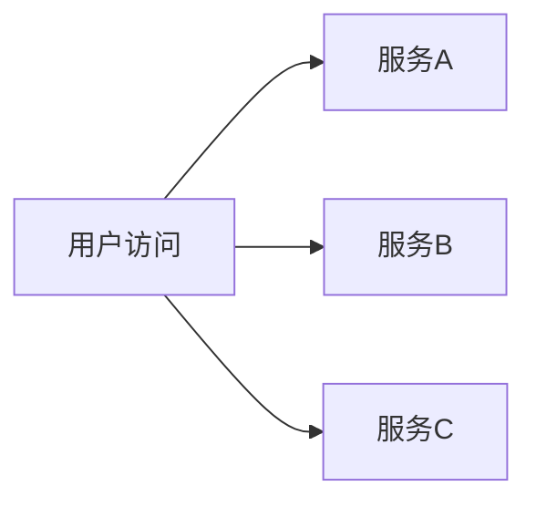

# 面积图与堆叠图

在数据可视化中，面积图和堆叠图是两种常用的图表类型，用于展示时间序列数据或分类数据的趋势和分布。它们通过填充区域来增强数据的视觉表现力，帮助用户更直观地理解数据的变化和比例关系。

## 什么是面积图？

面积图是一种基于折线图的图表类型，它在折线下方填充颜色，形成“面积”效果。面积图通常用于展示时间序列数据的变化趋势，同时强调数据的总量或累积效果。

### 面积图的特点
- **强调趋势**：面积图通过填充区域，能够更直观地展示数据的上升或下降趋势。
- **累积效果**：面积图可以展示数据的累积效果，适合展示总量随时间的变化。
- **多系列对比**：可以通过叠加多个面积图来对比不同数据系列的趋势。

## 什么是堆叠图？

堆叠图是面积图的一种变体，它将多个数据系列堆叠在一起，展示每个系列在整体中的占比。堆叠图适合展示分类数据的分布情况，以及各部分对整体的贡献。

### 堆叠图的特点
- **展示占比**：堆叠图能够清晰地展示每个数据系列在整体中的占比。
- **多系列对比**：通过堆叠多个数据系列，可以直观地对比它们的分布情况。
- **累积效果**：堆叠图展示了整体的累积效果，适合展示总量和部分的关系。

---

## 面积图与堆叠图的创建

在 Grafana Alloy 中，可以通过配置面板来创建面积图和堆叠图。以下是一个简单的示例，展示如何使用 Grafana Alloy 创建一个面积图。

### 示例：创建一个面积图

```yaml
panels:
  - type: graph
    title: 示例面积图
    targets:
      - expr: 'sum(rate(http_requests_total[5m])) by (service)'
        legendFormat: "{{service}}"
    options:
      fill: 10
      lineWidth: 2
      stack: false
```

在这个示例中：
- `fill: 10` 设置了填充区域的不透明度。
- `lineWidth: 2` 设置了折线的宽度。
- `stack: false` 表示这是一个普通的面积图，而不是堆叠图。

### 示例：创建一个堆叠图

```yaml
panels:
  - type: graph
    title: 示例堆叠图
    targets:
      - expr: 'sum(rate(http_requests_total[5m])) by (service)'
        legendFormat: "{{service}}"
    options:
      fill: 10
      lineWidth: 2
      stack: true
```

在这个示例中：
- `stack: true` 表示这是一个堆叠图，多个数据系列会堆叠在一起。

---

## 实际应用场景

### 场景 1：监控网站流量
假设你正在监控一个网站的流量，想要展示不同服务的请求量随时间的变化。你可以使用面积图来展示每个服务的请求量趋势，或者使用堆叠图来展示每个服务在总流量中的占比。



### 场景 2：分析销售数据
假设你正在分析一个电商平台的销售数据，想要展示不同产品类别的销售额随时间的变化。你可以使用堆叠图来展示每个产品类别在总销售额中的占比，从而了解哪些类别对总销售额的贡献最大。

---

## 总结

面积图和堆叠图是数据可视化中非常实用的工具，能够帮助用户更直观地理解数据的趋势和分布。通过 Grafana Alloy，你可以轻松地创建这些图表，并根据实际需求调整它们的样式和配置。

### 附加资源
- [Grafana 官方文档](https://grafana.com/docs/)
- [Grafana Alloy 配置指南](https://grafana.com/docs/grafana/latest/features/alloy/)

### 练习
1. 使用 Grafana Alloy 创建一个面积图，展示某个服务的 CPU 使用率随时间的变化。
2. 修改上述面积图，将其转换为堆叠图，展示多个服务的 CPU 使用率占比。

通过实践这些练习，你将更好地掌握面积图和堆叠图的使用方法。