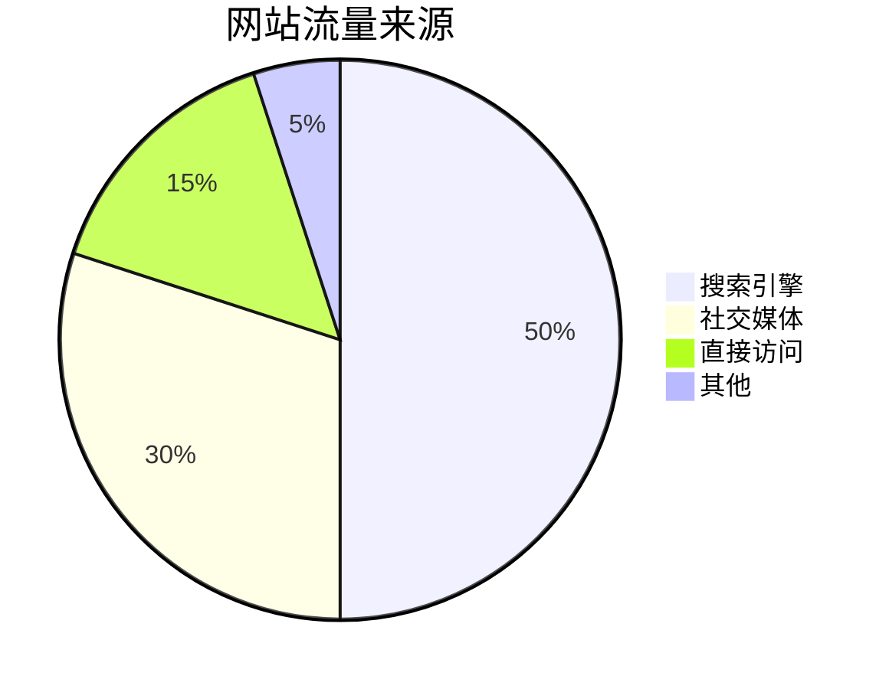

# 饼图与环形图

在数据可视化中，**饼图**和**环形图**是两种常用的图表类型，用于展示数据的比例关系。它们通过将数据划分为不同的扇形区域，直观地显示各部分在整体中的占比。本文将详细介绍如何在 Grafana Alloy 中使用这两种图表，并通过实际案例帮助你理解它们的应用场景。

## 什么是饼图与环形图？

**饼图**是一种圆形图表，将数据划分为多个扇形区域，每个区域的大小表示其在整体中的比例。**环形图**是饼图的一种变体，中心部分被挖空，形成一个环形结构。环形图在视觉上更加简洁，适合展示多个类别的比例关系。

### 饼图与环形图的适用场景
- **饼图**：适合展示少量类别（通常不超过 5-7 个）的比例关系。
- **环形图**：适合展示多个类别的比例关系，同时保持图表的简洁性。

## 在 Grafana Alloy 中创建饼图与环形图

Grafana Alloy 提供了强大的工具来创建饼图和环形图。以下是一个简单的示例，展示如何使用 Grafana Alloy 创建这两种图表。

### 示例：创建饼图

假设我们有以下数据，表示某公司各部门的销售额占比：

| 部门       | 销售额占比 |
|------------|------------|
| 销售部     | 40%        |
| 市场部     | 30%        |
| 研发部     | 20%        |
| 人力资源部 | 10%        |

我们可以使用以下代码在 Grafana Alloy 中创建一个饼图：

```json
{
  "type": "pie",
  "data": {
    "labels": ["销售部", "市场部", "研发部", "人力资源部"],
    "datasets": [
      {
        "data": [40, 30, 20, 10],
        "backgroundColor": ["#FF6384", "#36A2EB", "#FFCE56", "#4BC0C0"]
      }
    ]
  }
}
```

### 示例：创建环形图

环形图的创建与饼图类似，只需在配置中添加一个 `cutoutPercentage` 参数即可：

```json
{
  "type": "doughnut",
  "data": {
    "labels": ["销售部", "市场部", "研发部", "人力资源部"],
    "datasets": [
      {
        "data": [40, 30, 20, 10],
        "backgroundColor": ["#FF6384", "#36A2EB", "#FFCE56", "#4BC0C0"]
      }
    ]
  },
  "options": {
    "cutoutPercentage": 50
  }
}
```

:::tip
`cutoutPercentage` 参数控制环形图的中心挖空比例，值越大，环形越细。
:::

## 实际案例：网站流量来源分析

假设我们正在分析一个网站的流量来源，数据如下：

| 来源       | 流量占比 |
|------------|----------|
| 搜索引擎   | 50%      |
| 社交媒体   | 30%      |
| 直接访问   | 15%      |
| 其他       | 5%       |

我们可以使用环形图来展示这些数据：



:::note
在实际应用中，环形图更适合展示多个类别的比例关系，因为它比饼图更节省空间。
:::

## 总结

饼图和环形图是数据可视化中常用的图表类型，适合展示数据的比例关系。通过 Grafana Alloy，我们可以轻松创建这两种图表，并根据实际需求调整其样式和参数。希望本文能帮助你掌握饼图和环形图的基本用法，并在实际项目中灵活运用。

## 附加资源与练习

1. **练习**：尝试使用 Grafana Alloy 创建一个饼图，展示你所在城市各区的房价占比。
2. **资源**：阅读 Grafana 官方文档，了解更多关于图表配置的细节。
3. **扩展**：探索其他类型的图表（如柱状图、折线图），并比较它们与饼图、环形图的适用场景。

祝你学习愉快！