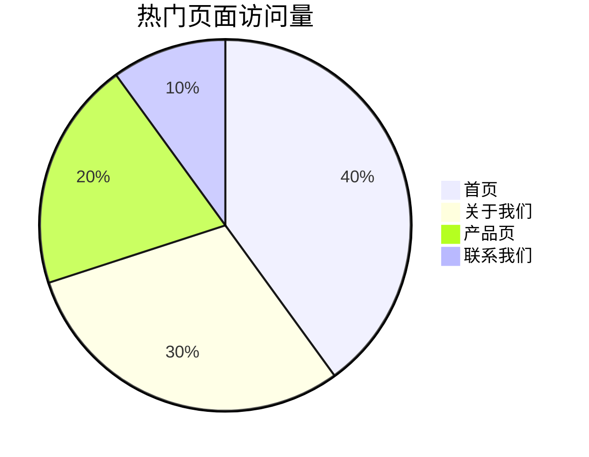

# 日志可视化

日志可视化是将日志数据以图形化的方式展示出来，以便更直观地分析和理解系统的运行状态。对于初学者来说，日志可视化是一个强大的工具，可以帮助你快速发现系统中的问题、趋势和异常。

## 什么是日志可视化？

日志可视化是通过将日志数据转换为图表、仪表盘或其他图形化形式，使得复杂的日志信息变得易于理解。通过可视化，你可以快速识别出系统中的错误、性能瓶颈或其他关键事件。

### 为什么需要日志可视化？

1. **快速发现问题**：通过图形化的方式，你可以更容易地发现系统中的异常和错误。
2. **趋势分析**：可视化可以帮助你识别系统中的趋势，例如流量增长、错误率上升等。
3. **提高效率**：相比于阅读大量的文本日志，图形化的展示方式可以大大提高分析效率。

## 日志可视化的基本步骤

### 1. 收集日志数据

首先，你需要收集日志数据。日志数据可以来自各种来源，例如应用程序、服务器、数据库等。常见的日志收集工具包括 `Fluentd`、`Logstash` 和 `Promtail`。

### 2. 解析日志数据

收集到的日志数据通常是结构化的或半结构化的。你需要解析这些数据，提取出有用的字段。例如，你可以使用正则表达式来解析日志中的时间戳、错误级别、消息内容等。

```plaintext
2023-10-01T12:34:56Z INFO: User login successful
2023-10-01T12:35:01Z ERROR: Database connection failed
```

### 3. 存储日志数据

解析后的日志数据需要存储在一个可查询的数据库中。常见的日志存储解决方案包括 `Elasticsearch`、`Loki` 和 `InfluxDB`。

### 4. 可视化日志数据

最后，你可以使用 Grafana Alloy 来创建仪表盘，将日志数据可视化。Grafana Alloy 支持多种数据源，包括 `Loki` 和 `Elasticsearch`，你可以轻松地将日志数据展示为折线图、柱状图、饼图等。

## 实际案例：监控 Web 服务器日志

假设你有一个 Web 服务器，你需要监控其访问日志，以了解网站的流量情况和错误率。

### 1. 收集日志数据

你可以使用 `Promtail` 来收集 Web 服务器的访问日志。

```yaml
server:
  http_listen_port: 9080
  grpc_listen_port: 0

positions:
  filename: /tmp/positions.yaml

clients:
  - url: http://localhost:3100/loki/api/v1/push

scrape_configs:
  - job_name: nginx
    static_configs:
      - targets:
          - localhost
        labels:
          job: nginx
          __path__: /var/log/nginx/access.log
```

### 2. 解析日志数据

假设你的 Nginx 访问日志格式如下：

```plaintext
127.0.0.1 - - [01/Oct/2023:12:34:56 +0000] "GET /index.html HTTP/1.1" 200 612
```

你可以使用正则表达式来解析日志中的 IP 地址、时间戳、请求方法、状态码等字段。

### 3. 存储日志数据

将解析后的日志数据存储到 `Loki` 中。

### 4. 可视化日志数据

在 Grafana Alloy 中创建一个仪表盘，展示以下内容：

- **请求量趋势**：使用折线图展示每小时的请求量。
- **错误率**：使用柱状图展示不同状态码的分布情况。
- **热门页面**：使用饼图展示访问量最高的页面。



## 总结

日志可视化是理解和分析系统运行状态的重要工具。通过 Grafana Alloy，你可以轻松地将日志数据转换为直观的图表和仪表盘，帮助你快速发现问题和趋势。

## 附加资源

- [Grafana Alloy 官方文档](https://grafana.com/docs/alloy/latest/)
- [Loki 日志收集与查询指南](https://grafana.com/docs/loki/latest/)
- [Promtail 配置指南](https://grafana.com/docs/loki/latest/clients/promtail/)

## 练习

1. 使用 `Promtail` 收集你的 Web 服务器日志，并将其存储到 `Loki` 中。
2. 在 Grafana Alloy 中创建一个仪表盘，展示请求量趋势和错误率。
3. 尝试使用不同的图表类型（如饼图、柱状图）来展示日志数据。

通过以上步骤，你将掌握日志可视化的基本技能，并能够将其应用到实际项目中。